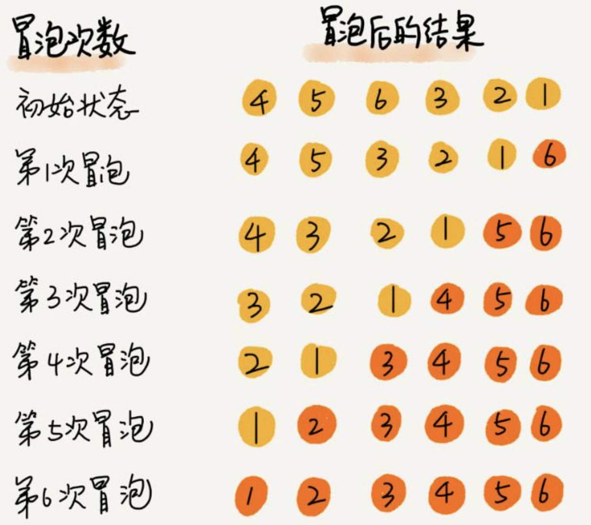
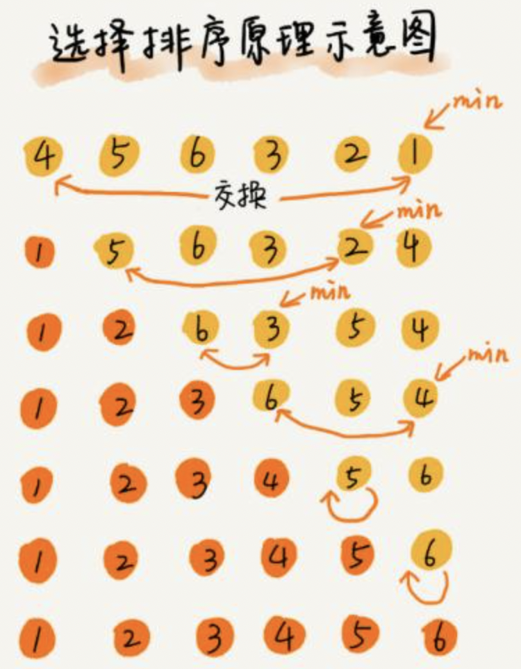
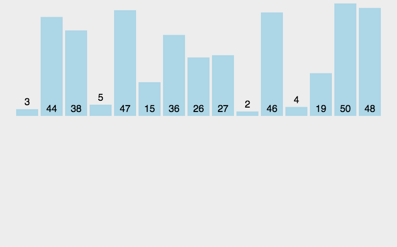

# 常见排序算法

## 冒泡排序

1. 依次比较数组中两个相邻元素的大小, 若a[i]>a[i+1], 则交换两个元素的位置, 两两都比较一遍称为一轮冒泡, 结果是让最大的元素排到最后
2. 重复以上步骤, 直到整个数组都有序
3. 优化方式: 每轮冒泡时，最后一次交换索引可以作为下一轮冒泡的比较次数，如果这个值为0, 表示整个数组有序, 直接退出循环即可



```java
@Test
public void sortTest1() {
    Integer[] arr = {1, 2, 3, 4, 5, 6, 7, 8, 9};
    Integer[] arr1 = {8, 9, 4, 5, 2, 7, 1, 3, 6};
    select(arr1, Integer::compareTo);
    System.out.println(Arrays.toString(arr));
    System.out.println(Arrays.toString(arr1));
}

public static <T> void bubble(T[] arr, Comparator<T> comparator) {
    for (int i = 0; i < arr.length - 1; i++) {
        boolean swapped = false;
        for (int j = 0; j < arr.length - 1 - i; j++) {
            if (comparator.compare(arr[j], arr[j + 1]) > 0) {
                swap(arr, j, j + 1);
                swapped = true;
            }
        }
        if (!swapped) break;
    }
}

public static <T> void bubbleV2(T[] arr, Comparator<T> comparator) {
    int lastSwappedIndex = arr.length - 1;
    for (;;) {
        int last = 0;
        for (int j = 0; j < lastSwappedIndex; j++) {
            if (comparator.compare(arr[j], arr[j + 1]) > 0) {
                swap(arr, j, j + 1);
                last = j;
            }
        }
        lastSwappedIndex = last;
        if(lastSwappedIndex == 0) break;
    }
}

public static void swap(Object[] arr, int index1, int index2) {
    Object obj = arr[index1];
    arr[index1] = arr[index2];
    arr[index2] = obj;
}
```

## 选择排序

> 每一轮会选择出最小的一个，放到数组的最左边，共经过数组元素个数减一轮，整个数组有序

1. 将数组分为两个子集，排序和未排序的，每一轮从未排序的子集中选出最小的元素，放入排序的子集
2. 重复以上步骤 直到整个数组有序
3. 优化方式：为了减小交换次数，每一轮可以先找到最小的索引，在每轮结束后，再进行元素交换



```java
public static <T> void selection(T[] arr, Comparator<T> comparator) {
    // i: 代表已排好序的最右侧索引
    for (int i = 0; i < arr.length - 1; i++) {
        // 最小值所在的索引
        int minValIndex = i;
        for (int j = i + 1; j < arr.length; j++) {
            if (comparator.compare(arr[minValIndex], arr[j]) > 0) {
                minValIndex = j;
            }
        }
        if (minValIndex != i) {
            swap(arr, minValIndex, i);
        }
    }
}

public static void swap(Object[] arr, int index1, int index2) {
    Object obj = arr[index1];
    arr[index1] = arr[index2];
    arr[index2] = obj;
}

public static void main(String[] a) {
    Integer[] arr = {1, 2, 3, 4, 5, 6, 7, 8, 9};
    Integer[] arr1 = {8, 9, 4, 5, 2, 7, 1, 6, 3};
    selection(arr1, Integer::compareTo);
    System.out.println(Arrays.toString(arr));
    System.out.println(Arrays.toString(arr1));
}
```

## 插入排序

1. 将数组分为两个区域，排序区域和末排序区域，每一轮从未排序区域中取出第一个元素，插入到排序区域（需保证顺序)
2. 重复以上步骤，直到整个数组有序



```java
public static <T> void insertion(T[] arr, Comparator<T> comparator) {
    // i 待插入元素的索引 从1开始
    for (int i = 1; i < arr.length; i++) {
        // 待插入的元素
        T temp = arr[i];
        int j = i - 1;
        while (j >= 0) {
            if (comparator.compare(temp, arr[j]) < 0) {
                arr[j + 1] = arr[j];
            } else {
                break;
            }
            j--;
        }
        arr[j + 1] = temp;
    }
}
```

