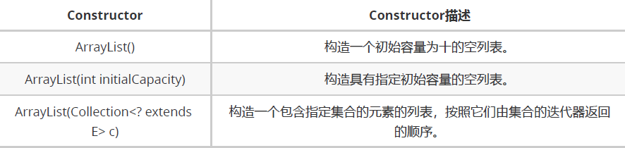

# ArrayList

## 介绍

`List`接口的可调整大小的数组实现

> 数组: 一旦初始化长度就不可以发生改变

## 特点

* 增删慢：每次删除元素，都需要更改数组长度、拷贝以及移动元素位置。
* 查询快：由于数组在内存中是一块连续空间，因此可以根据地址+索引的方式快速获取对应位置上的元素。

## 继承关系

### Serializable标记性接口

#### 序列化和反序列化

> 序列化：将对象的数据写入到文件（写对象）
> 
> 反序列化：将文件中的对象的数据读取出来（读对象）

&emsp;&emsp;类的序列化由实现java.io.Serializable接口的类启用。不实现此接口的类将不会使任何状态序列化或反序列化。可序列化类的所有子类型都是可序列化的。序列化接口没有方法或字段，仅用于标识可串行化的语义。

#### Serializable源码

```java
public interface Serializable {}
```

#### 案例

```java
class Student implements Serializable {
   private static final long serialVersionUID = 1014100089306623762L;
   //姓名
   private String name;
   //年龄
   private Integer age;
   public Student() {
   }
   public Student(String name, Integer age) {
       this.name = name;
       this.age = age;
   }
   public String getName() {
       return name;
   }
   public void setName(String name) {
       this.name = name;
   }
   public Integer getAge() {
       return age;
   }
   public void setAge(Integer age) {
       this.age = age;
   }
   @Override
   public String toString() {
       return new StringJoiner(", ", Student.class.getSimpleName() + "[", "]")
               .add("name='" + name + "'")
               .add("age=" + age)
               .toString();
   }
}

public class SeriDemo {
   public static void main(String[] args) throws Exception {
       Student s = new Student();
       System.out.println(s);
       //创建对象操作流 --> 序列化
       ObjectOutputStream oos = new ObjectOutputStream(new FileOutputStream("obj.txt"));
       //创建集合,且添加学生对象
       ArrayList<Student> list = new ArrayList<Student>();
       list.add(new Student("悔创阿里杰克马", 51));
       list.add(new Student("会点一点长几颗", 26));
       list.add(new Student("容颜老去蒋青青", 32));
       list.add(new Student("将里最丑刘一飞", 27));
       //将集合写入到文件
       oos.writeObject(list);
       //创建对象输入流 --> 反序列化
       ObjectInputStream ois = new ObjectInputStream(new FileInputStream("obj.txt"));
       //读取数据
       Object o = ois.readObject();
       //向下转型
       ArrayList<Student> al = (ArrayList<Student>) o;
       //遍历集合
       for (int i = 0; i < al.size(); i++) {
           //根据索引取出集合的每一个元素
           Student stu = al.get(i);
           System.out.println(stu);
       }
   }
}
```

### Cloneable标记性接口

#### 介绍 

一个类实现`Cloneable`接口来指示`Object.clone()`方法，该方法对于该类的实例进行字段的复制是合法的。在不实现`Cloneable`接口的实例上调用对象的克隆方法会导致异常`CloneNotSupportedException`被抛出。

简言之:**克隆就是依据已经有的数据，创造一份新的完全一样的数据拷贝**

#### Cloneable源码介绍

```java
public interface Cloneable { }
```

#### 克隆的前提条件

* 被克隆对象所在的类必须实现`Cloneable`接口
* 必须重写`clone`方法

#### clone的基本使用

```java
import java.util.ArrayList;

public class CloneDemo {
   public static void main(String[] args) {
       ArrayList<String> list = new ArrayList<String>();
       list.add("人生就是旅途");
       list.add("也许终点和起点会重合");
       list.add("但是一开始就站在起点等待终点");
       list.add("那么其中就没有美丽的沿途风景和令人难忘的过往");
       //调用方法进行克隆
       Object o = list.clone();
       System.out.println(o == list);
       System.out.println(o);
       System.out.println(list);
   }
}
```

#### clone源码分析

```java
// ArrayList类中的clone方法
public Object clone() {
   try {
       ArrayList<?> v = (ArrayList<?>) super.clone();
       v.elementData = Arrays.copyOf(elementData, size);
       v.modCount = 0;
       return v;
   } catch (CloneNotSupportedException e) {
       // this shouldn't happen, since we are Cloneable
       throw new InternalError(e);
   }
}
```

#### 案例

已知A对象的姓名为豹子头林冲，年龄30。由于项目特殊要求需要将该对象的数据复制另外一个对象B中，并且此后A和B两个对象的数据不会相互影响

##### 传统方式

new两个对象，然后手动set值,此时无论修改那个对象的值，另一个都不会受到影响

##### 克隆方式
   
###### 浅拷贝
     
1. 重写父类的clone方法（简单的调用父类的clone方法即可），然后访问修饰符修改为public
2. 此时修改其中一个对象的属性值，如果是基本数据类型和他们的包装类型，另一个对象的属性值不会收到影响
 
> **浅拷贝的局限性**：基本数据类型可以达到完全复制，引用数据类型则不可以
> 
> **原因**：引用数据类型仅仅是拷贝了一份引用

###### 深拷贝

1. 深拷贝，不能简单的调用父类的clone方法
2. 先调用父类的方法，然后向下转型
3. 然后调用引用类型的属性的clone方法，对属性进行克隆，然后向下转型
4. 将克隆出来的属性，赋值到2返回的对象
5. 此时无论修改那个对象的值，另一个都不会受到影响，包括引用类型的属性

### RandomAccess标记接口

#### 介绍

`RandomAccess`标记接口由`List`实现使用，以**表明它们支持快速（通常为恒定时间）随机访问**。

此接口的主要目的是允许通用算法更改其行为，以便在应用于**随机访问列表**或**顺序访问列表**时提供良好的性能。

用于操纵随机访问列表的最佳算法（例如`ArrayList` ）可以在应用于顺序访问列表时产生二次行为（如`LinkedList `）。 鼓励通用列表算法在应用如果将其应用于顺序访问列表之前提供较差性能的算法时，检查给定列表是否为`instanceof` ，并在必要时更改其行为以保证可接受的性能。

人们认识到，随机访问和顺序访问之间的区别通常是模糊的。 例如，一些`List` 实现提供渐近的线性访问时间，如果它们在实践中获得巨大但是恒定的访问时间。 这样的一个`List` 实现应该通常实现这个接口。 根据经验，` List` 实现应实现此接口，如果对于类的典型实例，此循环：

```java
// 随机访问
for (int i=0, n=list.size(); i < n; i++)
   list.get(i);
```

比这个循环运行得更快

```java
// 顺序访问
for (Iterator i=list.iterator(); i.hasNext(); )
    i.next();
```

#### 案例1：ArrayList

```java
//创建ArrayList集合
List<String> list = new ArrayList<>();
//添加1000 0000条数据
for (int i = 0; i < 10000000; i++) {
   list.add(i + "a");
}
System.out.println("----通过索引(随机访问:)----");
long startTime = System.currentTimeMillis();
for (int i = 0; i < list.size(); i++) {
   //仅仅为了演示取出数据的时间,因此不对取出的数据进行打印
   list.get(i);
}
long endTime = System.currentTimeMillis();
System.out.println("随机访问: " + (endTime - startTime));
System.out.println("----通过迭代器(顺序访问:)----");
startTime = System.currentTimeMillis();
Iterator<String> it = list.iterator();
while (it.hasNext()) {
   //仅仅为了演示取出数据的时间,因此不对取出的数据进行打印
   it.next();
}
endTime = System.currentTimeMillis();
System.out.println("顺序访问: " + (endTime - startTime));
//控制台效果
//----通过索引(随机访问:)----
//随机访问: 5
//----通过迭代器(顺序访问:)----
//顺序访问: 6
```

#### 案例2：LinkedList

将上述代码第2行修改为 List<String> list = new LinkedList<>();

控制台效果：随机访问及其慢，顺序访问比随机访问快


#### 为什么LinkedList随机访问比顺序访问要慢这么多？

由于随机访问的时候源码底层每次都需要进行折半的动作，再经过判断是从头还是从尾部一个个寻找。 而顺序访问只会在获取迭代器的时候进行一次折半的动作,以后每次都是在上一次的基础上获取下一个元素。 因此顺序访问要比随机访问快得多

##### 源码分析

###### 随机访问

```java
// 每次LinkedList对象调用get方法获取元素,都会执行以下代码
// list.get(i);

public class LinkedList<E> {

       public E get(int index) {
           //检验是否有效
           checkElementIndex(index);
           //调用node(index)
           return node(index).item;
       }

       //node方法
       Node<E> node(int index) {
           //node方法每次被调用的时候都会根据集合size进行折半动作
           //判断get方法中的index是小于集合长度的一半还是大于
           if (index < (size >> 1)) {
               //如果小于就从链表的头部一个个的往后找
               Node<E> x = first;
               for (int i = 0; i < index; i++)
                   x = x.next;
               return x;
           } else {
               Node<E> x = last;
               //如果大于就从链表的尾部一个个的往前找
               for (int i = size - 1; i > index; i--)
                   x = x.prev;
               return x;
           }
       }

   }
```

###### 顺序访问

```java

   //获取迭代器的时候,会执行以下代码  ListIterator是Iterator的子接口
   Iterator<String> it = list.iterator();

   //AbstractList为LinkedList父类的父类
   public abstract class AbstractList<E> {

       public ListIterator<E> listIterator() {
       //返回一个列表迭代器,且指定参数为0
           return listIterator(0);
       }

   }

   public class LinkedList<E> {

       public ListIterator<E> listIterator(int index) {
           //检查索引位置
           checkPositionIndex(index);
           //返回ListItr对象
           return new ListItr(index);
       }

       //LinkedList迭代器实现类
       private class ListItr implements ListIterator<E> {

           private Node<E> lastReturned;

           private Node<E> next;

           private int nextIndex;

           //将实际修改集合次数赋值给预期修改次数
           private int expectedModCount = modCount;

           ListItr(int index) {
               //判断 0 == size,实际上就是调用 node(index)方法
               next = (index == size) ? null : node(index);
               //将index的值赋值给 nextIndex,便于下次查找
               nextIndex = index;
           }

       }

   }

   Node<E> node(int index) {
       //在获取迭代器的时候也会进行折半的动作
       //但是在获取迭代器的时候 index 一定是0,因此 if的条件成立
       if (index < (size >> 1)) {
           Node<E> x = first;
           //由于循环条件不成立,不会执行 x.next;
           for (int i = 0; i < index; i++)
               x = x.next;
           return x; //返回第一个元素
       } else {
           Node<E> x = last;
           for (int i = size - 1; i > index; i--)
               x = x.prev;
           return x;
       }
   }

}

//迭代器调用 hasNext()方法的时候,会执行以下代码
   private class ListItr implements ListIterator<E> {
       public boolean hasNext() {
           //如果nextIndex < 集合的长度,就说明还有元素,可以进行next
           return nextIndex < size;
       }
   }

//当迭代器调用it.next();方法的时候会执行以下代码
it.next();
public class LinkedList<E>{
   private class ListItr implements ListIterator<E> {
       public E next() {
           checkForComodification(); //检查集合实际修改次数和预期次数是否一样
           //再次判断是否有元素
           if (!hasNext())
               throw new NoSuchElementException();
           //将链表的第一个元素赋值给lastReturned
           lastReturned = next;
           //将下一个元素赋值给next
           next = next.next;
           //nextIndex++
           nextIndex++;
           //返回第一个元素
           return lastReturned.item;
       }
   }
}
```

#### 实际开发场景

假设从数据库中查询`select * from user;`，用Java的List接收

那么在遍历集合的结果集之前面临一个问题,使用普通for遍历好? 还是使用迭代器(增强for)?

特别是数据量特别大的时候一定要考虑!

**对返回的集合进行判断,如果返回的集合实现了`RandomAccess`就使用,普通for,否则使用迭代器(增强for)**

```java
if(list instanceof RandomAccess){
   for (int i = 0; i < list.size(); i++) {
       System.out.println(list.get(i));
   }
}else {
   for (Obj obj : list) {
    System.out.println(obj);
   }
}
  ```

### AbstractList抽象类

## ArrayList源码分析

### 构造方法

#### 构造方法列表



#### 空参构造: public ArrayList()

通过空参构造方法创建集合对象并未构造一个初始容量为十的空列表，仅仅将DEFAULTCAPACITY_EMPTY_ELEMENTDATA 的地址赋值给elementData

```java
public class ArrayList<E> {
    //默认空容量的数组,长度为0
    private static final Object[] DEFAULTCAPACITY_EMPTY_ELEMENTDATA = {};
    //集合真正存储数据的容器
    transient Object[] elementData;
    //空参构造
    public ArrayList() {
        //赋值
        this.elementData = DEFAULTCAPACITY_EMPTY_ELEMENTDATA;
    }
}
```

#### 有参构造: public ArrayList(int initialCapacity)

```java
public class ArrayList<E> {
    private static final Object[] EMPTY_ELEMENTDATA = {};
    //指定容量的构造方法
    public ArrayList(int initialCapacity) {
        //判断容量是否大于0
        if (initialCapacity > 0) {
            //根据构造方法的参数创建指定长度的数据
            this.elementData = new Object[initialCapacity];
        } else if (initialCapacity == 0) {
            //将空数组的地址赋值给elementData
            this.elementData = EMPTY_ELEMENTDATA;
        } else {
            //制造出异常
            throw new IllegalArgumentException("Illegal Capacity: "+ initialCapacity);
        }
    }
}
```

#### 有参构造: public ArrayList(Collection<? extends E> c)

```java

public class ArrayList<E> {
    //长度为0的空数组
    private static final Object[] EMPTY_ELEMENTDATA = {};

    //集合存元素的数组
    Object[] elementData;

    //集合的长度
    private int size;

    public ArrayList(Collection<? extends E> c) {
        //将构造方法中的参数转成数组
        elementData = c.toArray();

        if ((size = elementData.length) != 0) {
            // 再次进行判断
            if (elementData.getClass() != Object[].class)
                // 数组的创建和拷贝
                elementData = Arrays.copyOf(elementData, size, Object[].class);
        } else {
            // 就把空数组的地址赋值给集合存元素的数组
            this.elementData = EMPTY_ELEMENTDATA;
        }
    }

    //将集合转数组的方法
    public Object[] toArray() {
        //调用数组工具类的方法
        return Arrays.copyOf(elementData, size);
    }
}

class Arrays {
    public static <T> T[] copyOf(T[] original, int newLength) {
        //再次调用方法得到一个数组
        return (T[]) copyOf(original, newLength, original.getClass());
    }

    public static <T,U> T[] copyOf(U[] original, int newLength, Class<? extends T[]> newType) {
        @SuppressWarnings("unchecked")
        //不管三元运算符的结果如何,都会创建一个新的数组
        //新数组的长度一定是和集合的size一样
        T[] copy = ((Object)newType == (Object)Object[].class)
            ? (T[]) new Object[newLength]
            : (T[]) Array.newInstance(newType.getComponentType(), newLength);
        //数组的拷贝
        System.arraycopy(original, 0, copy, 0,
                         Math.min(original.length, newLength));
        //返回新数组
        return copy;
    }
}
```

### 添加方法

#### 添加方法列表

| 方法                                                       | 描述                                                         |
| :--------------------------------------------------------- | :----------------------------------------------------------- |
| public boolean add(E e)                                    | 将指定的元素追加到此列表的末尾。                             |
| public void add(int index, E element)                      | 在此列表中的指定位置插入指定的元素。                         |
| public boolean addAll(Collection<? extends E> c)           | 按指定集合的Iterator返回的顺序将指定集合中的所有元素追加到此列表的末尾。 |
| public boolean addAll(int index, Collection<? extends E> c | 将指定集合中的所有元素插入到此列表中，从指定的位置开始。     |

#### public boolean add(E e)

```java
public class ArrayList<E> {
    //长度为0的空数组
    private static final Object[] EMPTY_ELEMENTDATA = {};

    //默认容量为空的数组
    private static final Object[] DEFAULTCAPACITY_EMPTY_ELEMENTDATA = {};

    //集合存元素的数组
    Object[] elementData;

    //集合的长度
    private int size;

    //默认的容量
    private static final int DEFAULT_CAPACITY = 10;

    public boolean add(E e) {
        ensureCapacityInternal(size + 1);
        elementData[size++] = e;
        return true;
    }

    private void ensureCapacityInternal(int minCapacity) {
        // 元素是不是空的，如果是 给初始容量10
        if (elementData == DEFAULTCAPACITY_EMPTY_ELEMENTDATA) {
            minCapacity = Math.max(DEFAULT_CAPACITY, minCapacity);
        }

        ensureExplicitCapacity(minCapacity);
    }

    private void ensureExplicitCapacity(int minCapacity) {
        // 修改集合的次数
        modCount++;
        // 判断是否需要扩容
        if (minCapacity - elementData.length > 0)
            grow(minCapacity);
    }

    private void grow(int minCapacity) {
        int oldCapacity = elementData.length;
        // >> : 右移,右移几位就相当于除以2的几次幂
        // << : 左移,左移几位就相当于乘以2的几次幂
        //扩容的核心算法: 原容量的1.5倍
        int newCapacity = oldCapacity + (oldCapacity >> 1);
        if (newCapacity - minCapacity < 0)
            newCapacity = minCapacity;
        if (newCapacity - MAX_ARRAY_SIZE > 0)
            newCapacity = hugeCapacity(minCapacity);
        // minCapacity is usually close to size, so this is a win:
        elementData = Arrays.copyOf(elementData, newCapacity);
    }
 }
```

#### public void add(int index, E element)

```java
public class ArrayList<E> {
    //长度为0的空数组
    private static final Object[] EMPTY_ELEMENTDATA = {};

    //默认容量为空的数组
    private static final Object[] DEFAULTCAPACITY_EMPTY_ELEMENTDATA = {};

    //集合存元素的数组
    Object[] elementData;

    //集合的长度
    private int size;

    //默认的容量
    private static final int DEFAULT_CAPACITY = 10;

    public void add(int index, E element) {
        rangeCheckForAdd(index); // 判断索引是否越界

        ensureCapacityInternal(size + 1);  // Increments modCount!!
        System.arraycopy(elementData, index, elementData, index + 1,
                         size - index);
        elementData[index] = element;
        size++;
    }

    private void ensureCapacityInternal(int minCapacity) {
        if (elementData == DEFAULTCAPACITY_EMPTY_ELEMENTDATA) {
            minCapacity = Math.max(DEFAULT_CAPACITY, minCapacity);
        }

        ensureExplicitCapacity(minCapacity);
    }

     private void ensureExplicitCapacity(int minCapacity) {
        modCount++;

        //只有容量不够的情况下才会调用 核心扩容的grow方法
        if (minCapacity - elementData.length > 0)
            grow(minCapacity);
     }

    private void rangeCheckForAdd(int index) {
        if (index > size || index < 0)
            throw new IndexOutOfBoundsException(outOfBoundsMsg(index));
    }

 }
```

#### public boolean addAll(Collection<? extends E> c)

```java
public class ArrayList<E> {
    //长度为0的空数组
    private static final Object[] EMPTY_ELEMENTDATA = {};

    //默认容量为空的数组
    private static final Object[] DEFAULTCAPACITY_EMPTY_ELEMENTDATA = {};

    //集合存元素的数组
    Object[] elementData;

    //集合的长度
    private int size;

    //默认的容量
    private static final int DEFAULT_CAPACITY = 10;

    public boolean addAll(Collection<? extends E> c) {
        //把有数据的集合转成数组
        Object[] a = c.toArray();
        //有数据集合长度赋值给numNew
        int numNew = a.length;
        //校验以及扩容
        ensureCapacityInternal(size + numNew);  // Increments modCount
        //真正拷贝的代码
        System.arraycopy(a, 0, elementData, size, numNew);
        //集合的长度进行更改
        size += numNew;
        //根据numNew的值返回是否添加成功
        return numNew != 0;
    }

 }

 //结论:底层使用了System.arraycopy方法进行了拷贝
```

#### public boolean addAll(int index, Collection<? extends E> c)

```java
public class ArrayList<E> {
    //长度为0的空数组
    private static final Object[] EMPTY_ELEMENTDATA = {};

    //默认容量为空的数组
    private static final Object[] DEFAULTCAPACITY_EMPTY_ELEMENTDATA = {};

    //集合存元素的数组
    Object[] elementData;

    //集合的长度
    private int size;

    //默认的容量
    private static final int DEFAULT_CAPACITY = 10;

     public boolean addAll(int index, Collection<? extends E> c) {
        //校验索引
        rangeCheckForAdd(index);
        //将数据源转成数组
        Object[] a = c.toArray();
        //记录数据源的长度 3
        int numNew = a.length;
        //目的就是为了给集合存储数据的数组进行扩容
        ensureCapacityInternal(size + numNew);

        //numMoved:代表要移动元素的个数 --> 1个
        //numMoved: 数据目的(集合list1)的长度-调用addAll的第一个参数 (索引1)
        int numMoved = size - index;
        //判断需要移动的个数是否大于0
        if (numMoved > 0)
            //使用System中的方法arraycopy进行移动
            System.arraycopy(elementData, index, elementData, index + numNew,
                             numMoved);
        //才是真正将数据源(list)中的所有数据添加到数据目的(lsit1)
        System.arraycopy(a, 0, elementData, index, numNew);
        size += numNew;
        return numNew != 0;
    }

    private void rangeCheckForAdd(int index) {
        if (index > size || index < 0)
            throw new IndexOutOfBoundsException(outOfBoundsMsg(index));
    }
 }

public final class System {

    参数
            src - 源数组。
            srcPos - 源数组中的起始位置。
            dest - 目标数组。
            destPos - 目的地数据中的起始位置。
            length - 要复制的数组元素的数量。

    public static void arraycopy(Object src,int srcPos,Object dest,int destPos,int length)
}
```

### 删除方法

```java
public class ArrayList<E> {
	public E remove(int index) {
        //范围校验
        rangeCheck(index);
	   //增量++
        modCount++;
        //将index对应的元素赋值给 oldValue
        E oldValue = elementData(index);
	    //计算集合需要移动元素个数
        int numMoved = size - index - 1;
        //如果需要移动元素个数大于0,就使用arrayCopy方法进行拷贝
        //注意:数据源和数据目的就是elementData
        if (numMoved > 0)
            System.arraycopy(elementData, index+1, elementData, index,
                             numMoved);
        //将源集合最后一个元素置为null,尽早让垃圾回收机制对其进行回收
        elementData[--size] = null;
	   //返回被删除的元素
        return oldValue;
    }
}
```

### 修改方法

```java
public class ArrayList<E> {
    //长度为0的空数组
    private static final Object[] EMPTY_ELEMENTDATA = {};

    //默认容量为空的数组
    private static final Object[] DEFAULTCAPACITY_EMPTY_ELEMENTDATA = {};

    //集合存元素的数组
    Object[] elementData;

    //集合的长度
    private int size;

    //默认的容量
    private static final int DEFAULT_CAPACITY = 10;

    public E set(int index, E element) {
        //校验索引
        rangeCheck(index);
        //根据索引取出元素 --> 被替换的元素
        E oldValue = elementData(index);
        //把element存入到elementData数组中
        elementData[index] = element;
        //返回被替换的元素
        return oldValue;
    }

    private void rangeCheck(int index) {
        if (index >= size)
            throw new IndexOutOfBoundsException(outOfBoundsMsg(index));
    }
 }
```

### 获取方法

```java
public class ArrayList<E> {
    //长度为0的空数组
    private static final Object[] EMPTY_ELEMENTDATA = {};

    //默认容量为空的数组
    private static final Object[] DEFAULTCAPACITY_EMPTY_ELEMENTDATA = {};

    //集合存元素的数组
    Object[] elementData;

    //集合的长度
    private int size;

    //默认的容量
    private static final int DEFAULT_CAPACITY = 10;


    public E get(int index) {
        //校验索引
        rangeCheck(index);
        //根据索引获取数组(集合)中的元素
        return elementData(index);
    }

    private void rangeCheck(int index) {
        if (index >= size)
            throw new IndexOutOfBoundsException(outOfBoundsMsg(index));
    }
 }
```

### oString()

```java
public class ArrayList<E> {
    //长度为0的空数组
    private static final Object[] EMPTY_ELEMENTDATA = {};

    //默认容量为空的数组
    private static final Object[] DEFAULTCAPACITY_EMPTY_ELEMENTDATA = {};

    //集合存元素的数组
    Object[] elementData;

    //集合的长度
    private int size;

    //默认的容量
    private static final int DEFAULT_CAPACITY = 10;
 }

 //ArrayList集合的亲爷爷类
 public abstract class AbstractCollection<E> {

    public String toString() {
        //获取迭代器
        Iterator<E> it = iterator();
        //判断迭代器是否有元素
        if (! it.hasNext())
            return "[]";
        //创建StringBuilder
        StringBuilder sb = new StringBuilder();
        //先追加了'['
        sb.append('[');
        //无限循环
        for (;;) {
            //调用迭代器的next方法取出元素,且将光标向下移动
            E e = it.next();
            //三元判断
            sb.append(e == this ? "(this Collection)" : e);
            if (! it.hasNext())
                //没有元素,在缓冲区的最后追加']',且把整个缓冲区的数据转成字符串
                //然后再结束该方法
                return sb.append(']').toString();

            //有元素,就直接追加
            sb.append(',').append(' ');
        }
    }
 }
```

### 迭代器iterator()

`public Iterator<E> iterator()`普通迭代器

```java
public class ArrayList<E> {
    //长度为0的空数组
    private static final Object[] EMPTY_ELEMENTDATA = {};

    //默认容量为空的数组
    private static final Object[] DEFAULTCAPACITY_EMPTY_ELEMENTDATA = {};

    //集合存元素的数组
    Object[] elementData;

    //集合的长度
    private int size;

    //默认的容量
    private static final int DEFAULT_CAPACITY = 10;

    //获取迭代器的方法
    public Iterator<E> iterator() {
        //创建了一个对象
        return new Itr();
    }

    //ArrayList集合的内部类 --> 迭代器的源码
    private class Itr implements Iterator<E> {
        int cursor;       // 光标,默认值就是0
        int lastRet = -1; // 记录-1
        // 将集合实际修改次数赋值给预期修改次数
        int expectedModCount = modCount;

        //判断集合是否有元素
        public boolean hasNext() {
            //光标是否不等于集合的size 3
            return cursor != size;
        }

        public E next() {
            checkForComodification();
            //光标赋值给i = 0
            int i = cursor;
            //判断,如果大于集合的size就说明没有元素了
            if (i >= size)
                throw new NoSuchElementException();
            //把集合存储数据数组的地址赋值给该方法的局部变量
            Object[] elementData = ArrayList.this.elementData;
            //进行判断,如果条件满足就会产生并发修改异常
            if (i >= elementData.length)
                throw new ConcurrentModificationException();
            //光标自增
            cursor = i + 1;
            //从数组中取出元素且返回
            return (E) elementData[lastRet = i];
        }

        //校验预期修改集合次数是否和实际修改集合次数一样
        final void checkForComodification() {
            if (modCount != expectedModCount)
                throw new ConcurrentModificationException();
        }
    }

 }
```

`Exception in thread "main" java.util.ConcurrentModificationException`并发修改异常

```java
public class ArrayList<E> {
    //长度为0的空数组
    private static final Object[] EMPTY_ELEMENTDATA = {};

    //默认容量为空的数组
    private static final Object[] DEFAULTCAPACITY_EMPTY_ELEMENTDATA = {};

    //集合存元素的数组
    Object[] elementData;

    //集合的长度
    private int size;

    //默认的容量
    private static final int DEFAULT_CAPACITY = 10;

    //查看add方法其目的就是为了找到记录集合实际修改次数的变量
    public boolean add(E e) {
        ensureCapacityInternal(size + 1);
        elementData[size++] = e;
        return true;
    }

    //获取迭代器的方法
    public Iterator<E> iterator() {
        //创建了一个对象
        return new Itr();
    }

    //ArrayList集合的内部类 --> 迭代器的源码
    private class Itr implements Iterator<E> {
        int cursor;       // 光标,默认值就是0
        int lastRet = -1; // 记录-1
        // 将集合实际修改次数赋值给预期修改次数
        // 获取迭代器的时候,那么expectedModCount的值也就是 3
        int expectedModCount = modCount;

        //判断集合是否有元素
        public boolean hasNext() {
            //光标是否不等于集合的size 3
            return cursor != size;
        }

        public E next() {
            checkForComodification();
            //光标赋值给i = 0
            int i = cursor;
            //判断,如果大于集合的size就说明没有元素了
            if (i >= size)
                throw new NoSuchElementException();
            //把集合存储数据数组的地址赋值给该方法的局部变量
            Object[] elementData = ArrayList.this.elementData;
            //进行判断,如果条件满足就会产生并发修改异常
            if (i >= elementData.length)
                throw new ConcurrentModificationException();
            //光标自增
            cursor = i + 1;
            //从数组中取出元素且返回
            return (E) elementData[lastRet = i];
        }

        //校验预期修改集合次数是否和实际修改集合次数一样
        final void checkForComodification() {
            if (modCount != expectedModCount)
                //如果不一样,就会产生并发修改异常
                throw new ConcurrentModificationException();
        }
    }

    //集合删除元素的方法
    public boolean remove(Object o) {
        //判断要删除的元素是否为null
        if (o == null) {
            for (int index = 0; index < size; index++)
                if (elementData[index] == null) {
                    fastRemove(index);
                    return true;
                }
        } else {
            //遍历集合
            for (int index = 0; index < size; index++)
                //拿着要删除的元素和集合的每一个元素进行比较
                if (o.equals(elementData[index])) {
                    //如果相等就调用方法进行删除
                    fastRemove(index);
                    return true;
                }
        }
        return false;
    }

    //真正删除元素的方法
    private void fastRemove(int index) {
        //在删除的方法中集合实际修改次数会自增
        //集合实际修改次数为:4 但是预期修改次数为:3
        modCount++;
        //计算集合要移动元素的个数
        int numMoved = size - index - 1;
        if (numMoved > 0)
            //移动的核心代码
            System.arraycopy(elementData, index+1, elementData, index,
                             numMoved);
        //就是让删除的元素置为null,就是为了尽快被垃圾回收机制回收
        elementData[--size] = null; // clear to let GC do its work
    }

 }
/*
 结论:
    一,集合每次调用add方法的时候,实际修改次数变量的值都会自增一次
    二,在获取迭代器的时候,集合只会执行一次将实际修改集合的次数赋值给预期修改集合的次数
    三,集合在删除元素的时候也会针对实际修改次数的变量进行自增的操作*/
```

并发修改的特殊情况

```java
public class ArrayList<E> {
    //长度为0的空数组
    private static final Object[] EMPTY_ELEMENTDATA = {};

    //默认容量为空的数组
    private static final Object[] DEFAULTCAPACITY_EMPTY_ELEMENTDATA = {};

    //集合存元素的数组
    Object[] elementData;

    //集合的长度
    private int size;

    //默认的容量
    private static final int DEFAULT_CAPACITY = 10;

    //查看add方法其目的就是为了找到记录集合实际修改次数的变量
    public boolean add(E e) {
        ensureCapacityInternal(size + 1);
        elementData[size++] = e;
        return true;
    }

    //获取迭代器的方法
    public Iterator<E> iterator() {
        //创建了一个对象
        return new Itr();
    }

    //ArrayList集合的内部类 --> 迭代器的源码
    private class Itr implements Iterator<E> {
        int cursor;       // 光标,默认值就是0
        int lastRet = -1; // 记录-1
        // 将集合实际修改次数赋值给预期修改次数
        // 获取迭代器的时候,那么expectedModCount的值也就是 3
        int expectedModCount = modCount;

        //判断集合是否有元素
        public boolean hasNext() {
            //光标是否不等于集合的size 3
            return cursor != size;
        }

        public E next() {
            checkForComodification();
            //光标赋值给i = 0
            int i = cursor;
            //判断,如果大于集合的size就说明没有元素了
            if (i >= size)
                throw new NoSuchElementException();
            //把集合存储数据数组的地址赋值给该方法的局部变量
            Object[] elementData = ArrayList.this.elementData;
            //进行判断,如果条件满足就会产生并发修改异常
            if (i >= elementData.length)
                throw new ConcurrentModificationException();
            //光标自增
            cursor = i + 1;
            //从数组中取出元素且返回
            return (E) elementData[lastRet = i];
        }

        //校验预期修改集合次数是否和实际修改集合次数一样
        final void checkForComodification() {
            if (modCount != expectedModCount)
                //如果不一样,就会产生并发修改异常
                throw new ConcurrentModificationException();
        }
    }

    //集合删除元素的方法
    public boolean remove(Object o) {
        //判断要删除的元素是否为null
        if (o == null) {
            for (int index = 0; index < size; index++)
                if (elementData[index] == null) {
                    fastRemove(index);
                    return true;
                }
        } else {
            //遍历集合
            for (int index = 0; index < size; index++)
                //拿着要删除的元素和集合的每一个元素进行比较
                if (o.equals(elementData[index])) {
                    //如果相等就调用方法进行删除
                    fastRemove(index);
                    return true;
                }
        }
        return false;
    }

    //真正删除元素的方法
    private void fastRemove(int index) {
        //在删除的方法中集合实际修改次数会自增
        //集合实际修改次数为:4 但是预期修改次数为:3
        modCount++;
        //计算集合要移动元素的个数
        int numMoved = size - index - 1;
        if (numMoved > 0)
            //移动的核心代码
            System.arraycopy(elementData, index+1, elementData, index,
                             numMoved);
        //就是让删除的元素置为null,就是为了尽快被垃圾回收机制回收
        elementData[--size] = null; // clear to let GC do its work
    }

 }

 结论:
    当要删除的元素在集合的倒数第二个位置的时候,不会产生并发修改异常
 原因:
    是因为在调用hasNext方法的时候,光标的值和集合的长度一样,那么就会返回false
    因此就不会再去调用next方法获取集合的元素,既然不会调用next方法那么底层就不会产生并发修改异常
```

并发修改异常解决方法 使用迭代器的删除方法

```java
public class ArrayList<E> {
    //长度为0的空数组
    private static final Object[] EMPTY_ELEMENTDATA = {};

    //默认容量为空的数组
    private static final Object[] DEFAULTCAPACITY_EMPTY_ELEMENTDATA = {};

    //集合存元素的数组
    Object[] elementData;

    //集合的长度
    private int size;

    //默认的容量
    private static final int DEFAULT_CAPACITY = 10;

    //查看add方法其目的就是为了找到记录集合实际修改次数的变量
    public boolean add(E e) {
        ensureCapacityInternal(size + 1);
        elementData[size++] = e;
        return true;
    }

    //获取迭代器的方法
    public Iterator<E> iterator() {
        //创建了一个对象
        return new Itr();
    }

    //ArrayList集合的内部类 --> 迭代器的源码
    private class Itr implements Iterator<E> {
        int cursor;       // 光标,默认值就是0
        int lastRet = -1; // 记录-1
        // 将集合实际修改次数赋值给预期修改次数
        // 获取迭代器的时候,那么expectedModCount的值也就是 3
        int expectedModCount = modCount;

        //判断集合是否有元素
        public boolean hasNext() {
            //光标是否不等于集合的size 3
            return cursor != size;
        }

         //迭代器自带的方法
         public void remove() {
            if (lastRet < 0)
                throw new IllegalStateException();
            checkForComodification();

            try {
                ArrayList.this.remove(lastRet);
                cursor = lastRet;
                lastRet = -1;
                //把实际修改集合次数赋值给预期修改次数
                expectedModCount = modCount;
            } catch (IndexOutOfBoundsException ex) {
                throw new ConcurrentModificationException();
            }
        }

        public E next() {
            checkForComodification();
            //光标赋值给i = 0
            int i = cursor;
            //判断,如果大于集合的size就说明没有元素了
            if (i >= size)
                throw new NoSuchElementException();
            //把集合存储数据数组的地址赋值给该方法的局部变量
            Object[] elementData = ArrayList.this.elementData;
            //进行判断,如果条件满足就会产生并发修改异常
            if (i >= elementData.length)
                throw new ConcurrentModificationException();
            //光标自增
            cursor = i + 1;
            //从数组中取出元素且返回
            return (E) elementData[lastRet = i];
        }

        //校验预期修改集合次数是否和实际修改集合次数一样
        final void checkForComodification() {
            if (modCount != expectedModCount)
                //如果不一样,就会产生并发修改异常
                throw new ConcurrentModificationException();
        }
    }

    //集合删除元素的方法
    public boolean remove(Object o) {
        //判断要删除的元素是否为null
        if (o == null) {
            for (int index = 0; index < size; index++)
                if (elementData[index] == null) {
                    fastRemove(index);
                    return true;
                }
        } else {
            //遍历集合
            for (int index = 0; index < size; index++)
                //拿着要删除的元素和集合的每一个元素进行比较
                if (o.equals(elementData[index])) {
                    //如果相等就调用方法进行删除
                    fastRemove(index);
                    return true;
                }
        }
        return false;
    }

    //真正删除元素的方法
    private void fastRemove(int index) {
        //在删除的方法中集合实际修改次数会自增
        //集合实际修改次数为:4 但是预期修改次数为:3
        modCount++;
        //计算集合要移动元素的个数
        int numMoved = size - index - 1;
        if (numMoved > 0)
            //移动的核心代码
            System.arraycopy(elementData, index+1, elementData, index,
                             numMoved);
        //就是让删除的元素置为null,就是为了尽快被垃圾回收机制回收
        elementData[--size] = null; // clear to let GC do its work
    }

    //集合删除的方法
    public E remove(int index) {
        rangeCheck(index);

        modCount++;
        E oldValue = elementData(index);

        int numMoved = size - index - 1;
        if (numMoved > 0)
            System.arraycopy(elementData, index+1, elementData, index,
                             numMoved);
        elementData[--size] = null; // clear to let GC do its work

        return oldValue;
    }

 }

 结论:
    一,迭代器调用remove方法删除元素,其实底层真正还是调用集合自己的删除方法来删除元素
    二,在调用remove方法中会每次都给预期修改次数的变量赋值
```


### 清空方法：clear()

```java
public class ArrayList<E> {
	//长度为0的空数组
    private static final Object[] EMPTY_ELEMENTDATA = {};

    //默认容量为空的数组
    private static final Object[] DEFAULTCAPACITY_EMPTY_ELEMENTDATA = {};

    //集合存元素的数组
    Object[] elementData;

    //集合的长度
    private int size;

    //默认的容量
    private static final int DEFAULT_CAPACITY = 10;

    //清空集合元素的方法
    public void clear() {
        //实际修改次数自增
        modCount++;
        //遍历集合
        for (int i = 0; i < size; i++)
            //把数组的每一个位置都置为null,让垃圾回收期尽早地回收
            elementData[i] = null;
        //把集合的长度置为0
        size = 0;
    }
}
```

### 包含方法contains(Object o)

```java
public class ArrayList<E> {
    //源码contains方法
    public boolean contains(Object o) {
        //调用indexOf方法进行查找
        return indexOf(o) >= 0;
    }
    public int indexOf(Object o) {
        //如果元素是null,也进行遍历操作
        //因为集合中有可能够会存储null
        if (o == null) {
            for (int i = 0; i < size; i++)
                if (elementData[i]==null)
                	return i;
        } else {
            for (int i = 0; i < size; i++)
            	if (o.equals(elementData[i]))
            		return i;
        }
        //如果没有走if,也没有走else,那么就说明o该元素在集合中不存在
        return -1;
    }
}
```

### 是否为空 isEmpty()

```java
public class ArrayList<E> {
    //长度为0的空数组
    private static final Object[] EMPTY_ELEMENTDATA = {};

    //默认容量为空的数组
    private static final Object[] DEFAULTCAPACITY_EMPTY_ELEMENTDATA = {};

    //集合存元素的数组
    Object[] elementData;

    //集合的长度
    private int size;

    //默认的容量
    private static final int DEFAULT_CAPACITY = 10;

    public boolean isEmpty() {
        //根据集合的长度返回对应的结果
        return size == 0;
    }
 }
```

## 面试题

### ArrayList是如何扩容的？

* 第一次扩容10 
* 以后每次都是原容量的1.5倍 [源码分析](#public-boolean-adde-e)

### ArrayList频繁扩容导致添加性能急剧下降，如何处理？

* 使用带参数的构造器 
* 这种优化方式只针对特定的场景，如果添加的元素是少量的、未知的，不推荐使用

### ArrayList插入或删除元素一定比LinkedList慢么?

```java
public class Test02 {
    public static void main(String[] args) {
        //创建ArrayList集合对象
        ArrayList<String> arrayList = new ArrayList<String>();
        //添加500W个元素
        for (int i = 0; i < 5000000; i++) {
            arrayList.add(i+"_");
        }
        //获取开始时间
        long startTime = System.currentTimeMillis();
        //根据索引删除ArrayList集合元素
        //删除索引5000对应的元素
        String value = arrayList.remove(50000);
        System.out.println(value);
        //获取结束时间
        long endTime = System.currentTimeMillis();
        System.out.println("ArrayList集合删除元素的时间: "+(endTime-startTime));

        //创建LinkedList集合对象
        LinkedList<String> linkedList = new LinkedList<String>();
        //添加500W个元素
        for (int i = 0; i < 5000000; i++) {
            linkedList.add(i+"_");
        }
        //获取开始时间
        startTime = System.currentTimeMillis();
        //根据索引删除LinkedList集合元素
        //删除索引5000对应的元素
        value = arrayList.remove(50000);
        System.out.println(value);
        endTime = System.currentTimeMillis();
        System.out.println("LinkedList集合删除元素的时间: "+(endTime-startTime));
    }
}
```

ArrayList根据索引删除方法源码解析：

```java
public class ArrayList<E> {
	public E remove(int index) {
        //范围校验
        rangeCheck(index);
	   //增量++
        modCount++;
        //将index对应的元素赋值给 oldValue
        E oldValue = elementData(index);
	    //计算集合需要移动元素个数
        int numMoved = size - index - 1;
        //如果需要移动元素个数大于0,就使用arrayCopy方法进行拷贝
        //注意:数据源和数据目的就是elementData
        if (numMoved > 0)
            System.arraycopy(elementData, index+1, elementData, index,
                             numMoved);
        //将源集合最后一个元素置为null,尽早让垃圾回收机制对其进行回收
        elementData[--size] = null;
	   //返回被删除的元素
        return oldValue;
    }
}
```

LinkedList根据索引删除方法源码解析：

```java
public class LinkedList<E> {

    //LinkedList集合删除的方法
    public E remove(int index) {
        //
        checkElementIndex(index);
        return unlink(node(index));
    }

    private void checkElementIndex(int index) {
        if (!isElementIndex(index))
            throw new IndexOutOfBoundsException(outOfBoundsMsg(index));
    }

    //校验
    private boolean isElementIndex(int index) {
        return index >= 0 && index < size;
    }

    //找元素的方法
    Node<E> node(int index) {  
        //不管索引是多少,在源码底层都会对整个链表上的元素进行折半的动作
        //如果要删除元素的索引小于集合长度的一半,那么就从头节点一个个的往后找
        //如果要删除元素的索引大于集合长度的一半,那么就从尾节点一个个的往后找
        //(注:这个查找的效率相对于ArrayList集合来说较低)
        //判断index 是否小于 集合长度的一半
        if (index < (size >> 1)) {
            //如果小于,那么就第一个节点赋值给x
            Node<E> x = first;
            //从头开始往后找
            //如果循环条件不满足,那么first就是要删除的元素
            //否则,要删除的元素就是first的下一个
            for (int i = 0; i < index; i++)  
                //获取下一个节点
                x = x.next;
            //返回找到的节点
            return x;
        } else {
            //把最后一个节点赋值给x
            Node<E> x = last;
            //从最后一个位置往前找
            //如果循环条件不满足,那么last就是要删除的元素
			//否则,要删除的元素就是last的前一个
            for (int i = size - 1; i > index; i--)
                //获取前一个节点
                x = x.prev;
            //返回找到的节点
            return x;
        }
    }

    E unlink(Node<E> x) {
        //获取节点中的元素
        final E element = x.item;
        //获取下一个节点
        final Node<E> next = x.next;
        //获取上一个节点
        final Node<E> prev = x.prev;

        if (prev == null) {
            first = next;
        } else {
            prev.next = next;
            x.prev = null;
        }

        if (next == null) {
            last = prev;
        } else {
            next.prev = prev;
            x.next = null;
        }
        //把元素置为null
        x.item = null;
        //长度--
        size--;
        //实际修改集合的次数自增
        modCount++;
        //返回被替换的元素
        return element;
    }
}
```

**结论**

1. 数组删除元素确实要比链表慢，慢在需要创建新数组，还有比较麻烦的数据拷贝，但是在ArrayList
底层不是每次删除元素都需要扩容，因此在这个方面相对于链表来说数组的性能更好
2. LinkedList删除元素之所以效率并不高，其原理在于底层先需要对整个集合进行折半的动作，然后
又需要对集合进行遍历一次，这些操作导致效率变低

### 如何复制某个ArrayList到另一个ArrayList中去？

1. 使用clone()方法

2. 使用ArrayList构造方法

3. 使用addAll方法

### 已知成员变量集合存储N多用户名称,在多线程的环境下,使用迭代器在读取集合数据的同时如何保证还可以正常的写入数据到集合?

### ArrayList、LinkedList区别

* ArrayList
  * 基于数组的数据结构 
  * 对于随机访问的get和set，ArrayList要优于LinkedList
  * 对于随机操作的add和remove，ArrayList不一定比LinkedList慢（ArrayList底层由于是动态数组，因此并不是每次add和remove的时候都需要创建新数组）
* LinkedList
  * 基于链表的数据结构
  * 对于顺序操作，LinkedList不一定比ArrayList慢
  * 对于随机操作，LinkedList效率明显较低

