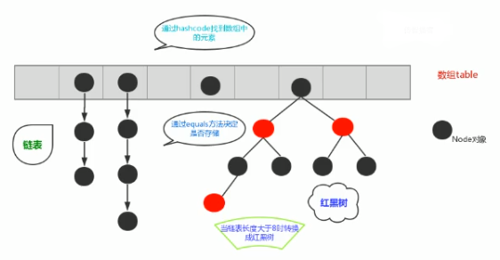
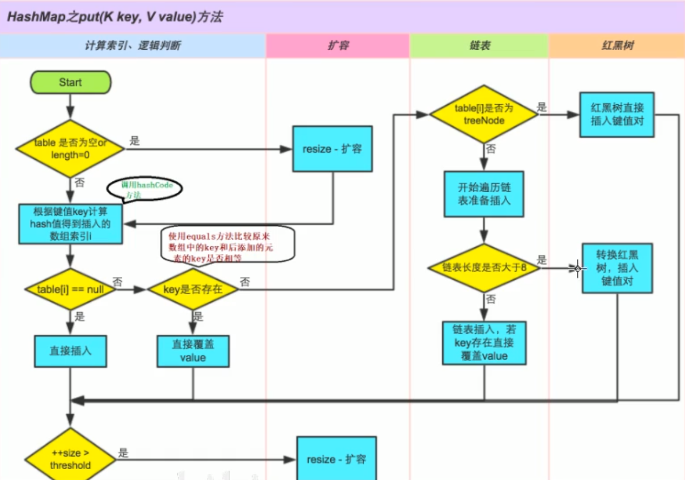
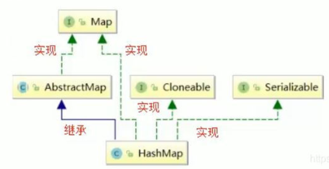

# HashMap
## HashMap特性

HashMap基于哈希表的Map接口实现，是以key-value存储形式存在，即主要用来存放键值对。

HashMap的实现不是同步的，这意味着它不是线程安全的。它的key、value都可以为null。此外，HashMap中的映射不是有序的。

**JDK1.8之前HashMap由数组＋链表组成的**，数组是HashMap的主体，链表则是主要为了解决hash冲突(两个对象调用的hashCode方法计算的哈希码值一致导致计算的数组索引值相同)而存在的("拉链法"解决冲突)。

**JDK1.8以后在解决哈希冲突时有了较大的变化，当链表的长度大于阈值(或者红黑树的边界值，默认为8）并且当前数组的长度大于64时，此时此索引位置上的所有数据改为使用红黑树存储。**

补充：将链表转换为红黑树前会判断，即使阈值大于8，但是数组长度小于64，此时并不会将链表转换为红黑树。而是选择进行数组扩容。
这样做的目的是因为数组比较小，尽量避免红黑树结构，这种情况下变为红黑树反而会降低效率，因为红黑树需要进行左旋，右旋，变色这些操作来保持平衡。同时数组长度小于64时，搜索时间相对要快些。所以综上所述为了提高性能减少搜索时间，底层在阈值大于8并且数组长度大于64时，链表才转换为红黑树。具体可以惨开treeifyBin方法。

当然虽然增加了红黑树作为底层数据结构，结构变得复杂了，但是阈值大于8并且数组长度大于64时，链表转换为红黑树时，效率也变的更高效。

**总结：**

1. **存取无序**
2. **建和值位置都可以是null，但是键的位置只能是一个null**
3. **键位置是唯一的，底层的数据结构控制键的**
4. **jdk1.8前数据结构是：数组＋链表  jdk1.8之后是：数组＋链表+红黑树**
5. **阈值(边界值)>8 并且数组长度大于64，才将链表转换为红黑树，变为红黑树的目的是为了高效的查询。**

## HashMap底层的数据结构

### 数据结构

数据结构就是存储数据的一种方式。

在JDK1.8之前HashMap由**数组+链表** 数据结构组成的。

在JDK1.8之后HashMap由**数组+链表+红黑树** 数据结构组成的。

ArrayList底层是数组数据结构，查询快增删慢。

LinkedList底层是双重链表数据结构，查询相对较慢，增删快

## 内存结构

1. HashMap<String,Integer> hm = new HashMap<>();

   当创建HashMap集合对象的时候，在jdk8前，构造方法中创建了一个默认长度是16的Entry[] table 用来存储键值对数据的。
   在jdk8以后不是在HashMap的构造方法底层创建数组了，是在第一次调用put方法时创建的数组，Node[] table 来存储键值对数据的。

2. 假设向哈希表中存储"kiki"-6,根据kiki调用String类中重写之后的hashCode()方法计算出值，然后结合数组长度采用某种算法(比如长度取余)计算出向Node数组中存储数据的空间的索引值。如果计算出的索引空间没有数据则直接将kiki-6存储到数组中。举例：计算出的索引是3

   * **面试题1**：哈希表底层采用何种算法计算哈希值？还有哪些算法可以计算出哈希值？

     底层采用的是key的hashCode方法的值结合数组长度进行无符号右移(>>>)、按位异或(^)、按位与(&)计算出索引

     还可以采用：平方取中法、取余数、伪随机数法

     那么为什么底层采用的无符号右移、按位异或、按位与而不是采用取余呢？其他计算方式效率比较低，而上述位运算效率较高。

3. 继续向插入数据kikis-18,假设kikis计算出的hashCode方法结合数组长度计算出的索引值也是3，那么此时数组空间不是null，此时底层就会比较kiki和kikis的hash值是否一致，如果不一致，则在空间上划出一个节点来存储键值对数据kikis-18
   ,这种方式称之为**拉链法**。

4. 假设向哈希表中存储数据kiki-20，那么首先根据kiki调用hashCode方法结合数组长度计算出索引值肯定是3，此时比较后存储的数据kiki和已经存在的数据的hash值是否相等，如果hash值相等， 此时发生**哈希碰撞（哈希冲突）**。

   那么底层会调用kiki所属类String中的equals方法比较两个内容是否相等：

     相等：则将后添加的数据的value覆盖之前的value

     不相等：那么继续向下和其他的数据的key进行比较以此类推，如果都不相等，则划出一个节点存储数据。

   如果节点长度即链表长度大于阈值8，并且数组长度大于64，则进行将链表变为红黑树。

   - **面试题2**：当两个对象的hashCode相等时会怎么样？

     会产生哈希碰撞，若key值的内容相同则替换旧的value，不然连接到链表后面，链表长度超过8就转换为红黑树结构存储。

   - **面试题3**：何时发生哈希碰撞、什么是哈希碰撞、如何解决哈希碰撞？

     只要两个元素的key计算的哈希码值相同就会发生哈希碰撞。jdk8前使用链表解决哈希碰撞。jdk8之后使用链表＋红黑树解决哈希碰撞。

   - **面试题4**：如果两个键的hashcode相同，如何存储键值对？

     hashcode相同，通过equals比较内容是都相同。

     相同则新的value覆盖之前的value

     不同则将新的键值对添加到哈希表中

5. 在不断添加数据的过程中，会涉及到扩容的问题，当超出临界值（且要存放的位置为空）时，扩容。默认的扩容方式：扩容为原来的2倍，并将原有的数据都复制过来。

6. 通过上述描述，当位于一个链表中的元素较多，即hash值相等但内容不相等的元素较多时，通过key值依次查找的效率较低。而jdk8中，哈希表的存储采用数组+链表+红黑树实现，当链表长度超过8且数组的长度大于64时，将链表转换为红黑树，这样就大大减少了查找时间。jdk8在哈希表引入红黑树的原因只是为了查找的效率更高。

   简单的来说，哈希表是由数组+链表+红黑树实现的。

   

   **但是这样的话问题又来了，传统的hashMap的缺点，jdk8为什么引入红黑树？这样结构不是更麻烦了吗，为何长度大于8要转成红黑树？**

   jdk8之前hashmap的实现时数组+链表，即使哈希算法取得再好，也很难达到元素百分百均匀分布。当HsahMap中有大量的元素都存放到同一个桶时，这个桶下有一条长长的链表，这个时候HashMap就相当于一个单链表，假如链表有n个元素，遍历的时间复杂度就是O(n)，完全失去的他的优势。针对这种情况，jdk8中引入了红黑树(查找时间复杂度O(logn))来优化这个问题。当链表长度很小的时候，即使遍历，速度也非常快，但是当链表长度不断变成，肯定会查询性能有一定的影响，所以才需要转换成红黑树。

   至于阈值为什么是8，应该去源码中查找原因。

7. 总结：

   

   说明：

   1. size表示HashMap中K-V的实时数量，注意这个不等于数组的长度
   2. treeshold(临界值)=capacity(容量)*loadFactor(加载因子)。这个值当前已占用数组长度的最大值。size超过这个临界值就重新resize(扩容)，扩容后的HashMap容量是之前容量的两倍。

## HashMap继承关系



```java
public class HashMap<K,V> extends AbstractMap<K,V> implements Map<K,V>,Cloneable,Serializable{

}
public abstract class AbstractMap<K,V> implements Map<K,v>{

}
```

说明：

* Serializable:说明HashMap可以序列化，反序列化
* Cloneable:说明HashMap是可以克隆的，创建并返回HashMap对象的一个副本。

补充：

上述代码中发现一个现象，面试的谈资（可以聊聊这个历史），HashMap继承了AbstractMap，而AbstractMap实现了Map，但是HashMap又实现了Map，这样是不是有点冗余？

答：据java集合框架的创始人Josh Bloch描述，这样的写法是一个错误。在java集合框架中，类似这样的写法很多，最开始写java集合框架的时候，他认为这样写，在某些地方可能是有价值的，直到他意识到错了。显然的，JDK的维护者，后来不认为这个小小的失误值得去修改，所以就这样存在下来了。


## HashMap集合类的成员变量

1. 序列化版本号

   ```java
   private static final long serialVersionUID = 362498820763181265L;
   ```

2. 集合的初始化容量（必须是2的N次方）

   ```java
   //默认的初始容量是16  ---1 << 4 相当于1*2的4次方---1*16
   static final int DEFAULT_INTTIAL_CAPACITY = 1 << 4;
   ```

   问题：为什么必须是2的n次幂？如果输入值不是2的幂比如10会怎么样？

   HashMap构造方法还可以指定集合的初始化容量大小：

   ```java
   HashMap(int initialCapacity)
   构造一个带指定初始容量和默认加载因子(0.75)的空 HashMap。
   ```

   根据上面的讲解我们已经知道，当向HashMap中添加一个元素的时候，需要根据key的Hash值，去确定其在数组中的具体位置。HashMap为了存取高效，要尽量较少碰撞，就是要尽量把数据分配均匀，每个链表长度大致相同，这个实现就在把数据存到哪个链表中的算法。

   这个算法实际就是取模，hash%length,计算机中直接求余效率不如位移运算(这点上述已经讲解)。所以源码中做了优化。使用hash&(length-1),而实际上hash%length等于hash&(length-1)的前提是length是2的n次幂。

   为什么这样能均匀分布减少碰撞呢？ 2的n次方实际就是1后面n个0，2的n次方-1实际就是n个1；

   举例：

   **说明：按位与运算：相同的二进制数位上，都是1的时候，结果为1，否则为零。**

   如果数组长度不是2的n次幂，计算出的索引特别容易相同，及其容易发生hash碰撞，导致其余数组空间很大程度上并没有存储数据，链表或红黑树过长，效率降低。

   小结：

   1.由上面可以看出，当我们根据key的hash确定其在数组的位置时，如果n为2的幂次方，可以保证数据的均匀插入，如果n不是2的幂次方，可能数组的一些位置永远不会插入数据，浪费数组空间，加大了哈希冲突。

   2.另一方面，一般我们可能会想通过%求余来确定位置，这样也可以，只不过性能不如&运算。而且当n是2的幂次方时：hash&(length-1) == hash % length 。

   3.因此，HashMap容量为2次幂的原因，就是为了数据的均匀分布，减少hash冲突，毕竟hash冲突越大，代表数组中一个链的长度越大，这样的话会降低hashmap的性能

   4.如果创建HashMap对象时，输入的数组长度是10，不是2的幂，HashMap通过一通位移运算和或运算得到的肯定是2的幂次数，并且是离那个数最近的数字。

