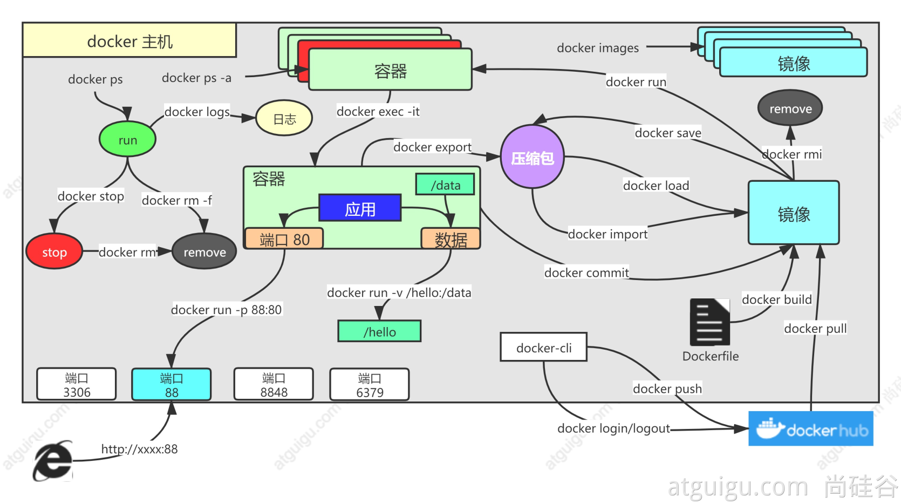

# Docker

## 架构


- Docker_Host：

- - 安装Docker的主机

- Docker Daemon：

- - 运行在Docker主机上的Docker后台进程

- Client：

- - 操作Docker主机的客户端（命令行、UI等）

- Registry：

- - 镜像仓库
  - Docker Hub

- Images：

- - 镜像，带环境打包好的程序，可以直接启动运行

- Containers：

- - 容器，由镜像启动起来正在运行中的程序

- 

## Docker安装[以CentOS7为例]

### 1.删除旧版本

```bash
sudo yum remove docker \
                  docker-client \
                  docker-client-latest \
                  docker-common \
                  docker-latest \
                  docker-latest-logrotate \
                  docker-logrotate \
                  docker-engine
```

### 2.使用yum安装

```bash
 sudo yum install -y yum-utils
 sudo yum-config-manager \
    --add-repo \
    https://download.docker.com/linux/centos/docker-ce.repo
 sudo yum install docker-ce docker-ce-cli containerd.io
```

### 3.启动

```bash
systemctl start docker
```

## 常用命令



### 1. 找镜像

去docker hub，找到需要的镜像

```bash
docker pull nginx  #下载最新版

镜像名:版本名（标签）

docker pull nginx:1.20.1


docker pull redis  #下载最新
docker pull redis:6.2.4

## 下载来的镜像都在本地
docker images  #查看所有镜像

redis = redis:latest

# 删除镜像
docker rmi 镜像名:版本号/镜像id
```

### 2.启动镜像

```bash
docker run [OPTIONS] IMAGE [COMMAND] [ARG...]

【docker run  设置项   镜像名  】 镜像启动运行的命令（镜像里面默认有的，一般不会写）

# -d：后台运行
# --restart=always: 开机自启
docker run --name=mynginx   -d  --restart=always -p  88:80   nginx

# 查看正在运行的容器
docker ps
# 查看所有
docker ps -a
# 删除停止的容器
docker rm  容器id/名字
docker rm -f mynginx   #强制删除正在运行中的

#停止容器
docker stop 容器id/名字
#再次启动
docker start 容器id/名字

#应用开机自启
docker update 容器id/名字 --restart=always
```

### 3.修改容器内容

#### 3.1方式一：进容器内部修改

```bash
# 进入容器内部的系统，修改容器内容
docker exec -it 容器id  /bin/bash
```

#### 3.2方式二：挂载数据到外部修改

```bash
docker run --name=mynginx   \
-d  --restart=always \
-p  88:80 -v /data/html:/usr/share/nginx/html:ro  \
nginx

# 修改页面只需要去 主机的 /data/html
```

### 4. 例子

#### 4.1MySQL

```bash
# 启动mysql
docker run -p 3306:3306 --name mysql_3306 -v /mydata/mysql/log:/var/log/mysql -v /mydata/mysql/data:/var/lib/mysql -v /mydata/mysql/conf:/etc/mysql -e MYSQL_ROOT_PASSWORD=123456 -d mysql:
```

#### 4.2Redis

```bash
# 启动redis 
docker run -p 16379:6379 --name redis_16379 -v /mydata/redis/data:/data -v /mydata/redis/conf/redis.conf:/etc/redis/redis.conf -d redis redis-server /etc/redis/redis.conf

# 进入redis-cli客户端
docker exec -it redis_16379  redis-cli
```

#### 4.3Nacos

```bash
docker  run --name nacos -d -p 18848:8848 --privileged=true --restart=always -e JVM_XMS=256m -e JVM_XMX=256m -e MODE=standalone -e PREFER_HOST_MODE=hostname -v /mydata/nacos/logs:/home/nacos/logs -v /mydata/nacos/init.d/custom.properties:/home/nacos/init.d/custom.properties nacos/nacos-server
```

### 5.提交改变

> 将自己修改好的镜像提交

```sh
docker commit [OPTIONS] CONTAINER [REPOSITORY[:TAG]]

docker commit -a "author string"  -m "首页变化" 341d81f7504f mynginx:v1.0

```

#### 镜像传输

```sh
# 将镜像保存成压缩包
docker save -o abc.tar guignginx:v1.0

# 别的机器加载这个镜像
docker load -i abc.tar
# 离线安装
```

### 6.push到远程仓库

> 推送镜像到docker hub；应用市场

```sh
docker tag local-image:tagname new-repo:tagname
docker push new-repo:tagname
```

```sh
# 把旧镜像的名字，改成仓库要求的新版名字
docker tag guignginx:v1.0 leifengyang/guignginx:v1.0

# 登录到docker hub
docker login       


docker logout（推送完成镜像后退出）

# 推送
docker push leifengyang/guignginx:v1.0


# 别的机器下载
docker pull leifengyang/guignginx:v1.0
```

### 7.补充

```sh
docker logs 容器名/id   排错

docker exec -it 容器id /bin/bash


# docker 经常修改nginx配置文件
docker run -d -p 80:80 \
-v /data/html:/usr/share/nginx/html:ro \
-v /data/conf/nginx.conf:/etc/nginx/nginx.conf \
--name mynginx-02 \
nginx


#把容器指定位置的东西复制出来 
docker cp 5eff66eec7e1:/etc/nginx/nginx.conf  /data/conf/nginx.conf
#把外面的内容复制到容器里面
docker cp  /data/conf/nginx.conf  5eff66eec7e1:/etc/nginx/nginx.conf
```


