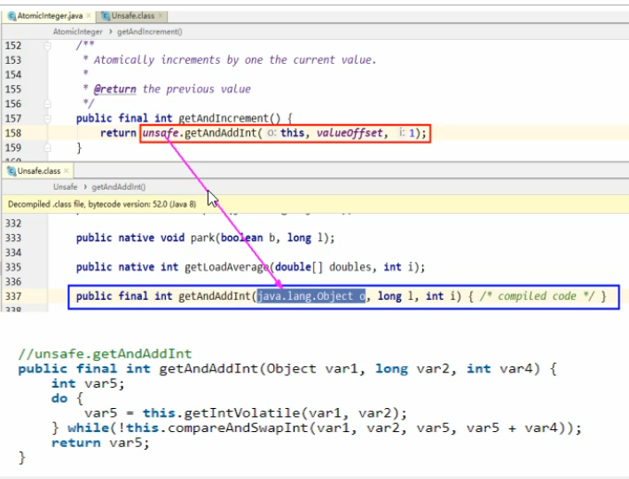

> CAS是什么?
>
> 比较并交换。一种乐观锁机制，如果对象当前值和期望值一样，那么则将对象的值设置成新值。和悲观锁不一样，它不需要抢占锁，它是一种尝试性的，能有效地提高效率，它的全称是 compareAndSwap ，是一条CPU并发原语，他依赖于硬件的原子操作实现。（原语的执行是连续的，在执行过程中不允许被终端，也就是说CAS是一条CPU原子指令，不会造成数据不一致的问题）
>
> 

```java
import java.util.concurrent.atomic.AtomicInteger;

/**
 * CAS是什么？
 *  compareAndSet 比较并交换。
 *
 */
public class CASDemo {
    public static void main(String[] args) {
        AtomicInteger atomicInteger = new AtomicInteger(1);
        //先真实值和期望值是否相同，然后再做修改
        boolean b = atomicInteger.compareAndSet(1, 2021);
        System.out.println(b+",当前值="+atomicInteger.get());
        //先真实值和期望值是否相同，然后再做修改
        boolean b2 = atomicInteger.compare AndSet(1, 1024);
        System.out.println(b2+",当前值="+atomicInteger.get());
    }
}
```

# CAS底层原理

```java
    /**
     * Atomically increments by one the current value.
     *
     * @return the previous value
     */
    public final int getAndIncrement() {
        //                        当前对象  内存偏移量
        return unsafe.getAndAddInt(this, valueOffset, 1);
    }    

```



do while 自旋

var1是AtomicInteger对象本身。

var2是对象值的引用地址。

var4需要变动的数量。

var5是用过var1 var2找出主内存中的真实的值。

用该对象当前的值与var5比较：

如果相同，更新var5+var4并且返回true

如果不同，继续取值然后再比较，直到更新完成。


假设线程A和线程B同时执行getAndAddInt操作（分别跑在不同的CPU上）：

1. AtomicInteger里面的value值原始为3，即主内存中的AtomicInteger的value是3，根据JMM模型，线程A和线程B各自持有一份值为3的副本分别在各自的工作内存；
2. 线程A通过getIntVolatile(var1,var2)拿到value的值为3，这时线程A被挂起。
3. 线程B也通过getIntVolatile(var1,var2)方法获取到value值3，此时刚好线程B没有被挂起并执行compareAndSwapInt方法比较内存值也为3，成功修改内存值为4，一切OK。
4. 这时线程A恢复，执行compareAndSwapInt方法比较，发现自己手里的值数字3和主内存的值数字4不一致，说明该值已经被其他线程抢先一步修改过了，那么线程A本次修改失败，重新读取重来一遍。
5. 线程A重新获取value值，因为变量value被volatile修饰，所以其他线程对它的修改，线程总是能看到，线程A继续执行compareAndSwapInt进行比较并交换，直到成功。

# Unsafe


Unsafe类使Java拥有了像C语言的指针一样操作内存空间的能力，同时也带来了指针的问题。过度的使用Unsafe类会使得出错的几率变大，因此Java官方并不建议使用的，官方文档也几乎没有。Oracle正在计划从Java 9中去掉Unsafe类。Unsafe类的方法都是native修饰的，也就是说Unsafe类中的方法都直接调用操作系统底层资源执行响应任务。

我们先来看看Unsafe的初始化方法，这是一个单例模式：

```java
private Unsafe() {}
private static final Unsafe theUnsafe = new Unsafe();
public static Unsafe getUnsafe() {
    Class cc = sun.reflect.Reflection.getCallerClass(2);
    if (cc.getClassLoader() != null)
        throw new SecurityException("Unsafe");
    return theUnsafe;
}
```

方法中，限制了它的 ClassLoader，如果这个方法的调用实例不是由Boot ClassLoader加载的，则会报错。可以做一个实验，因为Java源码中的类，除扩展包都是由Boot ClassLoader加载的，如果我们new一个Object对象，查看Object对象的ClassLoader，它一定是null。所以，正常情况下开发者无法直接使用Unsafe ，如果需要使用它，则需要利用反射：

```java
private static Unsafe getUnsafe(){
    try {
        Field field = Unsafe.class.getDeclaredField("theUnsafe");
        field.setAccessible(true);
        Unsafe unsafe = (Unsafe) field.get(null);
        return unsafe;
    } catch (Exception e) {
        e.printStackTrace();
    }
    return null;
}
```

**变量valueOffset**

表示该变量在内存的偏移地址，因为Unsafe是根据内存偏移地址获取数据的。

**变量value**

用volatile修饰，保证了多线程之间的内存可见性。

## synchorized和cas的区别

synchorized加锁，在同一时间内只允许一个进程进行访问。cas是自旋的思想，能够保证并发性和一致性。

# 总结

**CAS（CompareAndSwap）**，比较当前工作内存中的值和主内存中的值，如果相同则执行规定操作，

否则继续比较直到主内存和工作内存中的值一致为止。

**CAS应用**，CAS有3个操作数，内存值V，旧的预期值A，要修改的更新值B。当且仅当预期值A和内存值V相同时，将内存值V修改为B，否则什么都不做。

#  CAS缺点

1. 循环时间长，开销很大

   getAndAddInt方法执行时，有个do while，如果CAS失败，会一直进行尝试，如果长时间一直不成功，可能会给CPU带来很大的开销。

2. 只能保证一个共享变量的原子操作

   当对一个共享变量执行操作时，我们可以使用循环CAS的方式保证原子操作，但是，对多个共享变量，循环CAS就无法保证操作的原子性，这个时候就可以用锁来保证原子性。

3. ABA问题