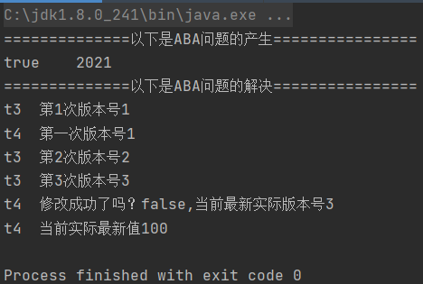

# ABA问题

CAS会导致ABA问题。

CAS算法实现一个重要前提需要取出内存中某时刻的数据并在当下时刻比较并替换，那么在这个时间差会导致数据的变化。

比如说一个线程one从内存位置V取出A，这时候另一个线程two也从内存中取出A，并且线程two进行了一些操作将值变成了B，然后线程two又将V位置的数据变成A，这时候线程one进行CAS操作发现内存中仍是A，然后线程one操作成功。

*尽管线程one的CAS操作成功，但是不代表这个过程就是没有问题的。*

# AtomicReference原子引用

```java

import lombok.AllArgsConstructor;
import lombok.Data;
import lombok.NoArgsConstructor;
import lombok.ToString;

import java.util.concurrent.atomic.AtomicReference;

@Data
@ToString
@AllArgsConstructor
@NoArgsConstructor
class User{
    String username;
    int age;
}

public class AtomicReferenceDemo {
    public static void main(String[] args) {

        User z3 = new User("z3",32);
        User l4 = new User("l4",34);

        AtomicReference<User> atomicReference = new AtomicReference<>();
        atomicReference.set(z3);
        System.out.println(atomicReference.compareAndSet(z3, l4) + "\t" + atomicReference.get().toString());
        System.out.println(atomicReference.compareAndSet(z3, l4) + "\t" + atomicReference.get().toString());
    }
}
```

# 时间戳原子引用

**解决ABA问题**？ 理解原子引用+新增一种机制，那就是修改版本号（类似时间戳）

```

import java.util.concurrent.atomic.AtomicReference;
import java.util.concurrent.atomic.AtomicStampedReference;

// ABA问题的解决   AtomicStampReference
public class ABADemo {

    static AtomicReference<Integer> atomicReference = new AtomicReference<>(100);
    static AtomicStampedReference<Integer> atomicStampedReference = new AtomicStampedReference<>(100,1);
    public static void main(String[] args) throws Exception{
        System.out.println("==============以下是ABA问题的产生================");
        new Thread(()->{
            atomicReference.compareAndSet(100, 101);
            atomicReference.compareAndSet(101, 100);
        },"t1").start();

        new Thread(()->{
            // 暂停一秒，保证t1线程完成了ABA操作
            try { Thread.sleep(1000); } catch (InterruptedException e) { e.printStackTrace(); }
            System.out.println(atomicReference.compareAndSet(100, 2021) + "\t" + atomicReference.get());
        },"t2").start();

        Thread.sleep(2000);
        System.out.println("==============以下是ABA问题的解决================");
        new Thread(()->{
            int stamp = atomicStampedReference.getStamp();//初始版本号
            System.out.println(Thread.currentThread().getName() + "\t" + "第1次版本号" + stamp);
            // 暂停一秒t3  保证t4已经拿到版本号了
            try { Thread.sleep(1000); } catch (InterruptedException e) { e.printStackTrace(); }
            atomicStampedReference.compareAndSet(100, 101, atomicStampedReference.getStamp(), atomicStampedReference.getStamp() + 1);
            System.out.println(Thread.currentThread().getName() + "\t" + "第2次版本号" + atomicStampedReference.getStamp());
            atomicStampedReference.compareAndSet(101, 100, atomicStampedReference.getStamp(), atomicStampedReference.getStamp() + 1);
            System.out.println(Thread.currentThread().getName() + "\t" + "第3次版本号" + atomicStampedReference.getStamp());
        },"t3").start();
        new Thread(()->{
            int stamp = atomicStampedReference.getStamp();//初始版本号
            System.out.println(Thread.currentThread().getName() + "\t" + "第一次版本号" + stamp);
            // 暂停三秒t4 保证t3完成一次aba操作
            try { Thread.sleep(3000); } catch (InterruptedException e) { e.printStackTrace(); }
            boolean b = atomicStampedReference.compareAndSet(100, 2019, stamp, stamp + 1);
            System.out.println(Thread.currentThread().getName() + "\t" + "修改成功了吗？" + b + ",当前最新实际版本号" + atomicStampedReference.getStamp());
            System.out.println(Thread.currentThread().getName() + "\t当前实际最新值" +atomicStampedReference.getReference());
        },"t4").start();
    }
}

```



