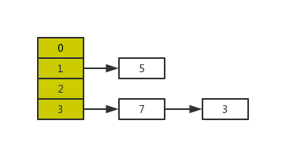
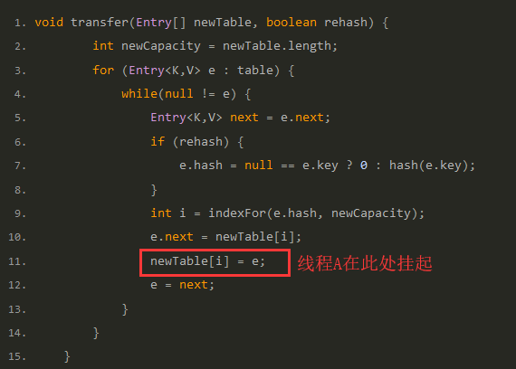
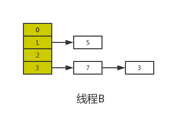
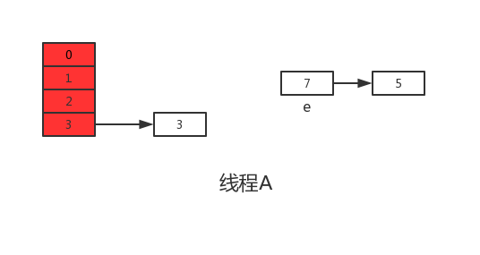
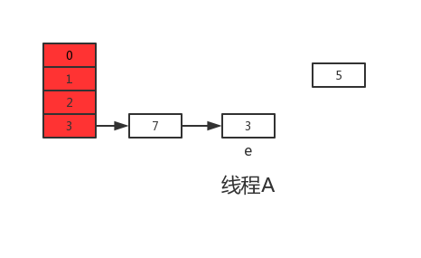
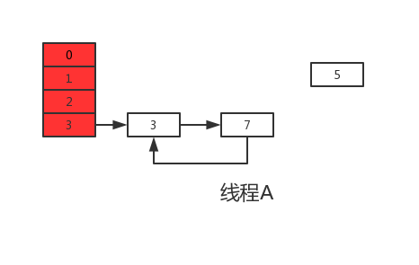

# 集合类线程不安全

## ArraysList线程不安全

**ArrayList部分源码**

```java
public class ArrayList<E> extends AbstractList<E>
        implements List<E>, RandomAccess, Cloneable, java.io.Serializable
{
    /**
     * 列表元素集合数组
     * 如果新建ArrayList对象时没有指定大小，那么会将EMPTY_ELEMENTDATA赋值给elementData，
     * 并在第一次添加元素时，将列表容量设置为DEFAULT_CAPACITY 
     */
    transient Object[] elementData; 

    /**
     * 列表大小，elementData中存储的元素个数
     */
    private int size;
    
    public boolean add(E e) {
    /**
     * 添加一个元素时，做了如下两步操作
     * 1.判断列表的capacity容量是否足够，是否需要扩容
     * 2.真正将元素放在列表的元素数组里面
     */
    ensureCapacityInternal(size + 1);  // Increments modCount!!
    elementData[size++] = e;
    return true;
}
    
}
```

*在多个线程进行add操作时可能会导致elementData数组越界*。

- 列表大小为9，即size=9
- 线程A开始进入add方法，这时它获取到size的值为9，调用ensureCapacityInternal方法进行容量判断。
- 线程B此时也进入add方法，它获取到size的值也为9，也开始调用ensureCapacityInternal方法。
- 线程A发现需求大小为10，而elementData的大小就为10，可以容纳。于是它不再扩容，返回。
- 线程B也发现需求大小为10，也可以容纳，返回。
- 线程A开始进行设置值操作， elementData[size++] = e 操作。此时size变为10。
- 线程B也开始进行设置值操作，它尝试设置elementData[10] = e，而elementData没有进行过扩容，它的下标最大为9。于是此时会报出一个数组越界的异常ArrayIndexOutOfBoundsException.

*一个线程的值覆盖另一个线程添加的值*，第二步 elementData[size++] = e 设置值的操作同样会导致线程不安全。从这儿可以看出，这步操作也不是一个原子操作，它由如下两步操作构成：

```java
elementData[size] = e;
size = size + 1;
```

在单线程执行这两条代码时没有任何问题，但是当多线程环境下执行时，可能就会发生一个线程的值覆盖另一个线程添加的值，具体逻辑如下：

- 列表大小为0，即size=0
- 线程A开始添加一个元素，值为A。此时它执行第一条操作，将A放在了elementData下标为0的位置上。
- 接着线程B刚好也要开始添加一个值为B的元素，且走到了第一步操作。此时线程B获取到size的值依然为0，于是它将B也放在了elementData下标为0的位置上。
- 线程A开始将size的值增加为1
- 线程B开始将size的值增加为2

这样线程AB执行完毕后，理想中情况为size为2，elementData下标0的位置为A，下标1的位置为B。而实际情况变成了size为2，elementData下标为0的位置变成了B，下标1的位置上什么都没有。并且后续除非使用set方法修改此位置的值，否则将一直为null，因为size为2，添加元素时会从下标为2的位置上开始。

**线程不安全演示**

```java
List<String> list = new ArrayList<>();
        for (int i = 0; i < 30; i++) {
            new Thread(()->{
                list.add(UUID.randomUUID().toString().replaceAll("-", "").substring(0, 8));
                System.out.println(list);
            },i+1+"").start();
        }
        /*
         * 1 故障现象
         *  java.util.ConcurrentModificationException 并发修改异常
         * 2 导致原因
         *  并发争抢修改导致
         * 3 解决方案
         *    1）使用Vector；加锁保证了数据一致性 add方法加了sync关键字 但并发性急剧下降
         *    2）Collections.synchronizedList(new ArrayList<>());       https://www.cnblogs.com/lujiahua/p/11408789.html
         *    3）java.util.concurrent.CopyOnWriteArrayList  写时复制
         * 4 优化建议
         */
```

## CopyOnWriteArrayList

*java.util.concurrent.CopyOnWriteArrayList  写时复制*

复制出一个新的Object[] newElements ，然后新的容器Object[] newElements里添加元素，然后再将原容器的引用指向新的容器 setArray(newElements) 。这样做的好处是可以对CopyOnWrite容器进行并发的读，而不需要加锁，因为当前容器不会添加任何元素。所以CopyOnWrite容器也是一种读写分离的思想，读和写不同的容器。

```java
     /**
     * Appends the specified element to the end of this list.
     *
     * @param e element to be appended to this list
     * @return {@code true} (as specified by {@link Collection#add})
     */
    public boolean add(E e) {
        final ReentrantLock lock = this.lock;
        lock.lock();   // 加锁，保证线程独有
        try {
            Object[] elements = getArray();  // 获取当前list的所有元素的数组
            int len = elements.length;       // 得到数组的长度
            Object[] newElements = Arrays.copyOf(elements, len + 1);  // 复制出一个新的，长度=原数组长度+1
            newElements[len] = e;  // 把要插入的元素放到最后一位
            setArray(newElements); // 再set进当前对象
            return true;           // 操作成功，返回true
        } finally {
            lock.unlock();  // 释放锁
        }
    }
```

## HashSet线程不安全

HashSet的底层是HashMap，HashSet的add方法：map.put(e,PRESENT)。hashset的add方法实际上是只关心map的key，value是一个Object类型的常量。

## CopyOnWriteArraySet线程安全

## HashMap线程不安全

HashMap的线程不安全体现在会造成死循环、数据丢失、数据覆盖这些问题。其中死循环和数据丢失是在JDK1.7中出现的问题，在JDK1.8中已经得到解决，然而1.8中仍会有数据覆盖这样的问题。

**扩容引发的线程不安全**

`HashMap`的线程不安全主要是发生在扩容函数中，即根源是在**transfer函数**中，JDK1.7中`HashMap`的`transfer`函数如下：

```jave
void transfer(Entry[] newTable, boolean rehash) {
        int newCapacity = newTable.length;
        for (Entry<K,V> e : table) {
            while(null != e) {
                Entry<K,V> next = e.next;
                if (rehash) {
                    e.hash = null == e.key ? 0 : hash(e.key);
                }
                int i = indexFor(e.hash, newCapacity);
                e.next = newTable[i];
                newTable[i] = e;
                e = next;
            }
        }
    }
```

这段代码是`HashMap`的扩容操作，重新定位每个桶的下标，并采用头插法将元素迁移到新数组中。头插法会将链表的顺序翻转，这也是形成死循环的关键点。理解了头插法后再继续往下看是如何造成死循环以及数据丢失的。

扩容造成死循环和数据丢失的分析过程

假设现在有两个线程A、B同时对下面这个`HashMap`进行扩容操作：

正常扩容后的结果是下面这样的：

但是当线程A执行到上面`transfer`函数的第11行代码时，CPU时间片耗尽，线程A被挂起。即如下图中位置所示：



此时线程A中：e=3、next=7、e.next=null

当线程A的时间片耗尽后，CPU开始执行线程B，并在线程B中成功的完成了数据迁移

重点来了，根据Java内存模式可知，线程B执行完数据迁移后，此时主内存中`newTable`和`table`都是最新的，也就是说：7.next=3、3.next=null。

随后线程A获得CPU时间片继续执行`newTable[i] = e`，将3放入新数组对应的位置，执行完此轮循环后线程A的情况如下：

接着继续执行下一轮循环，此时e=7，从主内存中读取e.next时发现主内存中7.next=3，于是乎next=3，并将7采用头插法的方式放入新数组中，并继续执行完此轮循环，结果如下：

执行下一次循环可以发现，next=e.next=null，所以此轮循环将会是最后一轮循环。接下来当执行完e.next=newTable[i]即3.next=7后，3和7之间就相互连接了，当执行完newTable[i]=e后，3被头插法重新插入到链表中，执行结果如下图所示：

上面说了此时e.next=null即next=null，当执行完e=null后，将不会进行下一轮循环。到此线程A、B的扩容操作完成，很明显当线程A执行完后，`HashMap`中出现了环形结构，当在以后对该`HashMap`进行操作时会出现死循环。

并且从上图可以发现，元素5在扩容期间被莫名的丢失了，这就发生了数据丢失的问题。

**JDK1.8中的线程不安全**

根据上面JDK1.7出现的问题，在JDK1.8中已经得到了很好的解决，如果你去阅读1.8的源码会发现找不到`transfer`函数，因为JDK1.8直接在`resize`函数中完成了数据迁移。另外说一句，JDK1.8在进行元素插入时使用的是尾插法。

为什么说JDK1.8会出现数据覆盖的情况喃，我们来看一下下面这段JDK1.8中的put操作代码：

```java
final V putVal(int hash, K key, V value, boolean onlyIfAbsent,
                   boolean evict) {
        Node<K,V>[] tab; Node<K,V> p; int n, i;
        if ((tab = table) == null || (n = tab.length) == 0)
            n = (tab = resize()).length;
        if ((p = tab[i = (n - 1) & hash]) == null) // 如果没有hash碰撞则直接插入元素
            tab[i] = newNode(hash, key, value, null);
        else {
            Node<K,V> e; K k;
            if (p.hash == hash &&
                ((k = p.key) == key || (key != null && key.equals(k))))
                e = p;
            else if (p instanceof TreeNode)
                e = ((TreeNode<K,V>)p).putTreeVal(this, tab, hash, key, value);
            else {
                for (int binCount = 0; ; ++binCount) {
                    if ((e = p.next) == null) {
                        p.next = newNode(hash, key, value, null);
                        if (binCount >= TREEIFY_THRESHOLD - 1) // -1 for 1st
                            treeifyBin(tab, hash);
                        break;
                    }
                    if (e.hash == hash &&
                        ((k = e.key) == key || (key != null && key.equals(k))))
                        break;
                    p = e;
                }
            }
            if (e != null) { // existing mapping for key
                V oldValue = e.value;
                if (!onlyIfAbsent || oldValue == null)
                    e.value = value;
                afterNodeAccess(e);
                return oldValue;
            }
        }
        ++modCount;
        if (++size > threshold)
            resize();
        afterNodeInsertion(evict);
        return null;
    }
```

其中第六行代码是判断是否出现hash碰撞，假设两个线程A、B都在进行put操作，并且hash函数计算出的插入下标是相同的，当线程A执行完第六行代码后由于时间片耗尽导致被挂起，而线程B得到时间片后在该下标处插入了元素，完成了正常的插入，然后线程A获得时间片，由于之前已经进行了hash碰撞的判断，所有此时不会再进行判断，而是直接进行插入，这就导致了线程B插入的数据被线程A覆盖了，从而线程不安全。

除此之前，还有就是代码的第38行处有个`++size`，我们这样想，还是线程A、B，这两个线程同时进行put操作时，假设当前`HashMap`的zise大小为10，当线程A执行到第38行代码时，从主内存中获得size的值为10后准备进行+1操作，但是由于时间片耗尽只好让出CPU，线程B快乐的拿到CPU还是从主内存中拿到size的值10进行+1操作，完成了put操作并将size=11写回主内存，然后线程A再次拿到CPU并继续执行(此时size的值仍为10)，当执行完put操作后，还是将size=11写回内存，此时，线程A、B都执行了一次put操作，但是size的值只增加了1，所有说还是由于数据覆盖又导致了线程不安全。

**总结**

`HashMap`的线程不安全主要体现在下面两个方面：
1.在JDK1.7中，当并发执行扩容操作时会造成环形链和数据丢失的情况。
2.在JDK1.8中，在并发执行put操作时会发生数据覆盖的情况。

## ConcurrentHashMap线程安全

