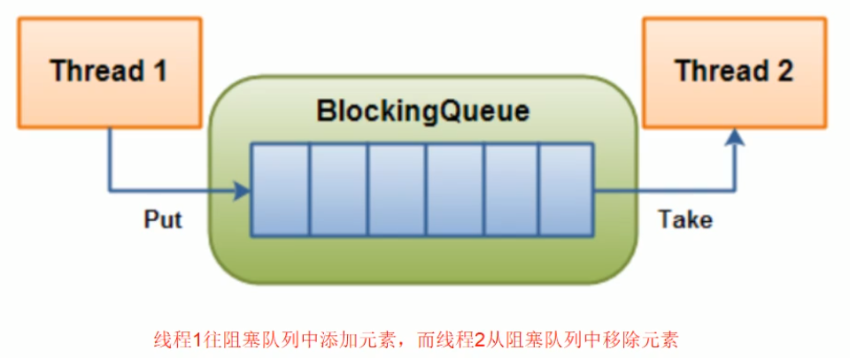
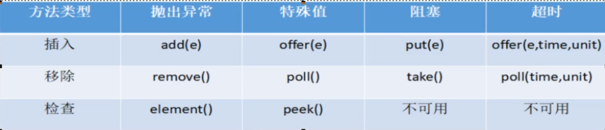
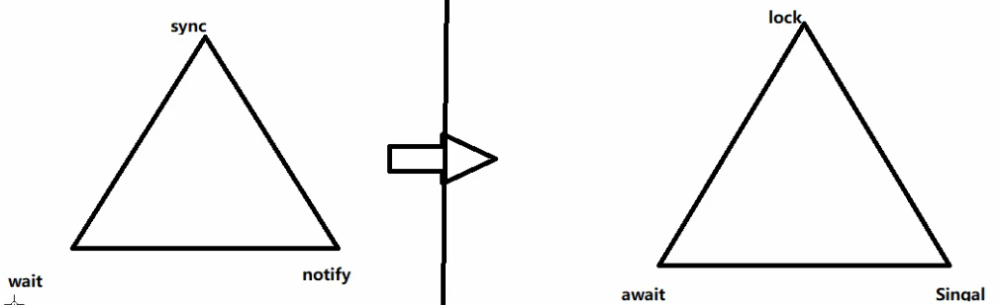

# 阻塞队列

## 是什么？

阻塞队列，顾名思义，首先它是一个队列，而一个阻塞队列在数据结构中所起的作用大致如下图所示：



当阻塞队列是空时，从队列中获取元素的操作将会被阻塞。

当阻塞队列是满时，往队列中添加元素的操作将会被阻塞。

试图从空的阻塞队列中获取元素的线程将会被阻塞，直到其他线程往空的队列插入新的元素。

同样，试图往已满的阻塞队列中添加新元素的线程同样也会被阻塞，直到其他的线程从队列中移除一个或者多个元素或者完全清空队列后使队列变得空闲起来并后续新增。

## 为什么用？好处？

在多线程领域：所谓阻塞，就是在某些情况下会挂起线程（即阻塞），一旦条件满足，被挂起的线程又会自动被唤醒。

为什么需要BlockingQueue：好处是我们不需要关心什么时候需要阻塞线程，什么时候需要唤醒线程。这一切BlockingQueue已经实现了。

在java.util.concurrent包发布以前，在多线程环境下，都需要手动实现这些细节，尤其还要兼顾效率和线程安全，而这会给我们的程序带来不小的负责度。

## BlockingQueue的核心方法



| 名称     | 说明                                                         |
| -------- | ------------------------------------------------------------ |
| 抛出异常 | 当阻塞队列满时,再往队列里面add插入元素会抛IllegalStateException: Queue full <br/>当阻塞队列空时,再往队列Remove元素时候回抛出NoSuchElementException |
| 特殊值   | 插入方法,成功返回true,失败返回false<br/>移除方法,成功返回元素,队列里面没有就返回null |
| 一直阻塞 | 当阻塞队列满时,生产者继续往队列里面put元素,队列会一直阻塞直到put数据or响应中断退出<br/>当阻塞队列空时,消费者试图从队列take元素,队列会一直阻塞消费者线程直到队列可用. |
| 超时退出 | 当阻塞队列满时,队列会阻塞生产者线程一定时间,超过后限时后生产者线程就会退出 |


## 架构梳理+种类分析

### 架构介绍


### 种类分析

**ArrayBlockingQueue: 由数组结构组成的有界阻塞队列.**

**LinkedBlockingQueue: 由链表结构组成的有界(但大小默认值Integer.MAX_VALUE)阻塞队列.**

PriorityBlockingQueue:支持优先级排序的无界阻塞队列.

DelayQueue: 使用优先级队列实现的延迟无界阻塞队列.

LinkedTransferQueue:由链表结构组成的无界阻塞队列.

LinkedBlocking**Deque**:由了解结构组成的双向阻塞队列.

**SynchronousQueue:不存储元素的阻塞队列,也即是单个元素的队列.**

> SynchronousQueue没有容量,与其他BlcokingQueue不同,SynchronousQueue是一个不存储元素的BlcokingQueue,每个put操作必须要等待一个take操作,否则不能继续添加元素,反之亦然.

## 用在哪里

### 生产者、消费者模式

**传统版**



```java

import java.util.concurrent.locks.Condition;
import java.util.concurrent.locks.Lock;
import java.util.concurrent.locks.ReentrantLock;

class ShareData{
    private int number = 0;

    private Lock lock = new ReentrantLock();

    private Condition condition = lock.newCondition();

    public void increment()  {
        lock.lock();
        try {
            // 判断
            while (number != 0) {
                // 等待  不能生产
                condition.await();
            }
            // 干活
            number++;
            System.out.println(Thread.currentThread().getName() + "\t" + number);
            // 通知唤醒
            condition.signalAll();
        } catch (InterruptedException e) {
            e.printStackTrace();
        } finally {
            lock.unlock();
        }
    }

    public void decrement()  {
        lock.lock();
        try {
            // 判断
            while (number == 0) {
                // 等待  不能消费
                condition.await();
            }
            // 干活
            number--;
            System.out.println(Thread.currentThread().getName() + "\t" + number);
            // 通知唤醒
            condition.signalAll();
        } catch (InterruptedException e) {
            e.printStackTrace();
        } finally {
            lock.unlock();
        }
    }
}

/**
 * 一个初始值为0的变量，两个线程对其交替操作，一个加1 一个减1 循环5次
 *
 * 1 线程操作资源类
 * 2 判断干活通知
 * 3 防止虚假唤醒
 */
public class ProdConsumerTraditionDemo {

    public static void main(String[] args) {
        ShareData shareData = new ShareData();
        new Thread(()->{
            for (int i = 0; i < 5; i++) {
                shareData.increment();
            }
        },"a").start();
        new Thread(()->{
            for (int i = 0; i < 5; i++) {
                shareData.decrement();
            }
        },"b").start();
    }
}
```


### 线程池

### 消息中间件