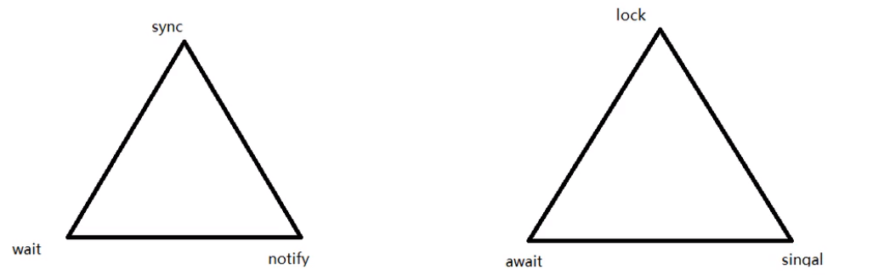

*synchronzed和Lock有什么区别？Lock有什么好处？举例？*

1. **原始构成**

   synchronized是关键字，属于JVM层面，

   ​	monitorenter（底层是通过monitor对象来完成，其实wait、notify等方法也依赖于monitor对象只有在同步方法中才能调wait、notify等方法）

   ​	monitorexit

   Lock是Api层面，是java.util.concurrent.locks.Lock的锁

2. **使用方法**

  synchronized  不需要用户手动去释放锁，当synchronized代码执行完后系统会自动让线程释放对锁的占用
  
  ReententLock则需要用户去主动释放锁（需要lock()和unlock()方法配合try/finally语句块），这就有可能导致出现死锁的现象。
  
3. **等待是否可中断**

   synchronized不可中断，除非抛出异常或者正常运行完成

   lock是可以中断的 1)设置超时方法tryLock(long timeout,TimeUnit unit)  2)LockInterruptibly()放代码块中，调用interrupt()方法可中断

4. **加锁是否公平**

   synchronized是非公平锁

   ReententLock两者都可以，默认非公平锁，构造器可传入Boolean参数（true为公平，false非公平）

5. **锁绑定多个条件Condition** (Lock有什么好处:精确唤醒)

  synchronized没有：synchronized不支持精确唤醒，只能随机唤醒或者是唤醒全部线程
  
  ReententLock用来实现分组唤醒需要唤醒的线程们，可以精确唤醒，而不是像synchronized要么随机唤醒要么全部唤醒线程。

代码：

```java
import java.util.concurrent.locks.Condition;
import java.util.concurrent.locks.Lock;
import java.util.concurrent.locks.ReentrantLock;

/*
题目：多线程之间按顺序调用，实现A->B->C三个线程启动，如下：
     AA打印5次,BB打印10次,CC打印15次
     ...(10轮)
 */
class ShareResource{
    private int number = 1;//A:1 B:2 C:3

    private Lock lock = new ReentrantLock();

    private Condition c1 = lock.newCondition();
    private Condition c2 = lock.newCondition();
    private Condition c3 = lock.newCondition();

    public void print5() {
        lock.lock();
        try {
            // 1 判断
            while (number != 1) {
                c1.await();
            }
            // 2 干活
            for (int i = 0; i < 5; i++) {
                System.out.println(Thread.currentThread().getName() + "\t" + i);
            }
            // 3 通知
            number = 2;
            c2.signal();
        } catch (InterruptedException e) {
            e.printStackTrace();
        } finally {
            lock.unlock();
        }
    }
    public void print10() {
        lock.lock();
        try {
            // 1 判断
            while (number != 2) {
                c2.await();
            }
            // 2 干活
            for (int i = 0; i < 10; i++) {
                System.out.println(Thread.currentThread().getName() + "\t" + i);
            }
            // 3 通知
            number = 3;
            c3.signal();
        } catch (InterruptedException e) {
            e.printStackTrace();
        } finally {
            lock.unlock();
        }
    }
    public void print15() {
        lock.lock();
        try {
            // 1 判断
            while (number != 3) {
                c3.await();
            }
            // 2 干活
            for (int i = 0; i < 15; i++) {
                System.out.println(Thread.currentThread().getName() + "\t" + i);
            }
            // 3 通知
            number = 1;
            c1.signal();
        } catch (InterruptedException e) {
            e.printStackTrace();
        } finally {
            lock.unlock();
        }
    }
}
public class SynchronizedAndReentrantLockDemo {

    public static void main(String[] args) {
        ShareResource shareResource = new ShareResource();
        new Thread(() -> {
            for (int i = 0; i < 10; i++) {
                shareResource.print5();
            }
        }, "A").start();
        new Thread(() -> {
            for (int i = 0; i < 10; i++) {
                shareResource.print10();
            }
        }, "B").start();
        new Thread(() -> {
            for (int i = 0; i < 10; i++) {
                shareResource.print15();
            }
        }, "C").start();
    }
}
```

