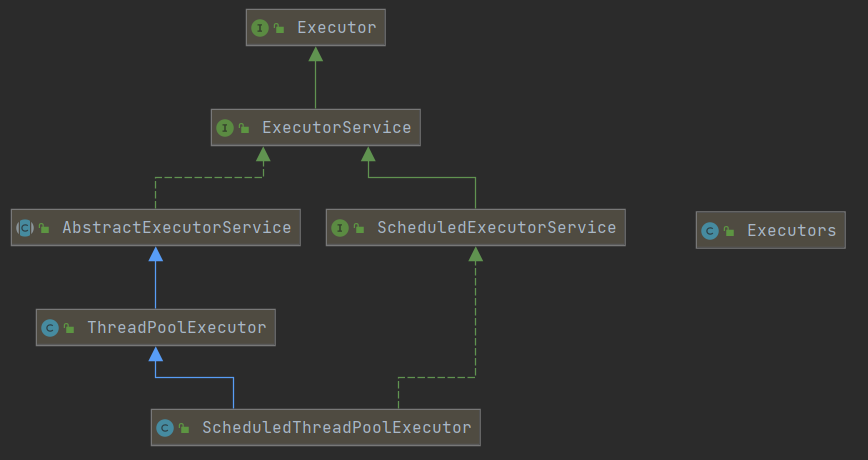

# 线程池

**为什么使用线程池？有什么优势**

线程池做的工作主要是控制运行线程的数量，**处理过程中将任务放入队列**，然后在线程创建后启动这些任务，**如果线程数量超过了最大数量的线程排队等候**，等其他线程执行完毕，再从队列中取出任务来运行。

他的主要特点为：**线程复用；控制最大并发数；管理线程。**

第一：降低资源消耗。通过重复利用已创建的线程降低线程创建和销毁造成的资源消耗。

第二：提高响应速度。当任务到达时，任务可以不需要的等到线程创建就能立即执行。

第三：提高线程的可管理性。线程是稀缺资源，如果无限制的创建，不仅会消耗系统的资源，还会降低系统的稳定性，使用线程池可以进行统一的分配，调优和监控。

### 线程池如何使用？

##### 架构说明

Java中的线程池是通过Executor框架实现的，该框架中用到了Executor，Executors，ExecutorService，ThreadPoolExecutor这几个类。



##### 编码实现

*了解*

Executors.newScheduledThreadPool()

java8新出的Executors.newWorkStealingPool(int)，可以使用目前机器上可用的处理器作为他的并行级别

***重点***

Executors.newFixedThreadPool(int)
：固定数量的线程  执行长期的任务，性能好很多

```java
public static ExecutorService newFixedThreadPool(int nThreads) {
        return new ThreadPoolExecutor(nThreads, nThreads,
                                      0L, TimeUnit.MILLISECONDS,
                                      new LinkedBlockingQueue<Runnable>());
}
/**
*主要特点如下：
*1.创建一个定长线程池，可控制线程最大并发数，超出的线程会在队列中等待。
*2.newFixedThreadPool创建的线程池corePoolSize和maximumPoolSize值是相等的，它使用的LinkedBlockingQueue。
*/
```


Executors.newSingleThreadExecutor()
：一个线程池中只有一个线程 一个任务一个任务执行的场景

```java
public static ExecutorService newSingleThreadExecutor() {
        return new FinalizableDelegatedExecutorService
            (new ThreadPoolExecutor(1, 1,
                                    0L, TimeUnit.MILLISECONDS,
                                    new LinkedBlockingQueue<Runnable>()));
}
/**
*主要特点如下：
*1.创建一个单线程化的线程池，他只会用唯一的工作线程来执行任务，保证所有任务按照顺序执行。
*2.newSingleThreadExecutor创建的线程池corePoolSize和maximumPoolSize值都是1，它使用的LinkedBlockingQueue。
*/
```


Executors.newCachedThreadPool()：一池多线程  适用：执行很多短期异步的小程序或者负载较轻的服务器

```java
public static ExecutorService newCachedThreadPool() {
    return new ThreadPoolExecutor(0, Integer.MAX_VALUE,
                                  60L, TimeUnit.SECONDS,
                                  new SynchronousQueue<Runnable>());
}
/**
*主要特点如下：
*1.创建一个可缓存线程池，如果线程池长度超过处理需要，可灵活回收线程，若无可回收，则新建线程。
*2.newCachedThreadPool创建的线程池将corePoolSize设置为0，将maximumPoolSize设置为Integer.MAX_VALUE，使用的SynchronousQueue，也就是说来了任务就创建线程运行，当线程空闲超过60秒，就销毁线程
*/
```

###### demo

```java

import java.util.concurrent.ExecutorService;
import java.util.concurrent.Executors;

/**
 * 第四种获得/使用Java多线程的方式：线程池
 */
public class MyThreadPoolDemo {

    public static void main(String[] args) {
        // cpu核心数
        int availableProcessors = Runtime.getRuntime().availableProcessors();

        // ======创建:常用的3个
        // 固定数量的线程 5个线程
        ExecutorService threadPool = Executors.newFixedThreadPool(5);
        // 一个线程池中只有一个线程
        ExecutorService threadPool2 = Executors.newSingleThreadExecutor();
        // 一个线程池N个线程
        ExecutorService threadPool3 = Executors.newCachedThreadPool();

        // ======使用
        // 模拟100个任务由5个线程处理
        try {
            for (int i = 0; i < 100; i++) {
                // 没有返回值的Runnable接口
                threadPool.execute(()-> System.out.println(Thread.currentThread().getName()+"\t executing"));
            }
            // 有返回值的Callable接口
            //threadPool.submit();
        } catch (Exception e) {

        } finally {
            // 一定要记得关闭
            threadPool.shutdown();
        }
    }
}
```


##### ThreadPoolExecutor的重要参数

```java
public ThreadPoolExecutor(    int corePoolSize,
                              int maximumPoolSize,
                              long keepAliveTime,
                              TimeUnit unit,
                              BlockingQueue<Runnable> workQueue,
                              ThreadFactory threadFactory,
                              RejectedExecutionHandler handler
                              ) {
        if (corePoolSize < 0 ||
            maximumPoolSize <= 0 ||
            maximumPoolSize < corePoolSize ||
            keepAliveTime < 0)
            throw new IllegalArgumentException();
        if (workQueue == null || threadFactory == null || handler == null)
            throw new NullPointerException();
        this.acc = System.getSecurityManager() == null ?
                null :
                AccessController.getContext();
        this.corePoolSize = corePoolSize;
        this.maximumPoolSize = maximumPoolSize;
        this.workQueue = workQueue;
        this.keepAliveTime = unit.toNanos(keepAliveTime);
        this.threadFactory = threadFactory;
        this.handler = handler;
}
```

1. corePoolSize:线程池中的常驻核心线程数
2. maximumPoolSize:线程池能够容纳同时执行的最大线程数,此值大于等于1
3. keepAliveTime:多余的空闲线程存活时间,当空间时间达到keepAliveTime值时,多余的线程会被销毁直到只剩下corePoolSize个线程为止
4. unit:keepAliveTime的单位
5. workQueue:任务队列,被提交但尚未被执行的任务
6. threadFactory:表示生成线程池中工作线程的线程工厂,用户创建新线程,**一般用默认即可**
7. handler:拒绝策略,表示当线程队列满了并且工作线程大于等于线程池的最大线程数(maxnumPoolSize)时如何来拒绝.

### 说说线程池的工作原理


1. 在创建了线程池后，等待提交过来的任务请求。

2. 当调用execute()方法添加一个请求任务时，线程池会做一下判断：

   2.1 如果正在运行的线程数量小于corePoolSize，那么马上创建线程运行这个任务；

   2.2 如果正在运行的线程数量大于等于corePoolSize，那么将这个任务放入队列；

   2.3 如果这时候队列满了且正在运行的线程数量还小于maximumPoolSize，那么还是要创建非核心线程立刻运行这个任务；

   2.4 如果队列满了且正在运行的线程数量大于或等于maximumPoolSize，那么线程池会启动饱和拒绝策略来执行。

3. 当一个线程完成任务时，他会从队列中取下一个任务来执行。

4. 当一个线程无事可做超过一定的时间（keepAliveTime）是，线程池会判断：

   如果当前运行的线程数大于corePoolSize，那么这个线程就被停掉；

   所以线程池的所有任务完成后它最终会收缩到corePoolSize的大小

### 拒绝策略？

##### 用处

等待队列也已经排满了,再也塞不下新的任务了<br>同时,<br>线程池的max也到达了,无法接续为新任务服务<br>这时我们需要拒绝策略机制合理的处理这个问题.

##### JDK内置的拒绝策略

AbortPolicy(默认):直接抛出RejectedException异常阻止系统正常运行

CallerRunPolicy:"调用者运行"一种调节机制,该策略既不会抛弃任务,也不会抛出异常,而是将某些任务回退到调用者，从而降低新任务的流量。

DiscardOldestPolicy:抛弃队列中等待最久的任务,然后把当前任务加入队列中尝试再次提交当前任务

DiscardPolicy:直接丢弃任务,不予任何处理也不抛出异常.如果允许任务丢失,这是最好的一种拒绝策略方案

以上内置策略均实现了RejectExecutionHandler接口

##### 你在工作中单一的/固定数的/可变你的三种创建线程池的方法,你用哪个多?超级大坑

答案是**一个都不用**,我们生产上只能使用自定义的线程池，也即手写线程池

*Executors中JDK给你提供了，为什么不用?*

参考阿里巴巴java开发手册<br> <br>【强制】线程资源必须通过线程池提供，不允许在应用中自行显式创建线程。

 说明：使用线程池的好处是减少在创建和销毁线程上所消耗的时间以及系统资源的开销，解决资源不足的问题。如果不使用线程池，有可能造成系统创建大量同类线程而导致消耗完内存或者“过度切换”的问题。 <br> <br>【强制】线程池不允许使用Executors去创建，而是通过ThreadPoolExecutor的方式，这样的处理方式让写的同学更加明确线程池的运行规则，规避资源耗尽的风险。

说明：Executors返回的线程池对象的弊端如下

1）FixedThreadPool和SingleThreadPool:

允许的请求队列长度为Integer.MAX_VALUE，可能会堆积大量的请求，从而导致OOM。

2）CachedThreadPool和ScheduledThreadPool：

允许的创建线程数量为Integer.MAX_VALUE，可能会堆积大量的请求，从而导致OOM。

##### 手写拒绝策略

```java
import java.util.concurrent.*;

/**
 * 第四种获得/使用Java多线程的方式：线程池
 */
public class MyThreadPoolDemo {

    public static void main(String[] args) {
        ExecutorService threadPool =
                new ThreadPoolExecutor(
                        // 核心线程数
                        2,
                        // 最大线程数
                        5,
                        // 空闲线程存活时间
                        1L,
                        // 空闲线程存活时间的单位
                        TimeUnit.SECONDS,
                        // 已提交的任务队列:被提交尚未执行的任务
                        new LinkedBlockingQueue<>(3),
                        // 线程工厂
                        Executors.defaultThreadFactory(),
                        // 拒绝策略
                        //new ThreadPoolExecutor.AbortPolicy() // 默认的，直接抛出RejectedException异常阻止系统正常运行
                        //new ThreadPoolExecutor.CallerRunsPolicy() // "调用者运行"一种调节机制,该策略既不会抛弃任务,也不会抛出异常,而是将某些任务回退到调用者，从而降低新任务的流量。
                        //new ThreadPoolExecutor.DiscardOldestPolicy() // 抛弃队列中等待最久的任务,然后把当前任务加入队列中尝试再次提交当前任务
                        new ThreadPoolExecutor.DiscardPolicy() // 直接丢弃任务,不予任何处理也不抛出异常.如果允许任务丢失,这是最好的一种拒绝策略方案
                );

        try {
            for (int i = 0; i < 10; i++) {
                // 没有返回值的Runnable接口
                threadPool.execute(()-> System.out.println(Thread.currentThread().getName()+"\t executing"));
            }
            // 有返回值的Callable接口
            //threadPool.submit();
        } catch (Exception e) {
            e.printStackTrace();
        } finally {
            // 一定要记得关闭
            threadPool.shutdown();
        }
    }
}

```


### 生产上如何合理设置参数？

##### CPU密集型

Runtime.getRuntime().availableProcessors();查看CPU核数

CPU密集的意思是该任务需要大量的运算，而没有阻塞，CPU一直全速运行。

CPU密集型只有在真正多核的CPU上才可能得到加速（通过多线程）

而在单核CPU上，无论你开几个模拟的多线程该任务都不可能得到加速，因为CPU总算力就那些。

CPU密集型任务配置尽可能少的线程数量

一般公式：CPU核数+1个线程的线程池

##### IO密集型

1. IO密集型的任务线程并不是一直在执行任务，则应配置尽可能多的线程，如CPU核数*2

2. IO密集型，即该任务需要大量的IO，即大量的阻塞

   在单线程上运行IO密集型的任务会导致浪费大量的CPU运算能力浪费在等待

   所以在IO密集型任务中使用多线程可以大大的加速程序运行，即使在单核CPU上，这种加速主要是利用了被浪费掉的阻塞时间。

   IO密集型时，大部分线程都阻塞，故需要多配置线程数：

   参考公式：CPU核数/(1-阻塞系数)    阻塞系数在0.8~0.9之间，一般取0.9

   比如8核CPU：8/(1-0.9) = 80个线程数

