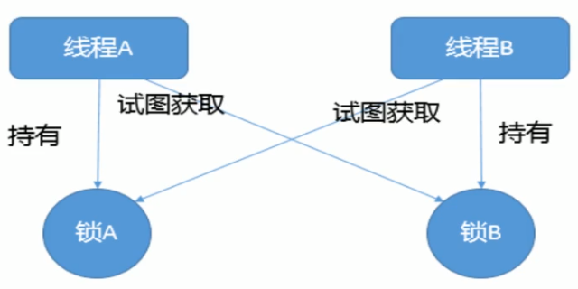

# 死锁

## 是什么

死锁是指两个或两个以上的进程在执行过程中，因争夺资源而造成的一种**互相等待的现象**，若无外力干涉那他们将无法推进下去，如果系统资源充足，进程的资源请求都能够得到满足，死锁出现的可能性就很低，否则就会因争夺有限的资源而陷入死锁



## 代码

```java
class HoldLockThread implements Runnable {
    private String lock1;
    private String lock2;

    public HoldLockThread(String lock1, String lock2) {
        this.lock1 = lock1;
        this.lock2 = lock2;
    }

    @Override
    public void run() {
        synchronized (lock1) {
            System.out.println(Thread.currentThread().getName() + "\t自己持有" + lock1 + "\t尝试获得：" + lock2);
            try { Thread.sleep(2000); } catch (InterruptedException e) { e.printStackTrace(); }
            synchronized (lock2) {
                System.out.println(Thread.currentThread().getName() + "\t自己持有" + lock2 + "\t尝试获得：" + lock1);
            }
        }
    }
}

/**
 * 死锁是指两个或两个以上的进程在执行过程中，
 * 因争夺资源而造成的一种互相等待的现象，
 * 若无外力干涉那他们将无法推进下去
 */
public class DeadLockDemo {

    public static void main(String[] args) {
        String lockA = "lockA";
        String lockB = "lockB";
        new Thread(new HoldLockThread(lockA, lockB), "AAA").start();
        new Thread(new HoldLockThread(lockB, lockA), "BBB").start();
       
    }
}
```

## 查看故障

linux  ps -ef | grep xxxx
        

windows下的Java程序 也有类似ps的查看进程的命令，但是目前我们需要查看的只是Java