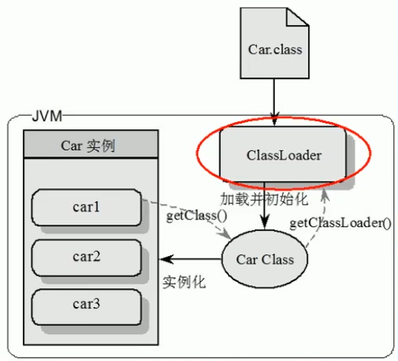
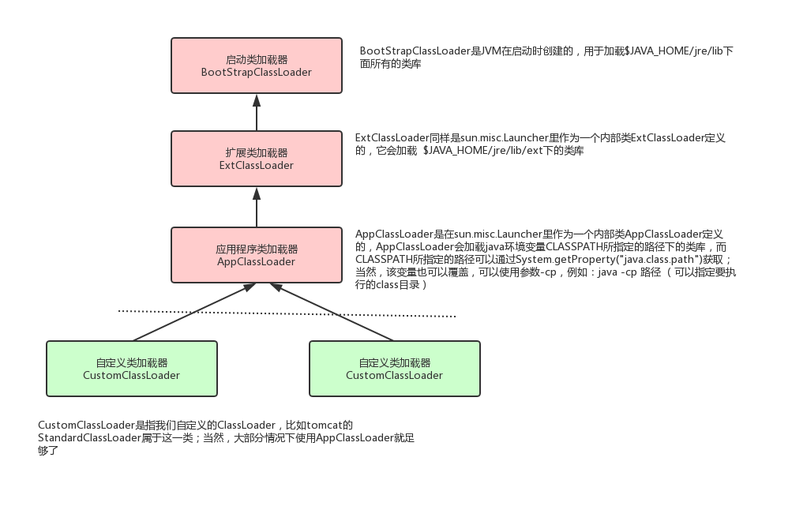
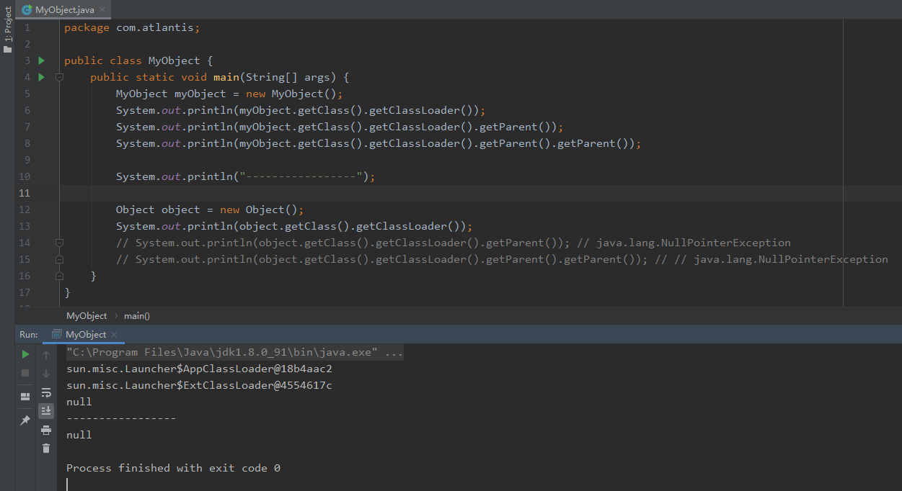
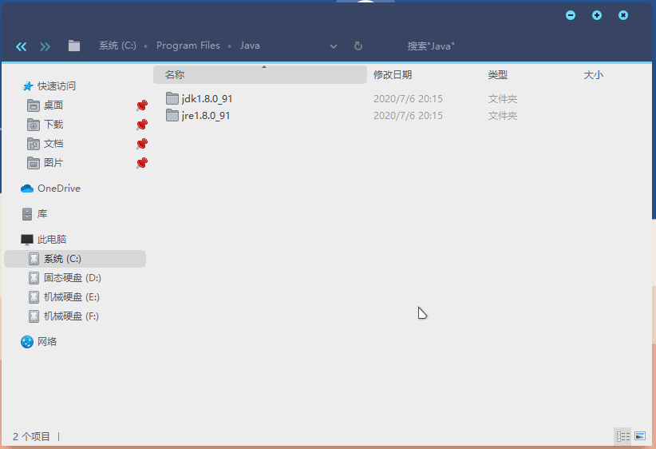

# 类装载器[Class Loader]

**类装载器ClassLoader**是负责加载class文件的，将class文件字节码内容加载到内存中，并将这些内容转换成方法区中运行时数据结构。**class loader只负责文件的加载，至于他是否能够运行，则由execution engine决定。**

在这里需要区分一下`class`与`Class`，小写的`class`，指的是编译Java代码后所生成的以`.class`为后缀名的字节码文件。而大写的`Class`是JDK提供的`java.lang.Class`，可以理解为封装类的模板，多用于反射场景，例如JDBC中的加载驱动`Class.forName("com.mysql.cj.jdbc.Driver");`。

接下来我们来观察下图，`Car.class`字节码文件被`ClassLoader`类装载器加载并初始化，在方法区中生成了一个`Car Class`的类模板，而我们平时所用到的实例化，就是在这个类模板的基础上，形成了一个个实例，即`car1`，`car2`。反过来讲，我们可以对某个具体的实例进行`getClass()`操作，就可以得到该实例的类模板，即`Car Class`。再接着，我们对这个类模板进行`getClassLoader()`操作，就可以得到这个类模板是由哪个类装载器进行加载的。

### 有哪些类装载器？

**（1）虚拟机自带的加载器**

1. 启动类加载器（Bootstrap），也叫根加载器，加载`%JAVAHOME%/jre/lib/rt.jar`。
2. 扩展类加载器（Extension），加载`%JAVAHOME%/jre/lib/ext/*.jar`，例如`javax.swing`包。
3. 应用程序类加载器（AppClassLoader），也叫系统类加载器，加载`%CLASSPATH%`的所有类。

**（2）用户自定义的加载器** ：用户可以自定义类的加载方式，但必须是`Java.lang.ClassLoader`的子类。

### 双亲委派和沙箱安全

接下来，我们通过下面代码来观察这几个类加载器。首先，我们先看自定义的`MyObject`，首先通过`getClassLoader()`获取到的是`AppClassLoader`，然后`getParent()`得到`ExtClassLoader`，再`getParent()`竟然是`null`？可能大家会有疑惑，不应该是Bootstrap加载器么？**这是因为，BootstrapClassLoader是使用C++语言编写的，Java在加载的时候就成了null。**

我们再来看Java自带的`Object`，通过`getClassLoader()`获取到的加载器直接就是`BootstrapClassLoader`，如果要想`getParent()`的话，因为是null值，所以就会报`java.lang.NullPointerException`空指针异常。

> 输出中，`sun.misc.Launcher`是JVM相关调用的入口程序。

那为什么会出现这个情况呢？这就需要我们来了解类加载器的加载顺序和机制了，即**双亲委派**和**沙箱安全** 。

**（1）双亲委派**，当一个类收到了类加载请求，它首先不会尝试自己去加载这个类，而是把这个请求委派给父类去完成，因此所有的加载请求都应该传送到启动类加载器中，只有当父类加载器反馈自己无法完成这个请求的时候（在它的加载路径下没有找到所需加载的`Class`），子类加载器才会尝试自己去加载。

采用双亲委派的一个好处是，比如加载位于`rt.jar`包中的类`java.lang.Object`，不管是哪个加载器加载这个类，最终都是委派给顶层的启动类加载器进行加载，确保哪怕使用了不同的类加载器，最终得到的都是同样一个`Object`对象。

**（2）沙箱安全机制**，是基于双亲委派机制上采取的一种JVM的自我保护机制，假设你要写一个`java.lang.String`的类，由于双亲委派机制的原理，此请求会先交给`BootStrapClassLoader`试图进行加载，但是`BootStrapClassLoader`在加载类时首先通过包和类名查找`rt.jar`中有没有该类，有则优先加载`rt.jar`包中的类，**因此就保证了java的运行机制不会被破坏，确保你的代码不会污染到Java的源码**。

**所以，类加载器的加载顺序如下：**

1. 当`AppClassLoader`加载一个`class`时，它首先不会自己去尝试加载这个类，而是把类加载请求委派给父类加载器`ExtClassLoader`去完成。
2. 当`ExtClassLoader`加载一个`class`时，它首先也不会自己去尝试加载这个类，而是把类加载请求委派给`BootStrapClassLoader`去完成。
3. 如果`BootStrapClassLoader`加载失败（例如在`$JAVA_HOME/jre/lib`里未查找到该`class`），会使用`ExtClassLoader`来尝试加载。
4. 若`ExtClassLoader`也加载失败，则会使用`AppClassLoader`来加载，如果`AppClassLoader`也加载失败，则会报出异常`ClassNotFoundException`。

> Tip：`rt.jar`是什么？做了哪些事？这些暂且不提，那你有没有想过，为什么可以在idea这些开发工具中可以直接去使用String、ArrayList、甚至一些JDK提供的类和方法？观察下面动图就可以知道，原来这些都在`rt.jar`中定义好了，且直接被启动类加载器进行加载了。
> 