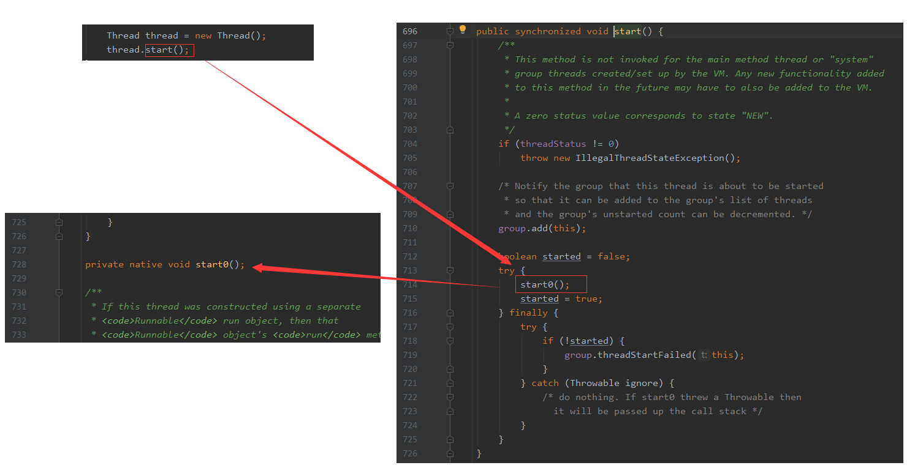

# 本地方法栈 Native Method Stack

**本地方法接口（Native Interface）**，其作用是融合不同的编程语言为 Java 所用，它的初衷是用来融合 C/C++ 程序的，Java 诞生的时候是 C/C++ 流行时期，要想立足，就得调用 C/C++ 程序，于是 Java
就在内存中专门开辟了一块区域处理标记为 native 的代码。

而**本地方法栈（Native Method Stack）**，就是在一个 Stack 中登记这些 native 方法，然后在执行引擎`Execution Engine`执行时加载本地方法库`native libraies`。

接下来，我们通过下图的多线程部分源码来理解什么是`native`方法。首先我们观察`start()`的源码，发现它其实并没有做什么复杂的操作，只是单纯的调用了`start0()`这个方法，然后我们去观察`start0()`的源码，发现它只是一个使用了`native`关键字修饰的一个方法（`private native void start0();`），但**只有声明却没有具体的实现！**。

为什么？我们都知道`Thread`是`Class`关键字修饰的类（`class Thread implements Runnable`），而不是接口。一般来说，类中的方法都要有定义和实现，接口里面才有方法的定义声明。这就是`native`方法的独特之处，说白了，被`native`关键字修饰的方法，基本上和我们，甚至和 Java 都没啥关系了，因为它要去调用底层操作系统或者第三方语言的库函数，所以我们不需要去考虑它具体是如何实现的。

