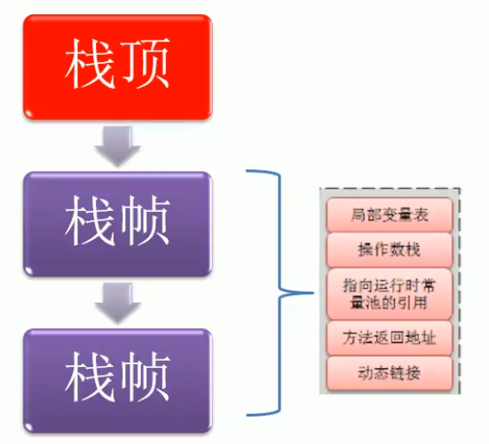
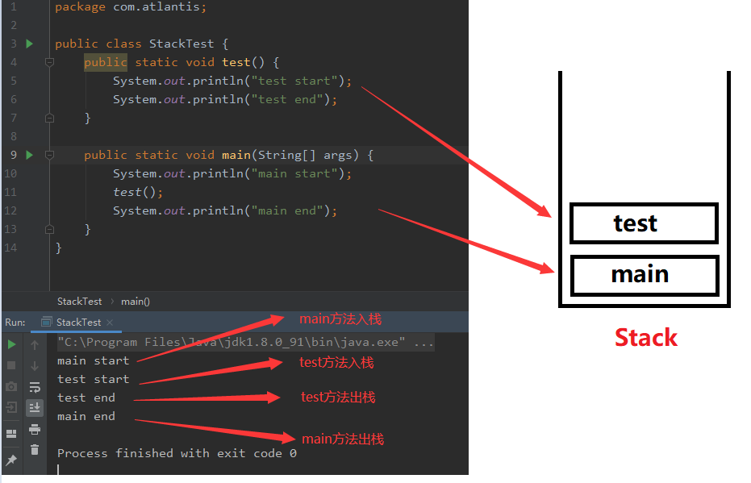
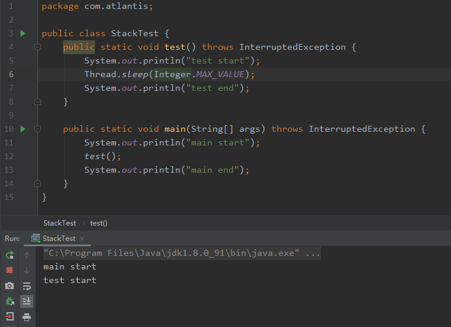
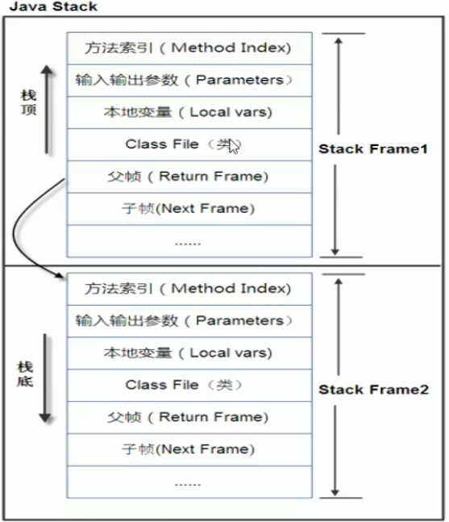
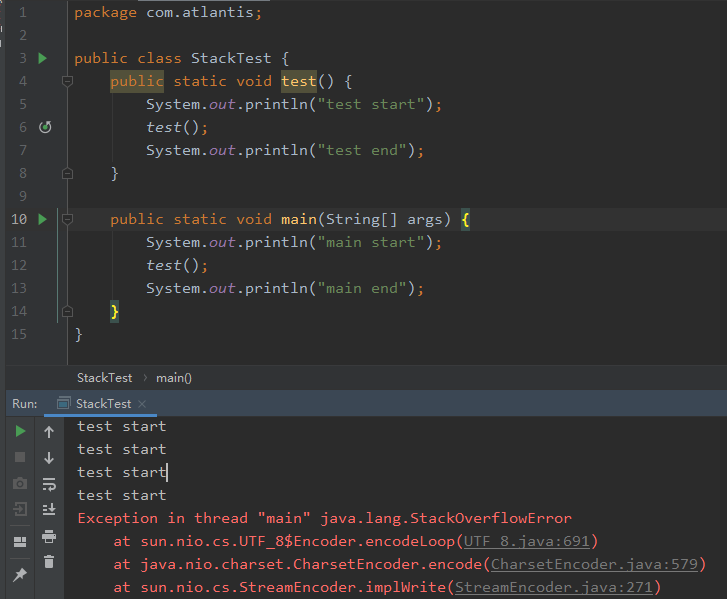
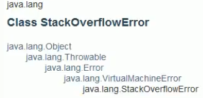

## 栈 Stack

**栈管运行，堆管存储！**

**栈（Stack）**，也叫栈内存，主管Java程序的运行，在线程创建时创建。其生命期是跟随线程的生命期，是线程私有的，线程结束栈内存也就是释放。

对于栈来说，不存在垃圾回收的问题，只要线程一结束该栈就Over。

### 6.1 栈存储什么数据？

栈主要存储**8种基本类型的变量、对象的引用变量、以及实例方法。**

这里引出一个名词，**栈帧**，什么是栈帧？
每个方法执行的同时都会创建一个栈帧，用于存储局部变量表、操作数栈、动态链接、方法出口等信息，每个方法从调用直至执行完毕的过程，就对应着一个栈帧在虚拟机中入栈到出栈的过程。

简单来说，**栈帧**对应一个方法的执行和结束，是方法执行过程的内存模型。

其中，栈帧主要保持了3类数据：

1. **本地变量（Local Variables）**：输入参数和输出参数，以及方法内的变量。
2. **栈操作（Operand Stack）**：记录出栈、入栈的操作。
3. **栈帧数据（Frame Data）**：包括类文件、方法等。

> 栈的大小是根据JVM有关，一般在256K~756K之间，约等于1Mb左右。

### 6.2 栈的运行原理

观察下图，在java中，`test()`和`main()`都是方法，而在栈中，称为栈帧。在栈中，`main()`都是第一个入栈的。
栈的顺序为：`main()`入栈 --> `test()`入栈 --> `test()`出栈 --> `main()`出栈。

根据代码和运行结果可以知道，`main()`想要出栈，则必须`test()`先出栈。那么怎么证明呢？观察下面代码，我们在`test()`方法中添加了一条语句`Thread.sleep(Integer.MAX_VALUE);`，来让`test()`无法进行出栈操作，进而导致`main()`也无法出栈。运行代码发现，运行结果如我们所料，程序一直停留在`test()`入栈，无法进行其他操作。

我接着观察下图，在图中一个栈中有两个栈帧，分别是`Stack Frame1`和`Stack Frame2`，对应方法1和方法2。其中`Stack Frame2`是最先被调用的方法2，所以它先入栈。然后方法2又调用了方法1，所以`Stack Frame1`处于栈顶位置。执行完毕后，依次弹出`Stack Frame1`和`Stack Frame2`，然后线程结束，栈释放。
所以，每执行一个方法都会产生一个栈帧，并保存到栈的顶部，顶部的栈帧就是当前所执行的方法，该方法执行完毕后会自动出栈。

总结如下，栈中的数据都是以栈帧（Stack Frame）的格式存在，栈帧是一个内存区块，是一个数据集，是一个有关方法（Method）和运行期数据的数据集，当一个方法A被调用时就产生了一个栈帧F1，并被压入到栈中，方法A中又调用了方法B，于是产生栈帧F2也被压入栈中，方法B又调用方法C，于是产生栈帧F3也被压入栈中······执行完毕后，**遵循“先进后出，后进先出”的原则**，先弹出F3栈帧，再弹出F2栈帧，再弹出F1栈帧。

### 6.3 栈溢出 StackOverflowError

大家肯定对栈溢出耳熟，那栈溢出是怎么产生的呢？

请看下面代码，`test()`方法里面又调用了`test()`方法，即自己调用自己，也叫递归。
同时，栈是一个内存块，它是有大小长度的，而我们观察代码发现，只要代码一运行，`test()`方法就会一直进行入栈操作，而没有出栈操作，结果肯定会超出栈的大小，进而造成栈溢出错误，即`java.lang.StackOverflowError`。

所以说，老哥们，禁止套娃，禁止套娃，禁止套娃！!!!∑(ﾟДﾟノ)ノ

> `java.lang.StackOverflowError`是错误，不是异常！证明如下 ：
> 