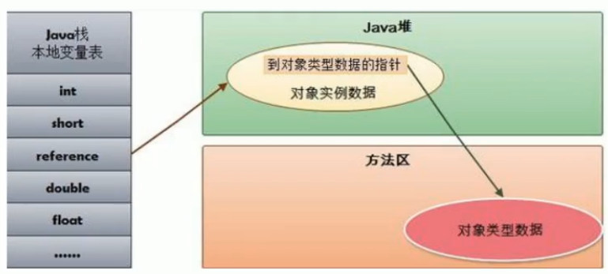
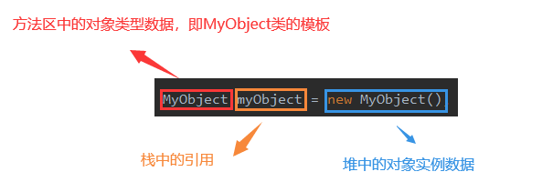

## 栈、堆、方法区的交互关系

栈、堆、方法区三者的关系如下图，其中`reference`是引用类型。

举个栗子，比如`MyObject myObject = new MyObject();`，等号左边`MyObject myObject`的`myObject`就是引用，在Java栈里面。等号右边的`new MyObject()`，`new`出来的`MyObject`实例对象在堆里面。简单来说，就是Java栈中的引用`myObject`指向了堆中的`MyObject`实例对象。

