## 堆 Heap

### 8.1 堆体系结构

一个JVM实例只存在一个堆内存，堆内存的大小是可以调节的。类加载器读取了类文件之后，需要把类、方法、常量变量放到堆内存中，保持所以引用类型的真实信息，方便执行器执行。

其中，堆内存分为3个部分：

1. Young Generation Space，新生区、新生代
2. Tenure Generation Space，老年区、老年代
3. Permanent Space，永久区、元空间

**Java7之前，堆结构图如下，而Java8则只将永久区变成了元空间。**
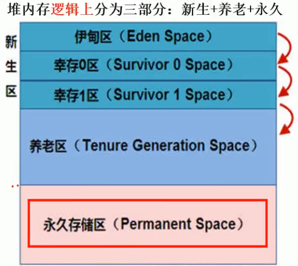

**总结一下，堆内存在逻辑上分为新生+养老+元空间，而堆内存在物理上分为新生+养老。**

### 8.2 对象在堆中的生命周期

那么如何直观的了解对象在堆中的生命周期呢？

（1）首先，新生区是类的诞生、成长、消亡的区域。一个类在这里被创建并使用，最后被垃圾回收器收集，结束生命。

（2）其次，所有的类都是在`Eden Space`被`new`出来的。而当`Eden Space`的空间用完时，程序又需要创建对象，JVM的垃圾回收器则会将`Eden Space`中不再被其他对象所引用的对象进行销毁，也就是垃圾回收（Minor GC）。此时的GC可以认为是**轻量级GC**。

（3）然后将`Eden Space`中剩余的未被回收的对象，移动到`Survivor 0 Space`，以此往复，直到`Survivor 0 Space`也满了的时候，再对`Survivor 0 Space`进行垃圾回收，剩余的未被回收的对象，则再移动到`Survivor 1 Space`。`Survivor 1 Space`也满了的话，再移动至`Tenure Generation Space`。

（4）最后，如果`Tenure Generation Space`也满了的话，那么这个时候就会被垃圾回收（Major GC or Full GC）并将该区的内存清理。此时的GC可以认为是**重量级GC**。如果`Tenure Generation Space`被GC垃圾回收之后，依旧处于占满状态的话，就会产生我们场景的`OOM`异常，即`OutOfMemoryError`。

### 8.3 Minor GC的过程

`Survivor 0 Space`，幸存者0区，也叫`from`区；
`Survivor 1 Space`，幸存者1区，也叫`to`区。

其中，`from`区和`to`区的区分不是固定的，是互相交换的，意思是说，在每次GC之后，两者会进行交换，谁空谁就是`to`区。

不明白？没关系，接着往下看。
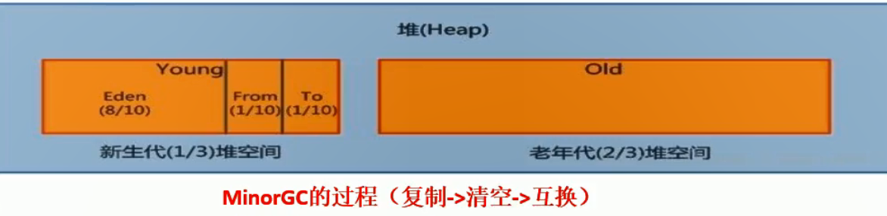
**（1）Eden Space、from复制到to，年龄+1。**
首先，当`Eden Space`满时，会触发第一次GC，把还活着的对象拷贝到`from`区。而当`Eden Space`再次触发GC时，会扫描`Eden Space`和`from`，对这两个区进行垃圾回收，经过此次回收后依旧存活的对象，则直接复制到`to`区（如果对象的年龄已经达到老年的标准，则移动至老年代区），同时把这些对象的年龄+1。

**（2）清空Eden Space、from**
然后，清空`Eden Space`和`from`中的对象，此时的`from`是空的。

**（3）from和to互换**
最后，`from`和`to`进行互换，原`from`成为下一次GC时的`to`，原`to`成为下一次GC时的`from`。部分对象会在`from`和`to`中来回进行交换复制，如果交换15次（由JVM参数`MaxTenuringThreshold`决定，默认15），最终依旧存活的对象就会移动至老年代。

总结一句话，**GC之后有交换，谁空谁是to**。

> 这样也是为了保证内存中没有碎片，所以`Survivor 0 Space`和`Survivor 1 Space`有一个要是空的。

### 8.4 HotSpot虚拟机的内存管理

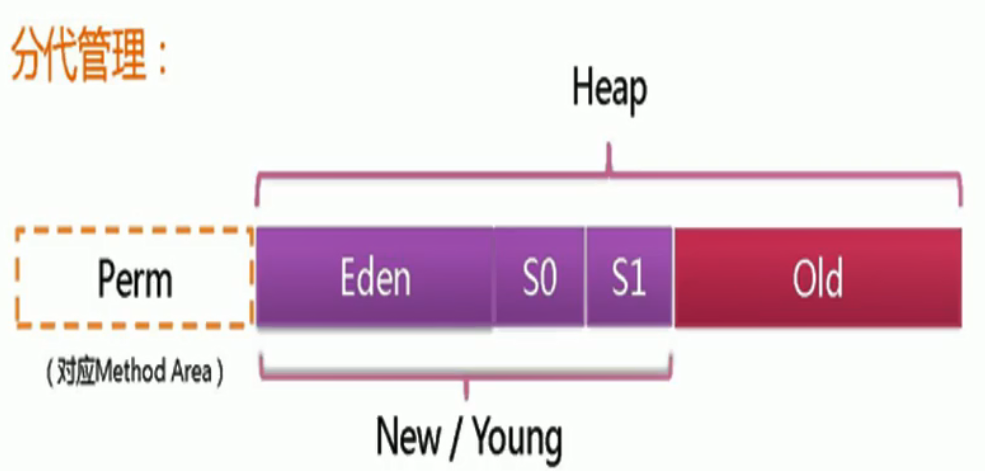

> 不同对象的生命周期不同，其中98%的对象都是临时对象，即这些对象的生命周期大多只存在于Eden区。

实际而言，方法区（`Method Area`）和堆一样，是各个线程共享的内存区域，它用于存储虚拟机加载的：类信息+普通常量+静态常量+编译器编译后的代码等等。**虽然JVM规范将方法区描述为堆的一个逻辑部分，但它却还有一个别名叫做Non-Heap（非堆内存），目的就是要和堆区分开。**

对于HotSpot虚拟机而言，很多开发者习惯将方法区称为 “永久代（`Permanent Gen`）” 。但严格来说两者是不同的，或者说只是使用永久代来实现方法区而已，永久代是方法区（可以理解为一个接口`interface`）的一个实现，JDK1.7的版本中，已经将原本放在永久代的字符串常量池移走。（字符串常量池，JDK1.6在方法区，JDK1.7在堆，JDK1.8在元空间。）
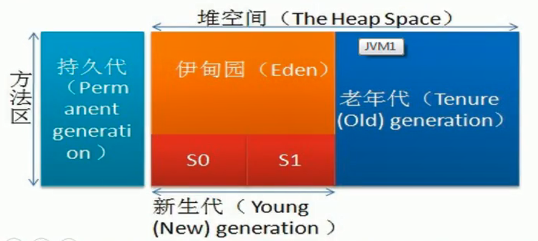

> 如果没有明确指明，Java虚拟机的名字就叫做`HotSpot`。
> 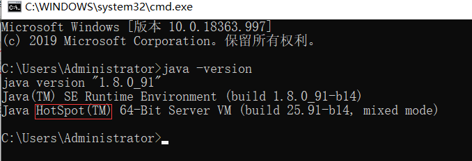

### 8.5 永久区

永久区是一个常驻内存区域，用于存放JDK自身所携带的`Class`，`Interface`的元数据（也就是上面文章提到的`rt.jar`等），也就是说它存储的是运行环境必须的类信息，被装载进此区域的数据是不会被垃圾回收器回收掉的，关闭JVM才会释放此区域所占用的内存。
**（1）JDK1.7**
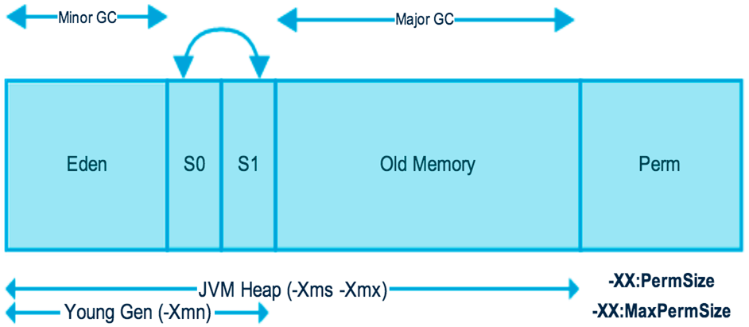
**（2）JDK1.8**
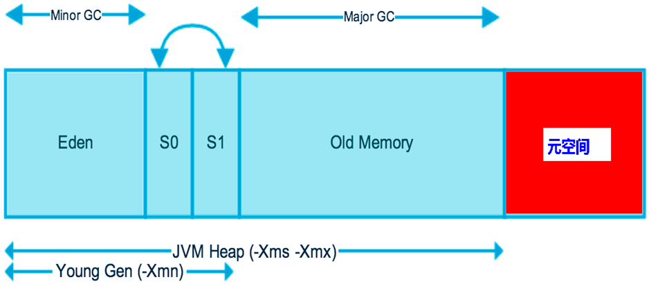
在JDK1.8中，永久代已经被移除，被一个称为**元空间**的区域所取代。元空间的本质和永久代类似。

元空间与永久代之间最大的区别在于： **永久带使用的JVM的堆内存，但是java8以后的元空间并不在虚拟机中而是使用本机物理内存。**

因此，默认情况下，元空间的大小仅受本地内存限制。
类的元数据放入`native memory`，字符串池和类的静态变量放入Java堆中，这样可以加载多少类的元数据就不再由`MaxPermSize`控制, 而由系统的实际可用空间来控制。

### 8.6 堆参数调优

在进行堆参数调优前，我们可以通过下面的代码来获取虚拟机的相关内存信息。

```java
public class JVMMemory {
    public static void main(String[] args) {
        // 返回 Java 虚拟机试图使用的最大内存量
        long maxMemory = Runtime.getRuntime().maxMemory();
        System.out.println("MAX_MEMORY = " + maxMemory + "（字节）、" + (maxMemory / (double) 1024 / 1024) + "MB");
        // 返回 Java 虚拟机中的内存总量
        long totalMemory = Runtime.getRuntime().totalMemory();
        System.out.println("TOTAL_MEMORY = " + totalMemory + "（字节）、" + (totalMemory / (double) 1024 / 1024) + "MB");
    }
}
```

运行结果如下：
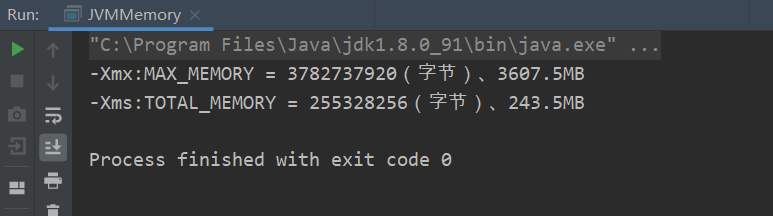
有人就有疑问了，这个`3607.5MB`和`243.5MB`是怎么算出来的？看下图就明白了，虚拟机最大内存为物理内存的1/4，而初始分配的内存为物理内存的1/64。
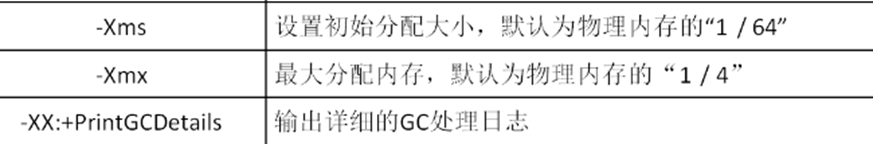
IDEA中如何配置JVM内存参数？在【Run】->【Edit Configuration…】->【VM options】中，输入参数`-Xms1024m -Xmx1024m -XX:+PrintGCDetails`，然后保存退出。
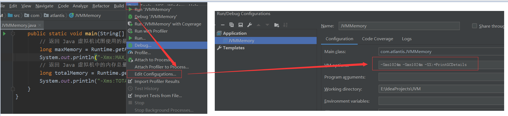
运行结果如下：
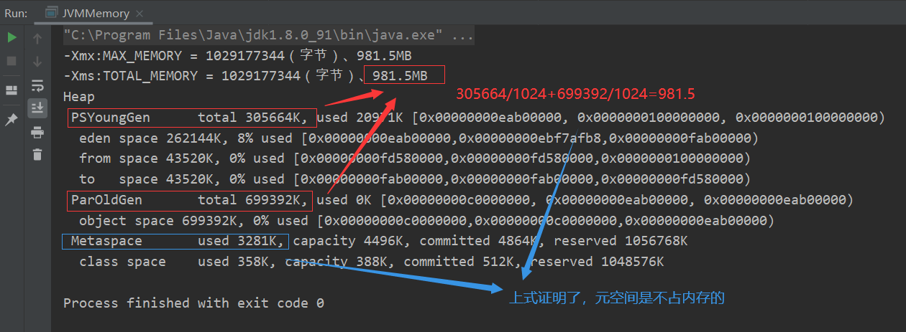

> **JVM的初始内存和最大内存一般怎么配？**
> 答：初始内存和最大内存一定是一样大，理由是避免GC和应用程序争抢内存，进而导致内存忽高忽低产生停顿。

### 8.7 堆溢出 OutOfMemoryError

现在我们来演示一下`OOM`，首先把堆内存调成10M后，再一直new对象，导致Full GC也无法处理，直至撑爆堆内存，进而导致`OOM`堆溢出错误，程序及结果如下：

```java
import java.util.Random;
public class OOMTest {
    public static void main(String[] args) {
        String str = "Atlantis";
        while (true) {
            // 每执行下面语句，会在堆里创建新的对象
            str += str + new Random().nextInt(88888888) + new Random().nextInt(999999999);
        }
    }
}
```

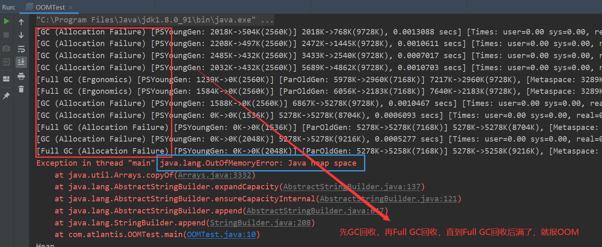

> 如果出现`java.lang.OutOfMemoryError: Java heap space`异常，说明Java虚拟机的堆内存不够，造成堆内存溢出。原因有两点：
> ①Java虚拟机的堆内存设置太小，可以通过参数`-Xms`和`-Xmx`来调整。
> ②代码中创建了大量对象，并且长时间不能被GC回收（存在被引用）。