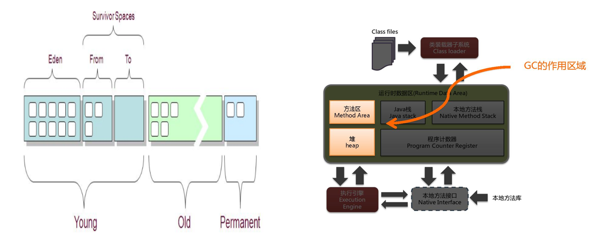
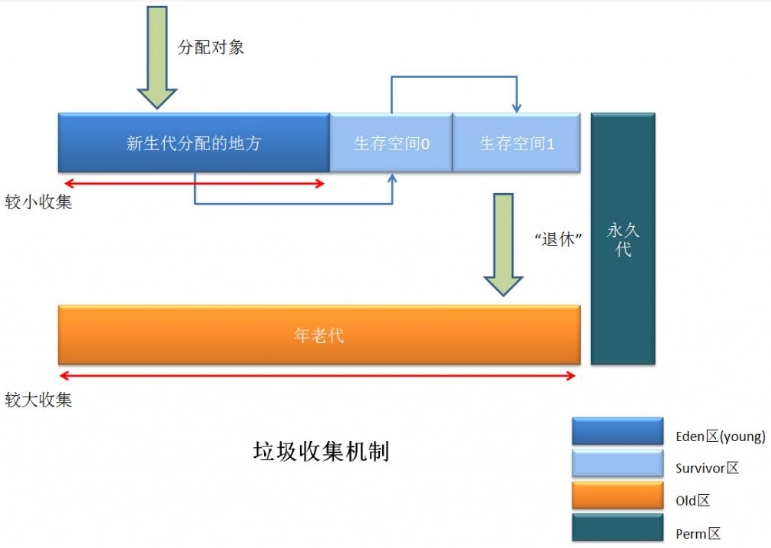
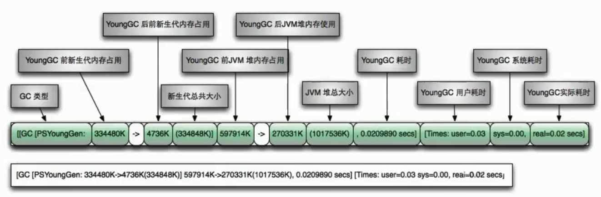
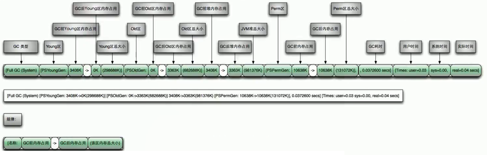

## GC（Java Garbage Collection）

### 9.1 GC垃圾收集机制

对于GC垃圾收集机制，我们需要记住以下几点：

1. 次数上频繁收集Young区。
2. 次数上较少收集Old区。
3. 基本不动元空间。

JVM在进行GC时，并非每次都对上面三个内存区域一起回收的，大部分时候回收的都是指新生代。
因此GC按照回收的区域又分了两种类型，一种是普通GC（minor GC），一种是全局GC（major GC or Full GC）

**Minor GC和Full GC的区别：**
**（1）普通GC（minor GC）**：只针对新生代区域的GC，指发生在新生代的垃圾收集动作，因为大多数Java对象存活率都不高，所以Minor GC非常频繁，一般回收速度也比较快。
**（2）全局GC（major GC or Full GC）**：指发生在老年代的垃圾收集动作，出现了Major GC，经常会伴随至少一次的Minor GC（但并不是绝对的）。Major GC的速度一般要比Minor GC慢上10倍以上

### 9.2 GC日志信息详解

通过上面`OOM`案例，是不是觉得那一大片的日志信息看不懂？懵逼？没事，通过下图你就知道如何阅读GC日志信息。

**（1）YGC相关参数：**

**（2）FGC相关参数：**

### 9.3 GC四大算法

1. 复制算法（Copying）
2. 标记清除（Mark-Sweep）
3. 标记压缩（Mark-Compact）
4. 分代收集算法