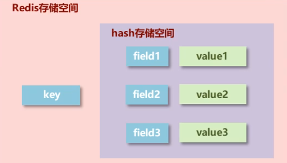
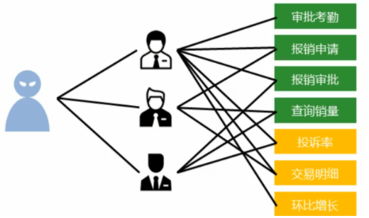

# hash类型数据的基本操作

hash类型：底层使用哈希表结构实现数据存储

* 添加、修改数据

  hset key field value

* 修改数据，如果有失败，如果没有创建

  hsetnx key field value

* 获取数据

  hget key field 

  hgetall key

* 删除数据

  hdel key field1 [field2] [...]

* 添加、修改多个数据

  hmset key field1 value1 field2 calue2

* 获取多个数据

  hmget key field1 field2 …

* 获取哈希表中字段的数量

  hlen key

* 获取哈希表中是否存在指定的字段

  hexists key field

* 获取哈希表中所有的字段名或字段值

  hkeys key

  hvals key 

* 设置指定字段的数值数据增加指定范围的值

  hincrby key field increment

  hincrbyfloat key field increment

  

**hash类型数据操作的注意事项**

+ hash类型下的value只能存储字符串，不允许存储其他类型数据，不存在嵌套现象。如果数据未获取到，对应的值为(nil)
+ 每个hash可以存储2^32-1个键值对
+ hash类型十分贴近对象的数据存储形式，并且可以灵活添加删除对象属性。但hash设计初中不是为了存储大量对象而设计的，切记不可滥用，更不可以将hash作为对象列表使用
+ hgetall操作可以获取全部属性，如果内部fiekd过多，遍历整体数据效率就会很低，有可能成为数据访问瓶颈

# list类型

- 数据存储需求：存储多个数据，并对数据进入存储空间的顺序进行区分
- 需要的存储数据：一个存储空间保存多个数据，且通过数据可以体现进入顺序
- list类型：保存多个数据，底层使用双向链表存储结构实现

*基本操作*

* 添加、修改数据

  lpush key value1 [value2] …

  rpush key value1 [value2] …

* 获取数据

  lrange key start stop

  lindex key index

  llen key

* 获取并移除数据

  lpop key

  rpop key

*拓展操作*

* 规定时间内获取并移除数据

  blpop key1 [key2] timeout

  brpop key1 [key2] timeout

* 移除指定数据

  lrem key count value

**list类型数据操作注意事项**

* list 中保存的数据都是string类型的，数据总容量是有限的，最多2^32-1个元素（4294967295）
* list具有索引的概念，但是操作数据时候通常以队列的形式进行入队出队操作，或以栈的形式进入栈出栈的操作
* 获取全部数据操作结束索引设置为-1
* list 可以对数据进行分页操作，通过第一页的信息来自list，第2页及更多的信息通过数据库的形式加载

# set类型

- 新的存储需求：存储大量的数据，在查询方面提供更高的效率
- 休要的存储结构：能够保存大量的数据，搞笑的内部存储机制，便于查询
- set类型：与hash存储结构完全相同，仅存储键，不存储值（nil),并且值式不允许重复的

*基本操作*

* 添加数据

  sadd key menber1 [member2]

* 获取全部数据

  smembers key

* 删除数据

  srem key member1 [member2]

* 获取集合数据总量

  scard key

* 判断集合中是否包含指定数据

  sismember key member

*扩展操作*

* 随机获取集合中指定数量的数据

  srandmember key [count]

* 随机获取集合中的某个数据并将该数据移出集合

  spop key

* 求两个集合的交并差集

  sinter key1 [key2] 

  sunion key1 [key2]

  sdiff key1 [key2]

* 求两个集合的交、并、差集并存储到指定集合中

  sinterstore destination key1 [key2]

  sunionstore destination key1 [key2]

  sdiffstore destination key1 [key2]

* 将指定数据从原始集合移动到目标集合中

  smove source destination member

**set类型数据的注意事项**

- set类型不允许数据重复，如果添加的数据在set中已经存在，将只保留一份
- set虽然与hash的存储结构相同，但是无法启用hash中存储值的空间

集团公司共具有12000名员工，内部OA系统中具有100多个角色，300多个业务操作，23000多种数据，每位员工具有一个或多个角色，如何快速进行业务操作的权限校验？

- 依赖set集合数据不重复的特征，依赖set集合hash存储结构特征完成数据过滤与快速查询
- 根据用户id获取用户所有角色
- 根据用户所有角色获取用户所有操作权限放入set集合
- 根据用户所有觉得获取用户所有数据全选放入set集合

## sorted_set

- 新的存储需求：根据排序有利于数据的有效显示，需要提供一种可以根据自身特征进行排序的方式
- 需要的存储结构：新的存储模型，可以保存可排序的数据
- sorted_set类型：在set的存储结构基础上添加可排序字段

*基本操作*

* 添加数据

  zadd *key* *score1* *member1 [score2 member2]*

* 获取全部数据

  zrange key start stop [WITHSCORES]

  zrevrange key start stop [WITHSCORES]

* 删除数据

  zrem key member [member …]

* 按条件获取数据

  zrangebyscore key min max [WITHSCORES] [LIMIT]
  zrevrangebyscore key max min [WITHSCORES]

* 条件删除

  zremrangebyrank key start stop

  zremrangebyscore key min max

**注意**

- min与max用于限定搜索查询的条件

- start与stop用于限定查询范围，作用于索引，表示开始和结束索引

- offset与count用于限定查询范围，作用于查询结果，表示开始位置和数据总量

- 获取集合数据总量

  zcard key

  zcount key min max

- 集合交、并操作

  zinterstore destination numkeys key [key …]

  zunionstore destination numkeys key [key …]