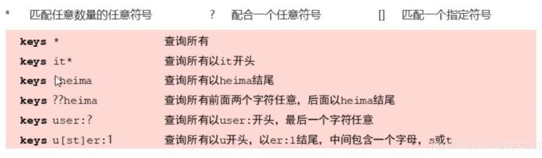

# key通用指令

### key特征

- key是一个字符串，通过key获取redis中保存的数据

### key基本操作

删除指定key

del key

获取key是否存在

exists key

获取key的类型

type key

key的拓展操作（时效性控制）：

为指定key设置有效期

expire key seconds

pexpire key milliseconds

expireat key timestamp

pexpireat key millinseconds-timestamp

获取key有效时间

ttl key

pttl key

切换key的时效性改为永久性

persist key

key拓展操作（查询）

keys pattern

key其他操作

为key改名

rename key newkey //如果已经有newkey的数据，直接覆盖

renamenx key newkey //如果已经有，则失败

对所有key排序

sort

# 数据库通用操作

* 切换数据库

  select index

* 其他操作

  quit

  ping

  echo message

* 数据移动

  move key db

* 数据清除

  dbsize

  flushdb

  flushall

