# 持久化简介

### 什么是持久化

利用永久性存储介质将数据进行保存，在特定的事件将保存的数据进行恢复的工作机制称为持久化

### 为什么要持久化

防止数据的意外丢失，确保数据安全性

### 持久化的过程保存什么

- 将当前数据状态进行保存，**快照形式**，存储数据结果，存储而是简单，关注点在数据 -----》 **RDB**
- 将数据的操作过程进行保存，**日志形式**，存储操作过程，存储格式复杂，关注点在数据的操作过程 ------》**AOF**

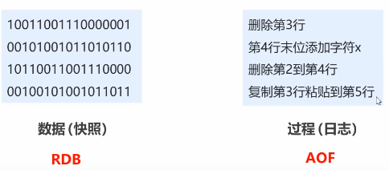

# RDB方式持久化

##### RDB启动方式

谁，什么事件，干什么事情？

- 谁：redis操作者（用户）
- 什么时间：即时（随时进行）
- 干什么事情：保存数据

##### RDB的启动方式——save指令

- 命令

> save

- 作用

  手动执行一次保存操作  会生成dump.rdb文件

##### RDB启动方式——save指令相关配置——在配置文件中修改

* dbfilename dump.rdb

  说明：设置本地数据库文件名，默认值为dump.rdb

  经验：通常设置魏dump-端口号.rdb

* dir

  说明：设置存储.rdb文件的路径

  经验：通常设置成存储空间较大的目录中，目录名称data

* rdbcompression yes

  说明：设置存储至本地数据库时是否压缩数据，默认为yes，采用LZF压缩

  经验：通常默认为开启状态，如果设置成no，可以节省CPU运行时间，但会使存储的文件变大（巨大）

* rdbchecksumy yes

  说明：设置是否进行RDB文件格式的校验，该校验过程在写文件和读文件过程均进行

  经验：通常默认为开启状态，如果设置为no，可以节约读写性过程约10%时间消耗，但是存储一定的数据损坏风险

注意：**Redis是单线程的**，所有命令都会在类似队列中排好队，不建议使用save指令，因为save指令的执行会阻塞当前Redis服务器，直到当前RDB过程完成位置，有可能会造成长时间阻塞，**线上环境不建议使用**

##### 数据量过大，单线程执行方式造成效率过低如何处理？

后台执行

- 谁：redis操作者（用户）发起指令；redis服务器控制指令执行
- 什么时间：即时（发起）；合理时间（执行）
- 干什么事情：保存数据

##### RDB启动方式——bgsave指令

- 命令

> bgsave

- 作用
  手动启动后台保存操作，但不是立即执行

##### RDB启动方式——bgsave指令工作原理

注意：bgsave命令是针对save阻塞问题做的优化。Redis内部所有涉及到RDB操作都采用bgsave的方式，save命令可以放弃使用

##### RDB启动方式——bgsave指令相关配置

以下跟save配置相同

新增

- stop-writes-on-bgsave-error yes

  说明：后台存储过程中如果出现错误线程，是否停止保存操作
  经验：通常默认为开启状态

到目前位置，save和bgsave都是手动的保存指令，那么会引入以下问题

**反复执行保存命令，忘记了怎么办？不知道数据产生了多少变化，何时保存？**

自动执行

- 谁：redis服务器发起指令（基于条件）
- 什么时间：满足条件
- 干什么事情：保存数据

##### RDB启动方式——save配置

- 配置

> save second changes

- 作用
  满足限定时间范围内ke的变化数量达到指定数量即进行持久化
- 参数
  second：监控时间范围
  changes：监控key的变化量
- 位置
  在conf文件中进行配置
- 范例

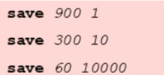

##### RDB启动方式——save配置原理

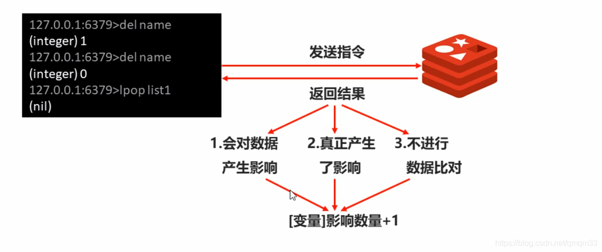
**注意：**

save配置要根据实际业务情况进行设置，频度过高或过低都会出现性能问题，结果可能是灾难性的

save配置中对second与changes设置通常具有互补对应关系，尽量不要设置成包含性关系

save配置启动后执行的是bgsave操作

### RDB三种启动方式对比

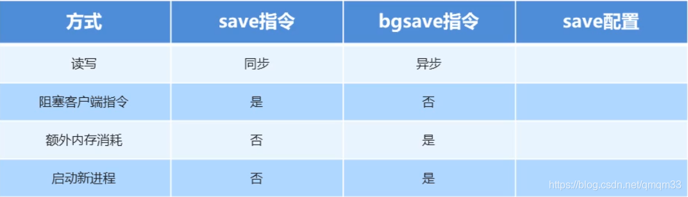

##### rdb特殊启动形式

- 全量复制
  在主从复制中会提到
- 服务器运行过程中重启
  debug reload
- 关闭服务器时指定保存数据
  shutdown save

### RDB 优缺点

##### RDB优点

- RDB是一个紧凑压缩的二进制文件，存储效率较高
- RDB内部存储的是redis在某个时间点的数据快照，非常适合用于数据备份，全量复制等场景
- RDB恢复数据的速度要比AOF快很多
- 应用：服务器中每X小时执行bgsave备份，并将RDB文件拷贝到远程己气中，用于灾难恢复

##### RDB缺点

- RDB方式无论是执行指令还是利用配置，无法做到实时持久化，具体较大的可能性丢失数据
- bgsave指令每次运行要执行fork操作创建子进程，要牺牲掉一些性能
- Redis的众多版本中未进行RDB文件格式的版本统一，有可能出现个版本服务之间数据格式无法兼容现象

##### RDB存储的弊端

- 存储数据量较大，效率较低——基于快照思想，每次读写都是全部数据，当数据量巨大时，效率非常低
- 大数据量下的IO性能较低
- 基于fork创建子进程，内存产生额外消耗
- 宕机带来的数据丢失风险

##### 解决思路

- 不写全数据，仅记录部分数据
- 改记录数据未记录操作过程
- 对所有操作均进行记录，排除丢失数据的风险
- 这也就是AOF的引入

#  AOF概念

- AOF持久化：以独立日志的方式记录每次写命令，重启时再重新执行AOF文件中命令达到恢复数据的目的。与RDB相比可以简单描述为改记录数据产生的过程
- AOF的主要作用是解决了数据持久化的实时性，目前已经是Redis持久化的主流方式

##### AOF写数据过程

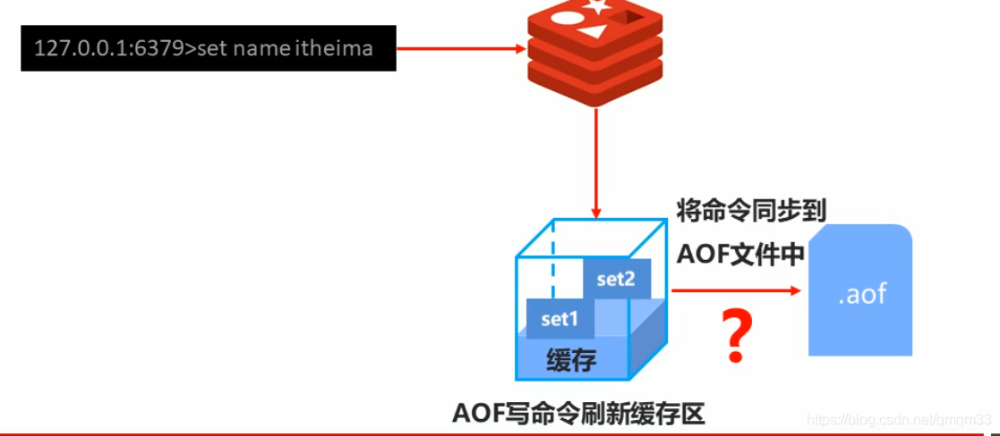

### AOF写数据三种策略

- always(每次)
- 每次写入操作均同步到AOF文件中，**数据零误差，性能较低**
- everysec(每秒)
  每秒将缓冲区中的指令同步到AOF文件中，**数据准确性高，性能较高**
  再系统突然当即的情况下丢失1秒内的数据
- no(系统控制)
  由操作系统每次同步到AOF文件的周期，整体过程**不可控**

##### AOF功能开启

- 配置

> appendonly yes|no

- 作用
  是否开启APF持久化功能，默认为不开启
- 配置

> appendfsync always|everysec|no

- 作用

  AOF写数据策略

##### AOF相关配置

- 配置

> appendfilename filename

- 作用
  AOF持久化文件名，默认文件名为appendonly.aof,建议配置为appendonly-端口号.aof
- 配置

> dir

- 作用
  AOF持久化文件保存路径，与RDB持久化文件保持一致即可

##### AOF写数据遇到的问题

**如果连续执行如下指令该如何处理**
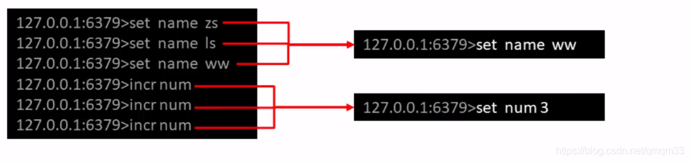

### AOF重写

随着命令的不断写入AOF，文件会越来越大，为了解决这个问题，Redis引入AOF重写机制压缩文件体积，AOF文件重写是将Redis进程内的数据转换为写命令同步到新AOF文件的过程，简单说就是将同样一个数据的若干个命令执行结果转换为最终结果数据对应的指令进行记录

##### AOF重写作用

- 降低磁盘占用量，提高磁盘利用路
- 提高持久化效率，降低持久化写时间，提高IO性能
- 降低数据恢复用时，提高数据恢复效率

##### AOF重写规则

- 进程内已超时的数据不再写入文件
- 忽略无效指令，重写时使用进程内数据直接生成，这样新的AOF文件只保留最终数据的写入命令　
  如del key1,hdel key2,srem key3,set key 222等

- 对统一数据的多条命令合并为一条命令
  如 lpush list1 a ,lpush list1 b,lpush list1 c可以转化为lpush list1 a b c
  为防止数据量过大造成客户端缓冲区溢出，对list,set,hash,set等类型，每条指令最多写入64个元素

##### AOF重写方式

- 手动重写

> bgrewriteaof

- 自动重写

> auto-aof-rewrite-min-size size
>
> auto-aof-rewrite-percentage percentage

##### AOF手动重写——bgrewriteaof指令工作原理

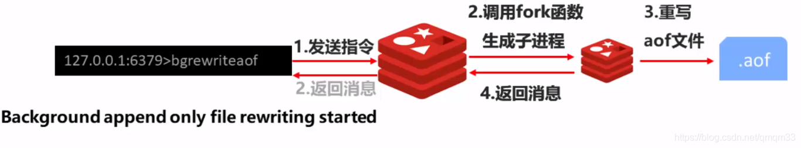

#### AOF自动重写方式

- 自动重写触发条件设置

> auto-aof-rewrite-min-size
>
> auto-aof-rewrite-percentage percent

- 自动重写触发对比参数（运行指令info Persistence获取具体信息）

> aof_current_size
> aof_base_size

- 自动重写触发条件

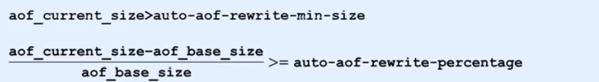
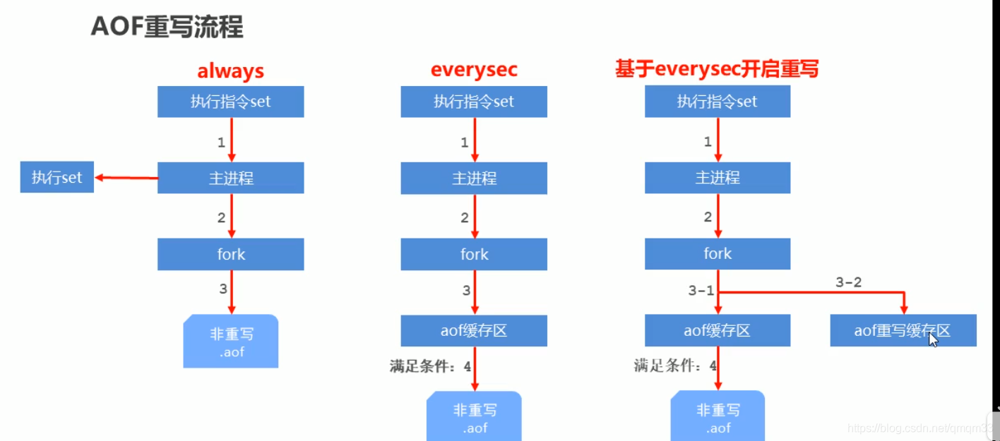
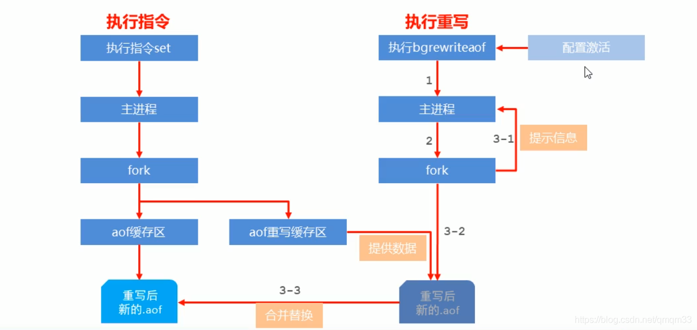

#  AOF和RDB的区别

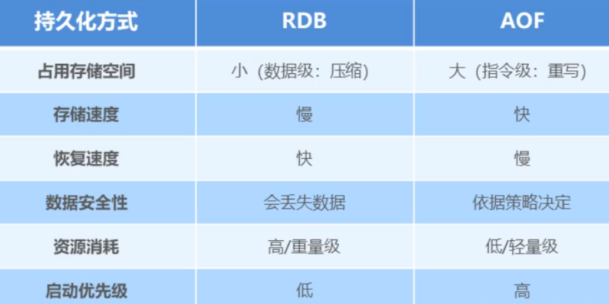

##### RDB和AOF的选择之感

- 对数据非常敏感，建议使用默认的AOF持久化方案

  AOF持久化策略使用erverysecond，每秒钟fsync一次。该策略redis任然可以保持很好的处理性能，当出现问题时，最多丢失0-1秒中的数据。
  注意：由于AOF文件存储体积较大，且恢复数据较慢

- 数据呈现阶段有效性，建议使用RDB持久化方案
  数据可以良好的做到阶段内无丢失（该阶段是开发者或运维人工手工维护的），且恢复速度较快，阶段点数据恢复通常采用RDB方案
  注意：利用RDB实现紧凑的数据持久化会使Redis降得很低

- 综合对比

1. RDB与AOF得选择实际上是在做一种权衡，每种都有利弊
2. 如不能承受数分钟以内得数据丢失，对业务数据非常敏感，选用AOF
3. 如能承受数分钟以内数据丢失，且追求大数据集得恢复速度，选用RDB
   灾难恢复选用RDB
4. 双保险策略，同时开启RDB和AOF，重启后，Redis优先使用AOF来恢复数据，降低丢失数据的量