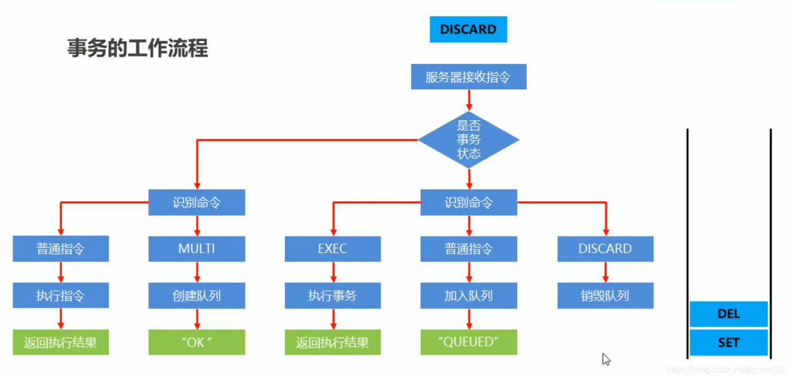

### 事务

redis事务是将一系列的命令放入一个队列Queue，然后原子顺序执行（执行过程中不会执行除此队列之外的指令）。

redis的事务没有回滚的概念，中间某一条指令出错，会继续向下执行。

##### 事务的基本操作

- 开启事务

> multi

​		作用
设定事务的开启位置，此指令执行后，后续的所有指令均加入到事务中

- 执行事务

> exec

​		作用
设定事务的结束位置，同时执行事务。与multi成对出现，成对使用

**注意：加入事务的命令暂时到任务队列中，并没有立即执行，只有执行exec命令才开始执行**

##### 事务定义过程中发现问题，怎么办？

- 取消事务

> discard

​		作用
终止当前事务定义，发生在multi之后，exec之前

##### 事务的工作流程

##### 事务的注意事项

- 语法错误:
  指命令书写格式有误

  处理结果
  如果定义的事务中所包含的命令存在语法错误，整体事务中所有命令均不会被执行。包括那些语法正确的命令

- 运行错误
  指命令格式正确，但是无法正常的执行。例如对list进行incr操作

  能够正确运行的命令会执行，运行错误的命令不会执行
  注意：已经执行完毕的命令对应的数据不会自动回滚，需要程序员自己在代码中实现回滚

##### 基于特定条件的事务执行——锁

- 对key添加监视锁，在执行exec前如果key发生了变化，终止事务执行

> watch key1 [key2…]

- 取消对所有key的监视

> unwatch

##### 基于特定条件的事务执行——分布式锁

解决方案

- 使用setnx设置一个公共锁

> setnx lock-key value

利用setnx命令的返回值特征，有值则返回设置失败，无值则返回设置成功

- 对于返回设置成功的，拥有控制权，进行下一步的具体业务操作
- 对于返回设置失败的，不具有控制权，排队或等待
  操作完毕通过**del**操作释放锁

> del lock-key

- 使用expire为锁key添加时间限定，到时不释放，放弃锁 **避免死锁**

> expire lock-key second
>
> 或者pexpire lock-kay millisenconds

由于操作通常都是微秒或者毫秒级，因此该锁设定时间不宜设置过大。具体时间需要业务测试后确认

- 例如：持有锁的操作最长执行时间127ms,最短执行时间7ms

- 测试百万次最长执行时间对应命令的最大消耗时，测试百万次网络延迟平均耗时
- 锁时间设定推荐：最大耗时* 120%+平均网络延迟*110%

- 如果业务最大耗时<<网络平均延迟，通常为2个数量级，取其中单个耗时较长即可