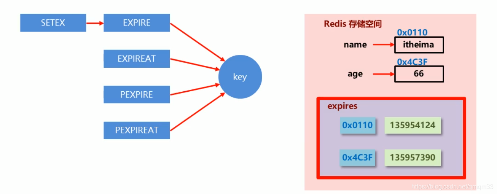
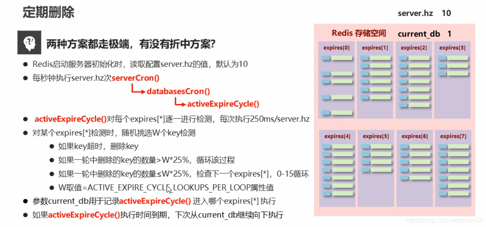
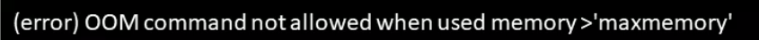
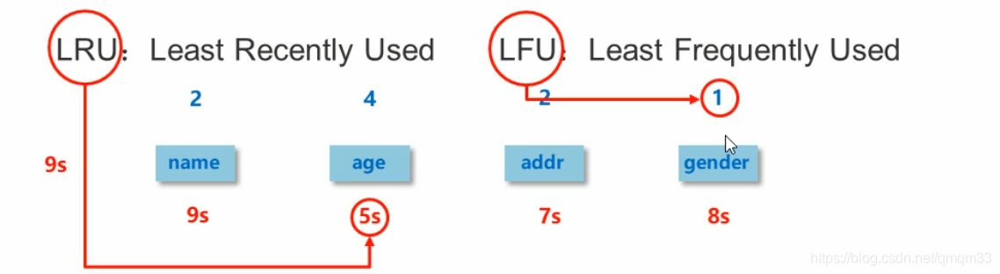
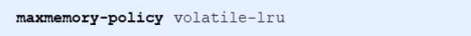

# Redis的删除策略

### Redis中的数据特征

Redis是一种内存级数据库，所有数据均存放在内存中，内存中的数据可以通过TTL指令获取其状态，TTL *key*返回的信息如下

- XX : 具有时效性的数据
- -1 : 永久有效的数据
- -2 : 已经过期的数据 或 被删除的数据 或 未定义的数据

### 数据删除策略

1. 定时删除
2. 惰性删除
3. 定期删除

##### 时效性数据的存储结构

##### 数据删除策略的目标

在内存占用与CPU占用之间寻找一种平衡，顾此失彼都会造成整体redis性能的下降，甚至引发服务器宕机或内存泄漏。

### 1定时删除

* 创建一个定时器，当key设置过期的时间时，由定时器任务立即执行对键值对的删除操作

优点：节约内存，到时就删除，快速释放掉不必要的内存占用

缺点：CPU压力很大，无论CPU此时负载多高，均占用CPU，会影响redis服务器响应时间和指定吞吐量

总结：用处理器性能换取存储空间（时间换空间）

### 2惰性删除

* 数据到达过期时间，不做处理。等下次访问该数据时：
  * 如果未过期，返回数据
  * 发现已经过期，删除，返回不存在

优点：节约CPU性能，发现必须删除的时候才删除

缺点：内存压力很大，出现长期占用内存的数据

总结：用存储空间换取处理器性能（空间换时间）

**以上两种方式都走极端，但是也有折中的方案**

### 3定期删除

* redis启动时，读取server.hz的值，默认为10

* 每秒中执行server.hz次serverCron()

  

* 周期性轮询redis中的时效性数据，采用随机抽取的策略，利用过期数据占比的方式删除频度

* 特点1：CPU性能占用设置有峰值，检测频度可自定义设置

* 特点2：内存压力不是很大，长期占用内存的冷数据会被持续性清理

* 总结：周期性抽查存储空间

### 删除策略对比

1. 定时删除：
   * 节约内存，无占用
   * 不分时段占用CPU资源，频度高
   * 拿时间换空间
2. 惰性删除
   * 内存占用严重
   * 延时执行，节约CPU性能
   * 拿空间换时间
3. 定期删除
   * 内存随机清理
   * 每秒花费固定的CPU资源维护内存数据
   * 随机抽查，重点抽查

### 逐出算法

##### 新数据进入检测

当新数据进入redis时，如果内存不足怎么办？

- Redis使用内存存储数据，在执行每一个命令前，会调用freeMemorylfNeeded()检测内存是否充足。如果内存不满足新加入数据的最低存储要求，redis要临时删除一些数据为当前指令清理存储空间。清理数据的策略称为逐出算法。
- 注意：逐出数据的过程不是100%能够清理出足够的可使用的内存空间，如果不成功则反复执行。当对所有数据尝试完毕后，如果不能达到内存清理的要求，将出现错误信息
- 

##### 影响数据逐出的相关配置

- 最大可使用内存

> maxmemory

​		占用物理内存的比例，默认为0，表示不限制。生产环境中根据需求设定，通常设置在50%以上

* 每次选取代删除数据的个数

> maxmemory-samples

​		选取数据时并不会全库扫描，导致严重的性能消耗，降低读写性能。因此采用随机获取数据的方式作为待检测删除数据

- 删除策略

> maxmemory-policy

​		达到最大内存后的，对被挑选出来的数据进行删除的策略

**检查易失数据（可能会过期的数据集server.db[i].expires)**

1. volatile-lru：挑选最近最少使用的数据淘汰  最近最少使用
2. volatile-lfu：挑选最近使用次数最少的数据淘汰  最近最不经常使用
3. volatile-ttl ：挑选将要过期的数据淘汰
4. volatile-random：任意选择数据淘汰

**检测全库数据（所有数据集server.db[i].dict）**

1. allkeys-lru：挑选最近最少使用的数据态太
2. allkeys-lfu：挑选最近使用次数最少的数据淘汰
3. allkeys-random：任意选择数据淘汰
   放弃数据驱逐

**禁止驱逐**

no-enviction（驱逐）：禁止驱逐数据（redis4.0默认策略），会引发错误OOM（OutOfMemory）

配置

* 数据逐出策略配置依据

  使用INFO命令输出监控信息，查询缓存int和miss的次数，根据业务需求调优Redis配置