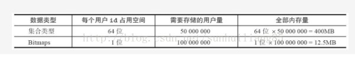
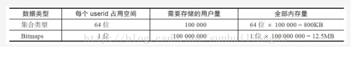

## 一.数据结构模型

Redis提供的Bitmaps这个“数据结构”可以实现对位的操作。Bitmaps本身不是一种数据结构，实际上就是字符串，但是它可以对字符串的位进行操作。

可以把Bitmaps想象成一个以位为单位数组，数组中的每个单元只能存0或者1，数组的下标在bitmaps中叫做偏移量。单个bitmaps的最大长度是512MB，即2^32个比特位。

## 二. 命令

 

 

### 2.1 设置值

命令：setbit key offset value

例如：setbit unique:users:2017-07-11 0 1 代表2017-07-11这天的独立访问用户的Bitmaps，用下标代表用户ID，1表示访问，0表示未访问，则上述命令代表第一个用户2017-07-11这天访问了系统。

 

### 2.2 获取值

命令：getbit key offset

例如： setbit unique:users:2017-07-11 0 1

getbit unique:users:2017-07-11 0

返回： 1

假如offset=0的元素不存在，则返回结果0

 

### 2.3 获取Bitmaps指定范围值为1的个数

命令：bitcount  key  [start] [end]

例如：setbit unique:users:2017-07-11 0 1

setbit unique:users:2017-07-11 9 1

bitcount unique:users:2017-07-11

返回： 2

bitcount unique:users:2017-07-11 0 0

返回：1

 

### 2.4 Bitmaps间的运算

#### 2.4.1 bitop and destkey key[key…]   计算Bitmaps的交集的数量

命令：bitop and destkey key[key…]

返回：保存到 destkey 的字符串(1字符等于8位)的长度，和输入 key 中最长的字符串长度相等。

 

例如：

redis> SETBIT bits-1 0 1        # bits-1 = 1001

(integer) 0

 

redis> SETBIT bits-1 3 1

(integer) 0

 

redis> SETBIT bits-2 0 1        # bits-2 = 1101

(integer) 0

 

redis> SETBIT bits-2 1 1

(integer) 0

 

redis> SETBIT bits-2 3 1

(integer) 0

 

redis> BITOP AND and-result bits-1bits-2

(integer) 1

 

redis> GETBIT and-result 0      # and-result = 1001

(integer) 1

 

redis> GETBIT and-result 1

(integer) 0

 

redis> GETBIT and-result 2

(integer) 0

 

redis> GETBIT and-result 3

(integer) 1

 

#### 2.4.2 bitop or destkey key[key…]   计算Bitmaps的并集的数量

命令：bitop or destkey key[key…]

返回：保存到 destkey 的字符串(1字符等于8位)的长度，和输入 key 中最长的字符串长度相等。

 

 

例如：

redis> SETBIT bits-1 0 1        # bits-1 = 1001

(integer) 0

 

redis> SETBIT bits-1 3 1

(integer) 0

 

redis> SETBIT bits-2 0 1        # bits-2 = 1101

(integer) 0

 

redis> SETBIT bits-2 1 1

(integer) 0

 

redis> SETBIT bits-2 3 1

(integer) 0

 

redis> BITOP or or-result bits-1 bits-2

(integer) 1

 

redis> GETBIT or-result 0      # or-result = 1101

(integer) 1

 

redis> GETBIT or -result 1

(integer) 1

 

redis> GETBIT or -result 2

(integer) 0

 

redis> GETBIT or -result 3

(integer) 1

#### 2.4.3 bitop not destkey key  计算Bitmaps的非集的数量

命令：bitop not destkey key

返回：保存到 destkey 的字符串(1字符等于8位)的长度，和输入 key 中最长的字符串长度相等。

 

 

例如：

redis> SETBIT bits-1 0 1        # bits-1 = 1001

(integer) 0

 

redis> SETBIT bits-1 3 1

(integer) 0

 

 

redis> SETBIT bits-2 3 1

(integer) 0

 

redis> BITOP not not-result bits-1

(integer) 1

 

redis> GETBIT not -result 0      # and-result = 0110

(integer) 0

 

redis> GETBIT not -result 1

(integer) 1

 

redis> GETBIT not -result 2

(integer) 1

 

redis> GETBIT not -result 3

(integer) 0

 

#### 2.4.4 bitop xor destkey key  计算Bitmaps的异或集的数量

命令：bitop xor destkey key[key..]

返回：保存到 destkey 的字符串(1字符等于8位)的长度，和输入 key 中最长的字符串长度相等。

 

例如：

redis> SETBIT bits-1 0 1        # bits-1 = 1001

(integer) 0

 

redis> SETBIT bits-1 3 1

(integer) 0

 

 

redis> SETBIT bits-2 3 1

(integer) 0

 

redis> BITOP xor xor-result bits-1bits-2

(integer) 1

 

redis> GETBIT not -result 0      # xor-result = 0100

(integer) 0

 

redis> GETBIT not -result 1

(integer) 1

 

redis> GETBIT not -result 2

(integer) 0

 

redis> GETBIT not -result 3

(integer) 0

#### 2.4.5 计算Bitmaps中第一个值为targetBit的偏移量

命令：bitpos key targetBit [start][end]

返回：第一个值为的偏移量

 

例如：

10.3.34.101:6378> setbit testbit 0 1   testbit 111010

(integer) 0

10.3.34.101:6378> setbit testbit 1 1

(integer) 0

10.3.34.101:6378> setbit testbit 2 1

(integer) 0

10.3.34.101:6378> setbit testbit 3 0

(integer) 0

10.3.34.101:6378> setbit testbit 4 1

(integer) 0

10.3.34.101:6378> setbit testbit 5 0

(integer) 0

10.3.34.101:6378> bitpos testbit 0    第一个值为0的偏移量是3

(integer) 3

### 三.Bitmaps应用场景

#### 3.1 统计活跃用户数

将每个用户的id对应bitmaps上的一个下标，通过对活跃用户对应的位进行置位，就能用一个value记录所有的活跃用户信息。

**假如我们有如下场景：**

需要统计N天内访问网站的用户，连续N天访问网站的用户。

解决方案：

   我们将每天访问网站的用户存储在一个bitmaps中，通过日期生成键，例如：unique:users:2017-07-11,这样我们就可以统计每天的用户访问情况，同时通过bitmaps的与或运算等功能统计出一个时间段内的活跃用户及连续N天访问网站用户等相关需求。

## 四. Bitmaps分析

当记录的活跃用户数占总数的比例高的时候，bitmaps相比集合类型要节省非常多的内存，但是如果每天的活跃用户数很少，则bitmaps并不试用。下面以1亿用户，每天分别有5千万和10万来具体分析：

