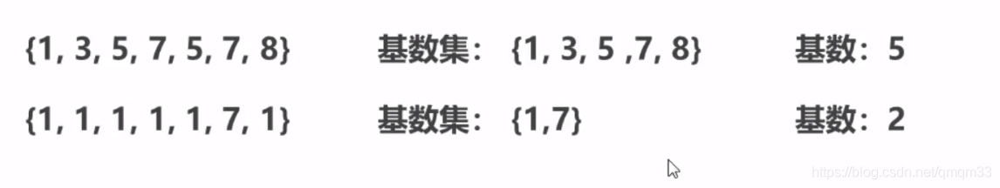

### HyperLogLog

**统计独立UV**

- 原始方案 set
  存储每个用户的id（字符串）
- 改进方案：Bitmaps
  存储每个用户状态（bit)
- 全新的方案：Hyperloglog
  基数统计

**基数**

- 基数是数据集去重后元素的个数
- HyoerLogLog是用来做计数统计的，运用了LogLog的算法
  

##### HyperLogLog类型的基本操作

- 添加数据

> pfadd key element [element …]

- 统计数据

> pfcount key [key …]

- 合并数据

> pfmerge destkey sourcekey [sourcekey …]

**相关说明**

- 用于进行计数统计，不是集合，不保存数据，值记录数量而不是具体数据
- 核心是计数估算算法，最终数值存在一定误差
- 误差范围：计数估计的数据是一个带有0.81%标准错误的近似值
- 耗空间极小，每个hyperloglog key占用了12k的内存用于标记基数
- pfadd命令不是一次性分配12k内存使用，会随着基数的增加内存逐渐增大
- Pfmerge命令合并后占用的内存空间为12k,无论合并之前数据量多少

