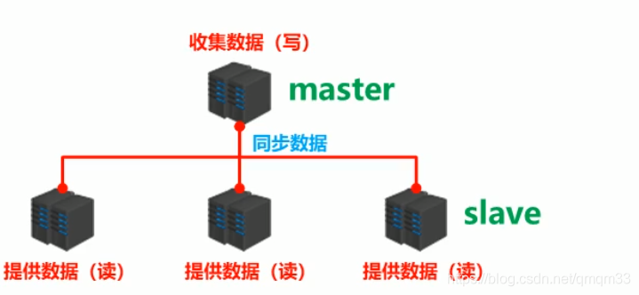
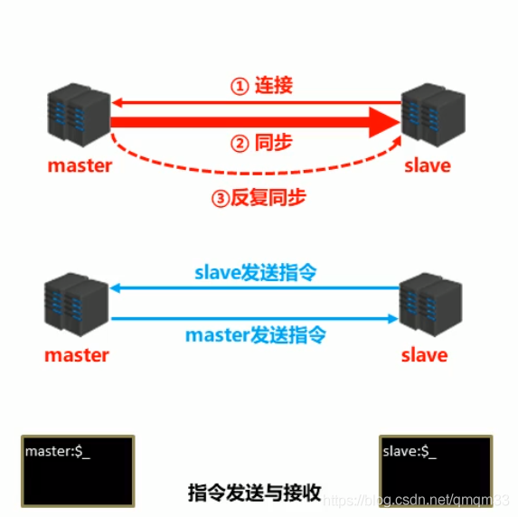
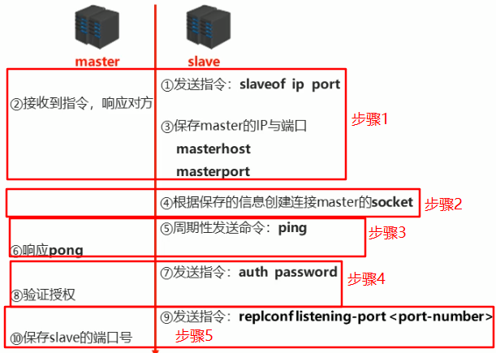
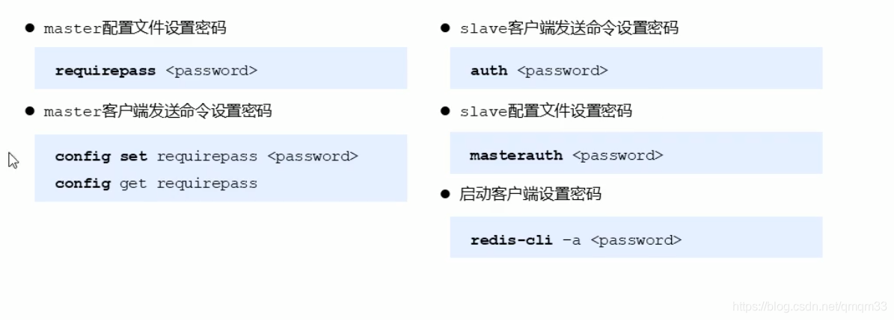
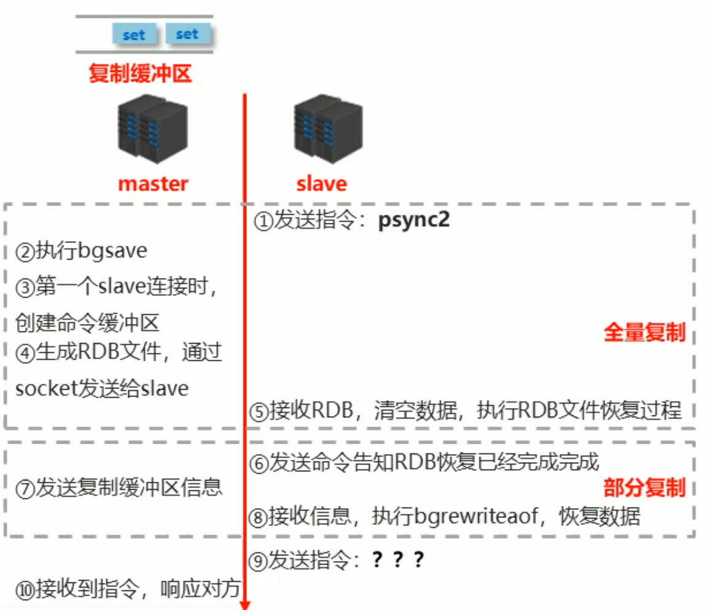
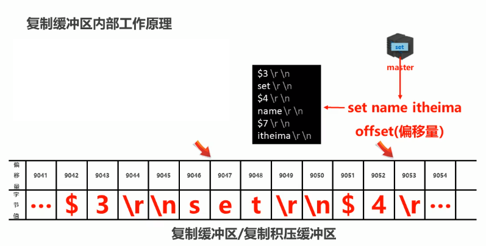
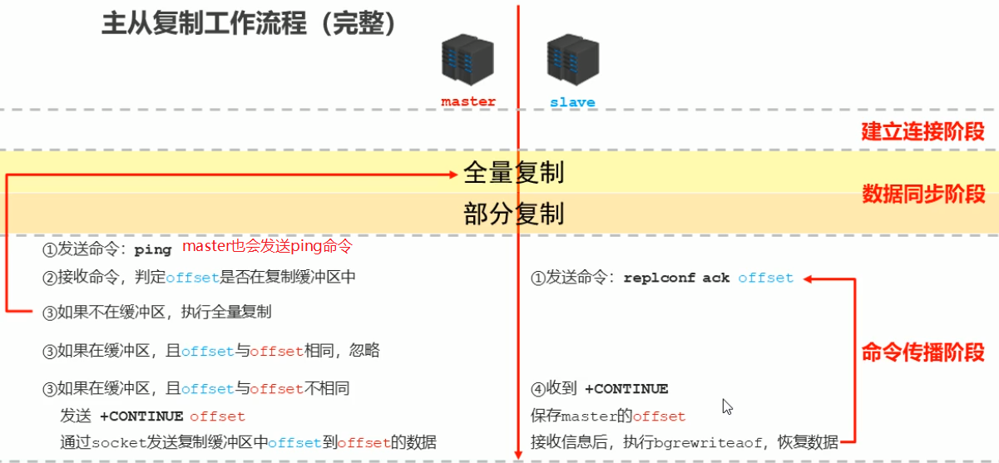
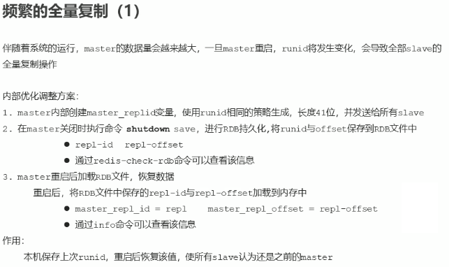
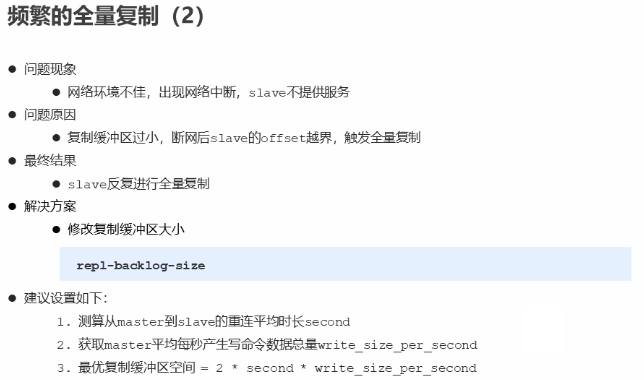
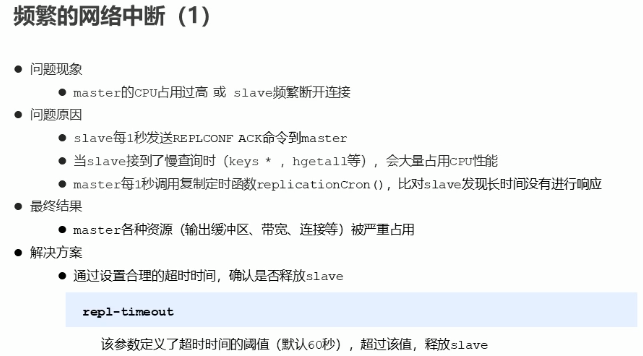

# Redis主从复制

为了避免单点redis服务器故障，准备多台服务器，互相连通。将数据复制多个副本保存在不同的服务器上，**链接在一起**，并保证数据是否**同步**的，即使有其中一台服务器宕机，其他服务器依然可以继续提供服务，实现Redis的高可用，同时实现数据冗余备份。

##### 主从复制

主从复制即将master中的数据即时，有效的复制到slace中
特征：一个master可以拥有多个slave,一个slave只对应一个master
职责：

- master:

  写数据
  执行写操作时，将出现变化的数据自动同步到slave

  读数据（可忽略）

- slave:

  读数据

  写数据（**禁止**）

##### 主从复制的作用

- 读写分离：master写，slave读，提高服务器的读写负载能力
- 负载均衡：基于主从结构，配合读写分离，由slave分担master负载，并根据需求的变化，改变slave的数量，通过多个从节点分担数据读取负载，大大提高Redis服务器并发量与数据吞吐量
- 故障恢复：当master出现问题时，由slave提供服务，实现快速的故障恢复
- 数据冗余：实现数据热备份，时持久化之外的一种数据冗余方式
- 高可用基石：基于主从复制，构建哨兵模式与集群，实现Redis的高可用方案

##### 主从复制工作流程

**总述**

- 主从复制过程大体可以分为3个阶段
  * 建立连接阶段（即准备阶段）
  * 数据同步阶段
  * 命令传播阶段

**阶段一：建立链接**

- 建立slave到master的链接，使master能够识别slave，并保存slave端口号

1. 设置master的地址和端口，保存master信息
2. 建立socket连接
3. 发送ping指令（定时器任务）
4. 身份验证（一般情况下，redis只是内网访问，都是无密码的）
5. 发送slave端口信息

至此，主从连接成功。达到了一下的状态：

* 在slave端，保存master的地址和端口
* 在master端，保存slave的地址和端口
* 总体而言，两者之间建立了socket连接

##### 主从链接(slave链接master)

- 方式1：客户端发送命令

  > slaveof *masterip* *materport* 

-  方式2：启动slave服务端时配置参数

  > redis-server -slaveof *masterip* *materport* 

- 方式3：服务器的配置文件中添加参数

  > slaveof *masterip* *materport* 

**主从断开链接**

- 客户端发送命令

	> slaveof no one

**授权访问**

**阶段二、数据同步阶段工作流程**

- 在slave初次链接master后，复制master中的所偶数据到slave
- 将slave的数据库状态更新成master当前数据库状态

1. slave请求同步数据
2. master创建RDB同步数据（执行bgsave）
3. slave恢复RDB同步数据
4. slave请求部分同步数据
5. slave恢复部分同步数据

至此，数据同步工作完成，达到了一下状态：

* 在slave端，具有master端全部数据，包含RDB过程接收的数据
* 在master端，保存slave当前数据同步的位置

**数据同步阶段master说明**

1. 如果master数据量巨大，数据同步阶段应该避免流量高峰期，避免造成master阻塞，影响业务正常执行

2. 复制缓冲区大小设定不合理，会导致数据溢出。如进行全量复制周期太长，进行部分赋值时发现数据已经存在丢失的情况，必须进行第二次全量复制，致使slave陷入死循环状态,修改缓冲区大小操作如下

   > repl-backlog-size 1mb   [master端操作]

3. master单机内存占用主机内存的比例不应过大，建议使用50-70%的内存，留下30-50%的内存用于执行bgsave命令和创建复制缓冲区

**数据同步阶段slave说明**

1. 为避免slave进行全量复制、部分复制时服务器响应阻塞或数据不同步，建议关闭此期间的对外服务

	> slave-server-stale-data yes|no  关掉写数据的功能

2. 数据同步阶段，master发送给slave信息可以理解master是slave的一个客户端，主动向slave发送命令
3. 多个slave同时对master请求数据同步，master发送的RDB文件增多，会对带宽造成巨大冲击，如果master宽带不足，因此数据同步需要根据业务需求，适量错峰。
4. slave过多时，建议调整拓扑结构，由一主多从结构变为树状结构，中间节点既是master,也是slave。注意使用树状结构时，由于层级深度，导致深度越高的slave与最顶层master间数据同步延迟较大，数据一致性变差，应谨慎选择

**阶段三：命令传播阶段**

- 当master数据库状态被修改后，导致主从服务器数据库状态不一致，此时需要让主从数据同步到一致的状态，同步的动作成为命令传播
- master将接受到的数据变更命令发送给slave，slave接受命令后执行命令。

**命令传播阶段的部分复制**

- 命令传播阶段出现了断网的现象

  网络闪断闪连     忽略

  短时间网络中断 部分复制

  长时间网络中断 全量复制

- 部分复制的三个要素

  1. 服务器的运行id (runid)

     * 概念：服务器运行ID时每一台服务器每次运行的身份识别码，一台服务器多次运行可以生成多个运行ID

     * 组成：运行ID由40位字符组成，是一个随机的十六禁止字符

     * 作用：运行ID被用于在服务器间进行传输，识别身份

       ​			如果想两次操作均对同一台服务器进行，必须每次操作携带对应的运行ID，用于对方识别

     * 实现方式：运行ID在每台服务器启动时自动生成，master在首次连接slave时，会将自己的运行ID发送给slave，slave保存此ID，通过info命令，可以查看节点的runid

  2. 复制积压缓冲区

     * 概念：复制缓冲区，又名复制积压缓冲区，是一个先进先出的队列（FIFO），用于存储服务器执行过的命令，每次传播命令，master都会将传播的命令记录下来并存储在复制缓冲区

       复制缓冲区默认存储空间大小是1M，由于存储空间大小是固定的，当入队元素的数量大于队列长度时，最先入队的元素会被弹出，而新元素会被放入队列

     * 由来：每台服务器启动时，如果开启有AOF或被链接成为master节点，即创建复制缓冲区。
     * 作用：用来保存master收到的所有指令（仅影响数据变更的指令，例如set,select）

     * 组成：

       * 偏移量
       * 字节值
     
       
     
     * 工作原理：
     
       * 通过offset区分不同的slave当前数据传播的差异
       * master记录已发送的信息对应的offset
       * slave记录已接收的信息对应的offset
     
  3.   主从服务器复制偏移量（offset）
  
     * 概念：一个数字，描述复制缓冲区中的指令字节位置
  
     * 分类
  
       * master复制偏移量：记录发送给所有slave的指令字节对应的位置（多个）
       * slave复制偏移量：记录slave接受master发送过来的指令字节对应的位置（一个）
  
     * 数据来源：
  
       master端：发送一次记录一次
  
       slave端：接收一次记录一次
  
     * 作用：同步信息，对比master与slave的差异，当slave断线后，恢复数据使用
  
  

**心跳机制**

- 进入命令传播阶段后，master与slave间需要进行信息交换，使用心跳机制进行维护，实现双方连接保持在线
- master心跳
  * 指令：PING
  * 周期：由repl-ping-slave-period决定，默认10秒
  * 作用：判断slave是否在线
  * 查询： INFO replication   获取slave最后一次链接时间间隔,lag项维持在0或1视为正常
- slave心跳指令
  * 指令：REPLCONF ACK {offset}
  * 周期：1秒
  * 作用1：汇报slave自己的复制偏移量，获取最新的数据变更指令
  * 作用2：判断master是否在线
    心跳阶段注意事项

**心跳阶段注意事项**

- 当slave多数掉线，或延迟过高时，master为保障数据稳定性，将拒绝所有信息同步操作，以下配置在master中配置

    > min-slave-to-write 2   slave数量少于2个，关闭master写功能
    >
    > min-slave-max-lag 8   salve的连接时长过长，关闭master写功能

	slave数量少于2个或者所有slave延迟都大于等于10秒时，强制关闭master写功能，停止数据同步

- slave数量由slave发送REPLCONF ACK命令做确认

- slave延迟由slave发送REPLCONF ACK命令做确认

***

重点！！此图是主从复制的完整工作流程

***

##### 主从复制常见问题

