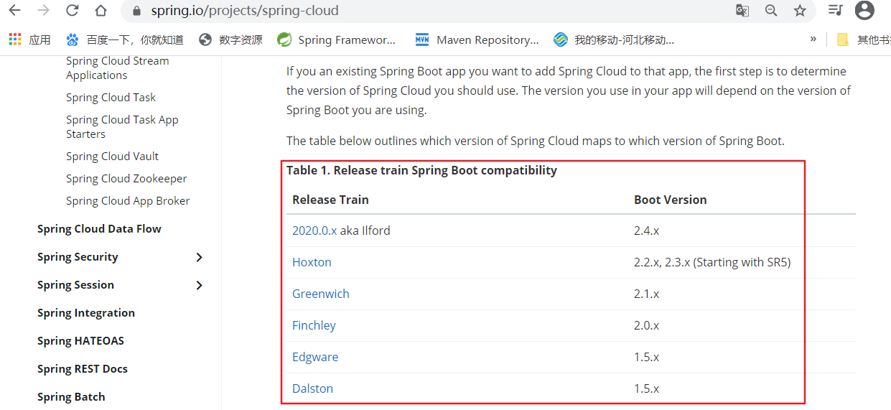
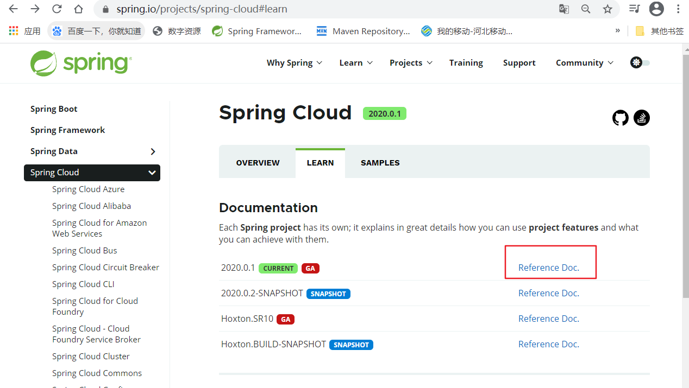
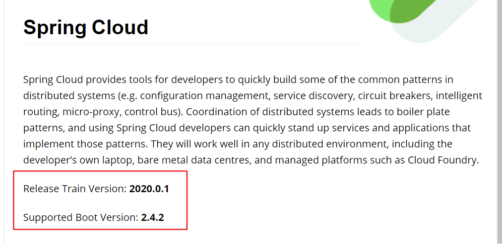

前提：Spring Cloud 必须使用 Spring Boot 开发 。

# 1.Spring Cloud 版本规则

 大多数 Spring 项目是以 **"主版本号.次版本号.增量版本号.里程碑版本号"** 的形式命名版本。**主版本号** 表示项目的重大重构；**次版本号** 表示新特性的添加和变化；**增量版本号** 一般表示Bug修复；**里程碑版本号** 表示某版本号的里程碑；例如：Spring Framework 稳定版本4.3.5.RELEASE、里程碑版本 5.0.0.M4 等。

  来到 Spring Cloud 这块，它并未采用上面这种方式。而是以 **"英文单词SRX（X为数字）"** 的形式命名版本号。**因为 Spring Cloud 是一个综合项目，包含很多的子项目，由于子项目也维护着自己的版本号，所以采用这种命名方式避免与子项目的版本混淆。**

  **"英文单词"** 叫做 **Release Train**(俗称：火车发版)，Camden、Dalston、Edgware、Finchley、Greenwich、Hoxton 等都是 **伦敦地铁** 的名称，按照字母顺序发行；

  **"SRX"** 表示 **Service Release**，其中X是一个递增数字。一般表示 Bug 后的版本；在 SR 版本发布之前，会先发布一个 Release 版本，例如在发布 Edgware SR1之前，会先发布 Edgware RELEASE。

  **"GA"** 表示 **General Availability**，正式发布的版本，官方推荐使用此版本。在国外都是用 GA 来说明 Release 版本的。

  **"RC"** 表示 **Release Candidate**，候选版本，几乎不会加入新功能，着重于除错，是最终版之前的最后版本。

  **"SNAPSHOT"** 表示 **快照版本**，不稳定、尚处于开发中的版本。

  **"PRE"** 表示 **预览版**，内部测试版。主要是给开发人员和测试人员测试和找BUG用的，不建议使用。

# 2.版本选型问题

**提示：并不是用最新的就最好哦，这里也是有一个对应关系的**

## 2.1 Spring Boot 选择

  在Spring Boot 2.x 之前，我们使用的都是1.x 版本。但是在 2.x 版本出来之后，Spring 官方推荐我们升级使用 Spring Boot 2.x 版本。

 官方文档可参考：[Spring Boot 2.x 新特性](https://github.com/spring-projects/spring-boot/wiki/Spring-Boot-2.0-Release-Notes)。

## 2.2 Spring Cloud 版本选择

Spring Boot 和 Spring Cloud 有一个对应关系的。

