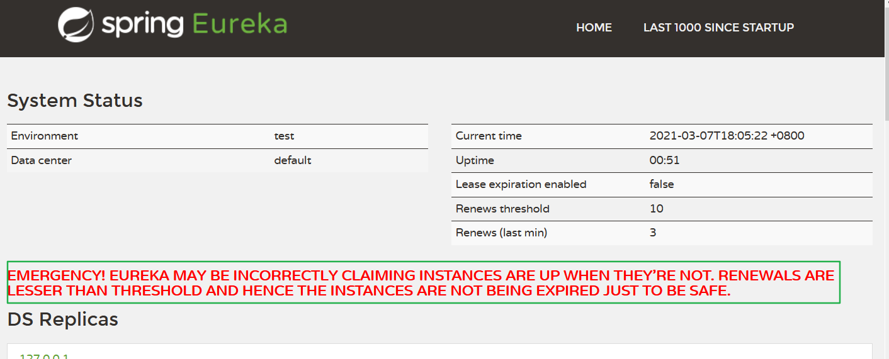

# 为什么要使用Spring Cloud全家桶

[基于 RestTemplate 搭建微服务工程](008-RestTemplate.md)虽然可以实现服务之间的调用，但是 **随着服务模块的增加** 、 **服务模块需要变更为集群模式** 的需求，这时候 **服务与服务之间的管理（链路调用管理、配置管理、注册管理 等等）** 就变得非常的困难。**此时就需要用到 Spring Cloud 全家桶来对我们多个服务进行管理了。**


# 服务治理

​		在我们没有服务注册中心时，也可以实现多个服务之间调用。服务调用之间，我们是通过 RestTemplate 直接将 **服务提供者** URL写死在代码中的方式来完成调用。

  当服务很多时，单靠代码来手动管理就变得很麻烦。此时就需要引入一个**公共组件**来帮我们统一管理这么多的服务，包括 **服务是否正常运行**、**集群服务管理**、**动态感知服务上下线** 等。**Eureka** 就这样来到了我们的身边。

### 2.1 什么是服务治理

  Spring Cloud 封装了 Netflix 公司开发的 Eureka 模块来 **实现服务治理**。

  在传统的 RPC 远程调用框架中，管理每个服务与服务之间的依赖关系非常复杂，所以需要使用 **服务治理** 来管理服务与服务之间的依赖关系，从而实现 **服务调用**、**负载均衡**、**容错**、**服务的注册与发现** 等。

### 2.2 什么是服务注册与发现

  Eureka 采用了 **CS** 的设计机构 **（C指的是client（客户端软件），S指的是Server（服务端软件）**，Eureka Server 作为服务注册功能的服务器，它是服务注册中心。而系统中的其他微服务，使用 Eureka 的客户端连接到 Eureka Server，并维持心跳连接。这样系统的维护人员就可以通过 Eureka Server 来监听系统中各个微服务是否正常运行。

  在服务注册与发现中，有一个注册中心。当服务器启动的时候，会把当前自己服务器的信息（服务地址、通讯地址等）以别名的方式注册到注册中心上。另一方（消费者|服务提供者）会以该别名的方式去注册中心上获取到实际的服务通讯地址，然后再通过调用等方式来实现通信。


## 3.Eureka 组件介绍

Eureka 包含两个组件：

**1.Eureka Server**   

**2.Eureka Client**

### 3.1 Eureka Server

  Eureka Server 提供 **服务注册** 服务。各个微服务节点通过配置启动后，会在 Eureka Server 中进行注册，这样 Eureka Server 中的服务注册表中就会存储所有可用服务节点的信息，服务节点的信息可以在界面中直观的看到。

### 3.2 Eureka Client

  Eureka Client 通过 **注册中心** 进行访问。它是一个 Java 客户端，用于简化与 Eureka Server 的交互，客户端同时也具备一个内置的、使用轮询（round-robin）负载算法的负载均衡器。

  在应用启动后，Eureka Client 将会向 Eureka Server **发送心跳连接（周期为30s）**。如果 Eureka Server 在多个心跳周期内没有接收到某个节点的心跳，Eureka Server 将 **会从服务注册表中把这个服务节点移除（默认 90s）**

## 4.微服务工程引入 Eureka

### 4.1 搭建 Eureka Server 工程

##### Ⅰ.建module

  模块名称定义为：**a03-cloud_eureka_server_7001**，来充当服务注册中心的角色。

##### Ⅱ.改pom

##### Ⅲ.写yml

##### Ⅳ.主启动

​	略，见git

### 4.2 改造 Eureka Client 工程

​		Eureka Server 服务已经成功，接下来我们只需将 **服务提供者**、**服务消费者** 都注册到 Eureka Server 中，让 Eureka Server 能够管理这些服务。

  **服务提供者** 、**服务消费者** 相对Eureka Server 来说，他们都是客户端，改造都是一样样的。此处就以 **服务提供者** 为例进行改造。

##### Ⅰ.建module

  改造原来的`a01-cloud-provider-payment8001`工程和`a02-cloud-consumer-order80`工程，分别当作服务的提供者和服务的消费者

##### Ⅱ.改pom

添加依赖

```xml
        <!--eureka client-->
        <dependency>
            <groupId>org.springframework.cloud</groupId>
            <artifactId>spring-cloud-starter-netflix-eureka-client</artifactId>
        </dependency>
```


##### Ⅲ.写yml

```yaml
server:
  port: 8001
eureka:
  client:
    # 表示是否将自己注册进 EurekaServer.默认为true
    register-with-eureka: true
    # 是否从EurekaServer抓取已有的注册信息,默认为true.单节点无所谓,集群必须设置为true,才能配合ribbon使用负载均衡
    fetchRegistry: true
    service-url:
      #EurekaServer地址
      defaultZone: http://localhost:7001/eureka     #单机版
```


##### Ⅳ.主启动

​	略，见git

##  集群版搭建

1. 只有一台 Eureka Server 来提供服务，如果 Eureka Server 宕机的话，所有服务都完蛋；
2. 只有一台 **服务提供者** ，它如果挂了，Eureka Server 不挂，同样得完蛋。

> eureka集群原理
>
> ​	**相互注册，互相守望**

##### 1再创建 Eureka Server 模块

模块名称定义为：**a040-cloud_eureka_server_7002**，来充当服务注册中心的角色。让它与 **a030-cloud_eureka_server_7001** 构成集群模式。

集群模式，需要修改两个注册中心的yml文件。

#### 2服务提供者(Service Provider) 集群搭建

  原有服务提供者为 `a010-cloud-provider-payment8001` ，我们在来个一样的模块，命名为：`a011-cloud-provider-payment8002`。让它们两个构成集群模式。

最终效果


**此时发现：**

1. 7001 和 7002 两个Eureka Server 集群之间相互注册。
2. 8001 和 8002 两个服务提供方也注册到了 7001 和 7002 两个 Eureka Server 集群中

## 3将消费者注册到 Eureka Server集群

将消费着的yml文件的defaultZone修改即可，也可以不修改，因为注册中心是相互守望、互相注册的。

#### 4需要对消费者 Controller 进行修改

  之前我们是直接将地址写死的状态，因为现在 **服务提供方** 也已经是集群模式了，我们不能继续使用域名来直接调用了，**此处就需要来使用 服务名调用了**。

```java
@RestController
@RequestMapping("order")
@Slf4j
public class OrderController {

    // private final static String PAYMENT_URL = "http://localhost:8001/";
    // 修改为服务名进行访问
    public static final String PAYMENT_URL = "cloud-provider-payment";


    private final RestTemplate restTemplate;

    public OrderController(RestTemplate restTemplate) {
        this.restTemplate = restTemplate;
    }

    @PostMapping("create")
    public CommonResult create(@RequestBody Payment payment) {
        log.info("消费者调用创建接口...");
        return restTemplate.postForObject(PAYMENT_URL + "payment/create", payment, CommonResult.class);
    }

    @GetMapping("get/{id}")
    public CommonResult getById(@PathVariable Long id) {
        log.info("消费者调用创建接口...");
        return restTemplate.getForObject(PAYMENT_URL + "payment/get/" + id, CommonResult.class);
    }

}
```

#### RestTemplate 开启负载均衡注解

```java
@Configuration
@EnableEurekaClient // 说明这是一个euraka的客户端
public class ApplicationContextConfiguration {


    @Bean
    @LoadBalanced // 开启负载均衡，默认为轮询
    public RestTemplate getRestTemplate() {
        return new RestTemplate();
    }

}
```

到此为止，**Eureka Server 集群**、**Service Provider 集群**、**消费者注册到 Eureka Server 集群**（包括 **Service Provider 集群注册到 Eureka Server 集群**）全部配置完成。

  RestTemplate 配合 **微服务名** 访问方式、@LoadBalance 默认轮询负载均衡机制的使用，Eureka 微服务集群模式，大功搞成。

## 服务实例名

   当服务实体向 Eureka Server 注册时，注册名默认是 **"IP名:应用名:应用端口名"**，在 Eureka Server 中显示如图。


根据需要，**我们也可以自定义实例名**。

当我们将鼠标放在实例上，发现 url 指向的如果还是**主机名+端口号**，或者说是你想跳转到指定的地址。**此时我们也可以来自定义实例名指向的 URL 地址。**

```yaml
eureka:
  instance:
    instance-id: ${spring.cloud.client.ip-address}:${server.port} # 主机名称修改(配置后Eureka Server处显示,不配置显示默认注册名)
    prefer-ip-address: true # 访问路径可以显示IP地址
    status-page-url-path: /aaa/bbb # 跳转的相对路径
```

# 关闭 Eureka 自我保护模式

保护模式，主要用于一组客户端 和 Eureka Server 之间存在网络分区场景下的保护。一旦进入保护模式，Eureka Server 将会尝试保护其服务注册表中的信息，不再删除服务注册表中的数据，也就是不会注销任何微服务实例。

  当我们在 Eureka Server 服务首页中，看到有如下这段提示，则说明此时 Eureka Server 已经进入了保护模式。



## Eureka Server 为什么会进入保护模式

  默认情况下，如果 Eureka Server 在一定时间内没有收到某个微服务实例的心跳，Eureka Server 便会将该实例注销。 **（默认是90s）**

  但是 **当网络分区发生故障(延迟、卡顿、拥挤)时**，微服务与 Eureka Server 之间是无法正常通信的，**在这种情况下微服务本身其实是健康的，本来是不应该注销这个服务的**，此时 Eureka 便会通过 “自我保护模式” 来解决这个问题。

  Eureka 的自我保护机制，就是 CAP 原则中的 **AP 分支**。即满足：**可用性**、**分区容错性**。

> CAP 原则又称 CAP 定理，指的是在一个分布式系统中，一致性（Consistency）、可用性（Availability）、分区容错性（Partition tolerance）。CAP 原则指的是，这三个要素最多只能同时实现两点，不可能三者兼顾。

## 如何禁用自我保护

  在 Eureka 中，自我保护模式默认是 **开启** 的。**此处也只是来演示一下如何关闭。****生产环境中是不建议关闭 Eureka 的自我保护模式**。

eureka server端添加如下配置

```yml
eureka:
  server:
    enable-self-preservation: false #关闭自我保护机制 默认为true
    eviction-interval-timer-in-ms: 2000 #清理无效节点的间隔
```

eureka client端添加如下配置

```yml
eureka:
  instance:
    # Eureka客户端向服务端发送心跳的时间间隔,单位为妙(默认是30s)
    lease-renewal-interval-in-seconds: 1
    # Eureka服务端在收到最后一次心跳后的等待时间上限,单位为秒(默认90s),超时将移除服务
    lease-expiration-duration-in-seconds: 2
```

这种情况下，我们手动将该微服务停止，Eureka Server 便会在 4s 超时过后，将其移除服务。不会给它任何的机会，当遇到网络 **延迟、卡顿、拥挤** 时，这种操作显然是不友好的。

