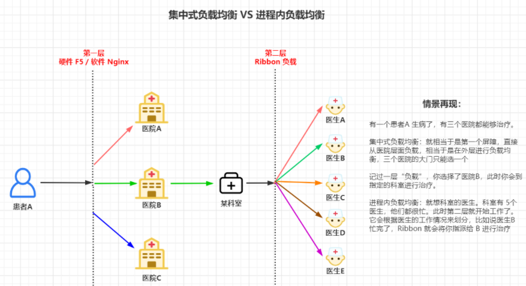
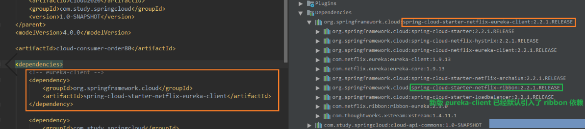
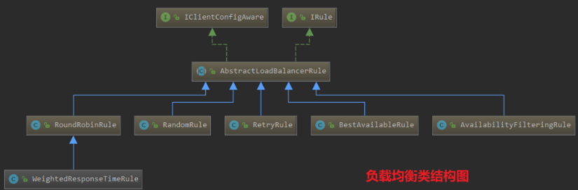
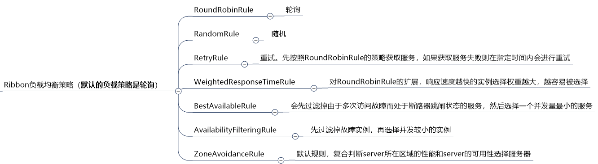

负载均衡

负载均衡，简单的说就是将用户的请求平摊分配到多个服务，从而达到系统的 HA（高可用）。日常中常用的负载均衡有：软件 Nginx、LVS；硬件 F5 等。

负载均衡，又分为两种：**集中式负载均衡**、**进程内负载均衡**。

#### 1.集中式负载均衡

  即在服务的消费方和提供方之间，使用独立的负载均衡设施（可以是硬件，如 ：F5；也可以是软件，如：Nginx）。由该设施负责把访问请求通过某种策略转发至服务的提供方。

#### 2.进程内负载均衡

  即将负载均衡逻辑集成到消费方，消费方从服务注册中心获知有哪些服务地址可用，然后自己再从这些地址中选择出一个合适的服务器进行调用。**Ribbon 就属于进程内负载均衡** ，它只是一个类库，集成于消费方进程，消费方通过它来获取到服务提供方的地址。



# Ribbon

接上一章内容，随着微服务都成功注册到 Eureka Server 中（此处包括 **服务提供方(集群模式)** 和 **服务消费者**），服务注册流程告一段落。

此时接收到一个请求过来，通过 Eureka 服务名的方式进行访问，在调用 **服务提供方** 时，发现它是 **集群模式** 有多个服务可用，那此时到底该调用哪个服务进行数据返回？？

此时就用到了 **负载均衡** 的概念。Spring Cloud就是使用Ribbon来实现的负载均衡

## 1.什么是 Ribbon

  Spring Cloud Ribbon是一个基于HTTP和TCP的客户端 **负载均衡(Load Balance)** 工具，它基于Netflix Ribbon实现。**通过 Spring Cloud 的封装，可以让我们轻松地将面向服务的REST模版请求自动转换成客户端负载均衡的服务调用。**

  Spring Cloud Ribbon虽然只是一个工具类框架，它不像服务注册中心、配置中心、API网关那样需要独立部署，但是它几乎存在于每一个 Spring Cloud 构建的微服务和基础设施中。因为微服务间的调用，API网关的请求转发等内容，实际上都是通过 Ribbon 来实现的，包括后续我们将要介绍的 Feign，它也是基于 Ribbon实现的工具。所以，对 Spring Cloud Ribbon 的理解和使用，对于我们使用 Spring Cloud来构建微服务非常重要。

## 3. RestTemplate

  Spring 提供了一种简单便捷的模板类来进行 API 的调用，那就是 RestTemplate。接下来就详细地跟大家介绍一下 RestTemplate 的使用方法。

  RestTemplate是 Spring 提供的用于访问 Rest服务的客户端，它提供了多种便捷访问远程 Http 服务的方法，能够大大提高客户端的编写效率。对比于之前我们使用的 HttpClient来说，它的底层还是基于 HttpClient 进行封装，而且封装的还不错，使用起来非常的方便。

   RestTemplate 类官方介绍：[ RestTemplate 类官方介绍](https://docs.spring.io/spring-framework/docs/5.2.2.RELEASE/javadoc-api/org/springframework/web/client/RestTemplate.html)。在我们的日常开发中，常用到的也就是 `getForObject()/getForEntity()`、`postForObject()/postForEntity()` 这几个方法。

#### 3.1 xxxForObject 和 xxxForEntity 的区别

此处，就拿 getForObject 和 getForEntity 来说明

**getForObject()：** 返回对象为响应体中数据转换成的对象，基本上可以理解为是JSON

**getForEntity()：** 返回对象为 ResponseEntity 对象，包含了响应中的一些重要信息，比如 **响应头** 、**响应状态码**、**响应体** 等。

**推荐使用 xxxForObject()**。如果你需要一些请求的详细信息，那还是使用 xxxForEntity() 吧

```java
/**
 * 使用 getForObject 直接返回结果对象
 */
@GetMapping("/consumer/payment/get/{id}")
public CommonResult<Payment> getPayment(@PathVariable("id") Long id) {
    return restTemplate.getForObject(PAYMENT_URL + "/payment/get/" + id, CommonResult.class);
}

/**
 * 使用 getForEntity 返回的ResponseEntity对象,数据部分还需要通过 .getBody() 获取
 */
@GetMapping("/consumer/payment/getForEntity/{id}")
public CommonResult<Payment> getPayment2(@PathVariable("id") Long id){
    ResponseEntity<CommonResult> entity = restTemplate.getForEntity(PAYMENT_URL + "/payment/get/" + id, CommonResult.class);
    if (entity.getStatusCode().is2xxSuccessful()) {
        log.info(entity.getStatusCode() + "\t" + entity.getHeaders());
        return entity.getBody();
    }else{
        return new CommonResult<>(444, "操作失败");
    }
}
```

## 4. RestTemplate 整合 Ribbon

  Ribbon 其实就是一个软负载均衡的客户端组件。它可以和其他所需请求的客户端结合使用，和 Eureka 的结合只是其中的一个实例。

  **文章开头是这样介绍 Ribbon的**：`它几乎存在于每一个 Spring Cloud 构建的微服务和基础设施中，它是作为一个工具类级别的存在`。Spring Cloud Ribbon 的使用，将会贯穿于整个微服务体系。

#### 4.1 @LoadBalance注解

  在 Eureka 的学习中，我们在 RestTemplate 上添加 @LoadBalance 注解，便能帮我们实现负载均衡。此时我们并没有引入 Ribbon 相关的maven 依赖，这是为什么呢？

  **这是因为我们在引入最新的 eureka 客户端依赖时，它默认已经帮我们集成了 Ribbon**。所以只需要添加一个 @LoadBalance 注解，它便能够实现负载均衡的功能。依赖关系下图所示：


#### 4.2 项目引入Ribbon

   `spring-cloud-starter-netflix-eureka-client` 中，已经默认引入了 ribbon 依赖，我们就不在需要再额外的引入它了。你也可以手动来引入 Ribbon 依赖，虽然没有这个必要。

```xml
<!--手动引入ribbon依赖-->
<depedency>
	<groupId>org.springframework.cloud</groupId>
	<artifactId>spring-cloud-starter-netflix-ribbon</artifactId>
<depedency>
```

## 5.Ribbon 负载均衡策略

#### 5.1 负载均衡策略





#### 5.2 负载均衡策略修改（轮询 修改为 随机）

  在 Ribbon 提供的策略中进行修改，还是比较简单的。只需要在启动类或者配置类上，添加一个 **@RibbonClient** 注解即可。

```java
import com.netflix.loadbalancer.RandomRule;

@SpringBootApplication
@EnableEurekaClient
//将轮询方式，修改为随机方式(name为服务名,指定那个服务用哪种负载均衡策略)
@RibbonClient(name = "CLOUD-PAYMENT-SERVICE",configuration = RandomRule.class)
public class OrderMain80 {
    public static void main(String[] args) {
        SpringApplication.run(OrderMain80.class, args);
    }
}
```

#### 自定义负载均衡算法

  当我们需要自定义负载均衡算法时，这块是有一些讲究的。**这个自定义算法配置类，是不能够放在 @ComponentScan 所扫描的当前包下以及子包下。** 否则我们自定义的负载均衡算法将会被所有的 Ribbon 客户端所公用，达不到特殊化定制的目的。

  在项目启动类上，有一个 @SpringBootApplicaiton 注解，该注解中就有定义 @ComponentScan 属性。

所以我们在自定义负载均衡算法时，就不能够放在 **main启动类** 所在的包下，只能重新定义一个包来存放我们的自定义负载均衡算法。

使用自定义的算法，还是需要在主启动类进行相同的配置，只需要将 configuration 参数换成我们自定义的类名即可。

```java
import com.study.loadbalance.MyRule;

@SpringBootApplication
@EnableEurekaClient
//将轮询方式，修改为随机方式(name为服务名,指定那个服务用哪种负载均衡策略)
@RibbonClient(name = "CLOUD-PAYMENT-SERVICE",configuration = MyRule.class)
public class OrderMain80 {
    public static void main(String[] args) {
        SpringApplication.run(OrderMain80.class, args);
    }
}
```

