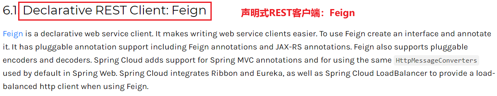

# 引言

引入 Ribbon 组件（在引入最新的 eureka 客户端依赖时，它默认已经帮我们集成了 Ribbon，此处并没有人为引入），同时配合 **RestTemplate + @LoadBalance 注解** ，就可以完成微服务之间 **客户端 → 服务端调用 + (集群)服务的负载均衡** 功能。

Feign 是 Spring Cloud 组件中的一个轻量级 Restful 的 HTTP 服务客户端。

Feign能干什么？
Feign旨在使编写Java Htpp客户端变得更容易.

使用Ribbon+RestTemplate时,利用RestTemplate对http请求的封装处理,形成了一套模板化的调用方法.但是在实际开发中,由于对服务依赖的调用可能不止一处,往往一个接口会被多处调用,所以通常都会针对每个微服务自行封装一些客户端类来包装这些依赖服务的调用.所以,Feign在此基础上做了进一步封装,由他来帮助我们定义和实现依赖服务接口的定义.在Feign的实现下,我们只需要创建一个接口并使用注解的方式来配置它(以前是Dao接口上标注Mapper注解,现在是一个微服务接口上面标注一个Feign注解即可),即可完成对服务提供方的接口绑定,简化了使用Spring cloud Ribbon时,自动封装服务调用客户端的开发量

Feign集成了Ribbon
利用Ribbon维护了服务列表信息,并且通过轮询实现了客户端的负载均衡.而与Ribbon不同的是,通过feign只需要定义服务绑定接口且以声明式的方法,优雅而简单的实现了服务调用

**！！！说明：本文所说的 Feign 即 OpenFeign。**

## 1.Feign 和 OpenFeign 区别

| Feign                                                        | OpenFeign                                                    |
| ------------------------------------------------------------ | ------------------------------------------------------------ |
| 1.Feign 是 Spring Cloud 组件中的一个轻量级 Restful 的 HTTP 服务客户端 | 1.OpenFeign是 Spring Cloud 在 Feign 基础上进行的封装(Feign有的 OpenFeign都有，Feign没有的OpenFeign还有，哈哈) |
| **2.Feign 内置了Ribbon，用来做客户端负载均衡** ，去调用服务注册中心的服务； | **2.OpenFeign 支持了 Spring MVC 的注解**，如@RequesMapping等；配合 Spring 开发，**如虎添翼；** |
| **3.Feign的使用方式是：** 使用 Feign 的注解定义接口，调用这个接口，就可以调用服务注册中心的服务 | 3.OpenFeign 的 @FeignClient 可以解析 SpringMVC 的 @RequestMapping 注解下的接口，并 **通过动态代理的方式产生实现类，实现类中做负载均衡并调用其他服务** |
| **4.Feign本身不支持Spring MVC的注解，它有一套自己的注解。（对比OpenFeign支持Spring MVC 注解，开发起来更香）** | **4.在类名上，@RequesMapping 注解不能与 @FeignClient 注解同时使用** |
| <depedency>   <groupId>org.springframework.cloud<groupId>   <artifacaId>spring-cloud-starter-**feign**</artifacaId> </dependency> | <depedency>   <groupId>org.springframework.cloud<groupId>   <artifacaId>spring-cloud-starter-**openfeign**</artifacaId> </dependency> |

## 2.Feign 用在微服务客户端

**Feign在消费端使用(官网有这样一句话：Declarative REST Client: Feign 声明式REST客户端：Feign)** SpringCloud 官网 OpenFeign 介绍：[OpenFeign 官网介绍](https://cloud.spring.io/spring-cloud-static/Hoxton.SR1/reference/htmlsingle/#spring-cloud-openfeign)



#### OpenFeign 让开发变得容易

  在使用 Ribbon + RestTemplate 时，利用 RestTemplate 对 HTTP 请求的封装处理，形成了一套模板化的调用方法。**缺点：在每次进行服务调用时，都需要通过@Resource/@Autowired的方式，来声明一个 RestTemplate。**

由于对服务依赖的调用可能不止一处，**往往一个接口会被多出调用，所以通常都会针对每个微服务自行封装一些客户端类来保证这些依赖服务的调用。(类似封装所谓的工具类等方式，这样明显不能根治，多个消费者的话就需要各持一份，缺点太明显！！！)** 所以，Feign 在此基础上做了进一步的封装，由它来帮助我们定义和实现依赖服务接口的定义。

  在 Feign 的实现下，① **我们只需要创建一个接口**   ② **并使用注解的方式来配置它**，即可完成 **对服务提供方的接口绑定**，简化了使用 Spring Cloud Ribbon 时，自动封装服务调用客户端的开发量。**记住这两步就可以了。**

  **大白话解释：** 客户端 A 要调用 B 服务，Feign 就是在 A 中创建一个一模一样的接口B来对外提供服务的接口，我们调用 A 中的这个接口，就可以代用到服务 B 。**（这也正好迎合了我们的 Controller → Service 的流程；没有 Feign 的话，我们在 Controller 不需要 Service 即可通过 RestTemplate 调用服务，还需要封装 RestTemplate 等，还不满足我们一般的开发流程）**

## OpenFeign 在 Spring Cloud 中使用方式

**Feign需要在消费方做配置**

**在服务消费者操作**

1. 建moulde

   模块名称定义为：`a021-cloud-consumer-feign-order-80`，来充当服务消费者的角色。

2. 改pom

   ```xml
   <!-- 引入 spring-cloud-openfeign 依赖-->
   <dependency>
       <groupId>org.springframework.cloud</groupId>
       <artifactId>spring-cloud-starter-openfeign</artifactId>
   </dependency>
   ```

   

3. 写yml

   ```yml
   server:
     port: 80
   
   eureka:
     client:
       # 不将自己注册到 Eureka(注册与否自己决定,随便)
       register-with-eureka: false
       service-url:
         # Eureka注册中心集群地址
         defaultZone: http://localhost:7001/eureka
   ```

   

4. 主启动

   ```java
   @SpringBootApplication
   @EnableFeignClients(basePackages = "org.example.springcloud.service")
   public class OrderFeignMain80 {
       public static void main(String[] args) {
           SpringApplication.run(OrderFeignMain80.class,args);
       }
   }
   ```

   

5. 配置类

6. 业务类

   1. #### 消费端新建接口，并添加注解@FeignClient("微服务的名字")

      ```java
      @Component
      @FeignClient(value = "CLOUD-PAYMENT-SERVICE") //添加@FeignClient注解,指定服务提供方服务名称
      public interface PaymentFeignService {
      
          //OpenFeign支持Spring MVC注解,此处通过@GetMapping去调用 CLOUD-PAYMENT-SERVICE 该服务指定的接口
          @GetMapping(value = "/payment/get/{id}")  
          public CommonResult getPaymentById(@PathVariable("id") Long id);//该接口声明必须和服务提供方一致
      }
      ```

   2. #### 控制层controller

        ```java
        @RestController
        public class OrderFeignController {

            //此处就可以通过调用Service来完成 Controller → Service 
            //具体Service具体业务怎么调用，具体业务实现就由它随便实现吧
            //这就是 OpenFeign 相比 RestTemplate 的好处
            @Resource
            private PaymentFeignService paymentFeignService;

            @GetMapping(value = "/consumer/payment/get/{id}")
            public CommonResult<Payment> getPaymentById(@PathVariable("id") Long id){
                return paymentFeignService.getPaymentById(id);
            }
        }
        ```


## OpenFeign 超时控制

  服务消费者在进行服务调用时，由于网络、查询效率 等问题，导致消费者不能及时获取返回数据，这就是 Feign 的超时控制。

  **默认 Feign 客户端只等待 1 秒钟**，但是服务端处理需要超过1秒钟，从而导致 Feign 客户端不再继续等待，**直接以超时报错的方式返回**。**为了避免这类情况，我们就需要设置 Feign 客户端的超时控制。**

#### 6.1 人为超时干预服务返回

  同样的接口，此时我们人为睡眠 5s，此时服务消费者再次调用该服务，因为服务端处理需要超过 1 秒钟，从而导致 Feign 客户端直接以报错的方式返回。

#### 6.2 设置 Feign 超时时间

  此时需要在 **客户端** 进行 Feign 的超时时间配置，我们只需要在 application.yml 中配置 **ribbon.ReadTimeout** 和 **ribbon.ConnectTimeout** 两个属性，并设置允许的超时时间即可。

```yaml
#设置feign客户端超时时间（OpenFeign集成了Ribbon，超时由ribbon控制）
ribbon:
  #指的是建立连接后从服务器读取到可用资源所用的时间
  ReadTimeout:  5000
  #指的是建立连接所用的时间，适用于网络正常的情况下，两端连接所用的时间
  ConnectTimeout: 5000
```

## OpenFeign 日志打印功能

  使用 Feign 进行服务间的调用，我们可以 **使用 Feign 为我们提供的日志打印功能**，通过 **配置日志级别** ，来了解 Feign 中 Http 请求的细节。说白了就是 **对Feign接口的调用情况进行监控和输出**

#### 7.1 Feign 日志级别

| 日志级别 | 说明                                                        |
| -------- | ----------------------------------------------------------- |
| NONE     | 默认的，不显示任何日志                                      |
| BASIC    | 仅记录请求方法、URL、响应状态码、执行时间                   |
| HEADERS  | 除了 BASIC 中定义的信息外，还有请求和响应的头信息           |
| FULL     | 除了 HEADERS 中定义的信息之外，还有请求和响应的正文及元数据 |

#### 7.2 设置 Feign 日志级别

**1. 定义Feign 配置类**

```java
import feign.Logger;
import org.springframework.context.annotation.Bean;
import org.springframework.context.annotation.Configuration;

@Configuration
public class FeignConfig {

    @Bean
    Logger.Level feignLoggerLevel(){
        return Logger.Level.FULL;
    }
}
```

**2. application.yml 配置日志输出级别**

```yaml
#配置日志输出级别
logging:
  level:
    com.study.springcloud.service.PaymentFeignService: debug
```