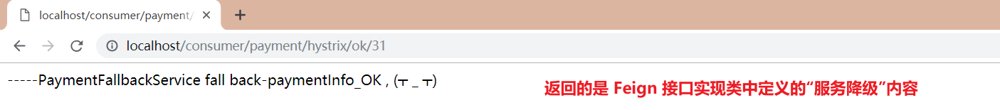

## 1.分布式系统面临的问题

  **高内聚、低耦合** 的设计思想，是软件工程中的概念，是判断软件设计好坏的标准，主要用于程序的 **面向对象** 的设计，主要看类的内聚性是否高，耦合度是否低。目的是使程序模块的可重用性、移植性大大增强。

  在 Spring Cloud 微服务中，已经使用了 Eureka、Feign等分模块开发，显然已经满足了 **低耦合** 的思想。但是现在它存在一个严重的问题。**那就是：多模块之间的链路调用问题。**

  完成某项操作，用户需要 **模块A → 模块B → 模块C → 模块D → 模块E** 的调用才能完成。这种挨个调用的方式，链路会越来越长，相当于一条绳上的蚂蚱，如果一个模块出现问题，就会导致整个业务的失败。

  复杂的分布式体系结构，就会有 N 多依赖，每个依赖关系在 **一些情况(网络超时、程序Bug、机房断电等)** 下 **不可避免** 的会出现失败。**如果图中 C模块 网络超时 出现问题，就会导致请求都卡在模块B 上，从而导致 模块B 的系统崩溃，这就是所谓的 "雪崩效应"**

#### 1.1 服务雪崩

  多个微服务之间调用的时候，假如 `微服务A`调用`微服务B和微服务C`，微服务B和微服务C又调用其它的微服务，这就是所谓的 **扇出**。如果扇出的链路上某个微服务的调用响应时间过长或者不可用，对微服务A的调用就会占用越来越多的系统资源，从而引起系统崩溃，这就是所谓的 **"雪崩效应"**。

  对于高流量的应用来说，单一的后端依赖可能会导致 **所有服务器** 上的 **所有资源** 在几秒内饱和。比失败更糟糕的是，这些应用程序还可能导致服务之间的延迟增加，备份队列，线程和其他系统资源紧张，导致整个系统发生更多的 **级联故障**。这些都需要对故障和延迟就行隔离和管理，以便单个依赖关系的失败，不能取消整个应用程序或系统的宕机。

  通常，当你发现一个模块下的某个实例失败后，这时候这个模块依然还会接收流量，然而这个问题模块还调用了其他模块，这就会导致级联故障，或者叫 **雪崩**。

  **这种级联故障的避免，就需要有一种兜底的方案，或者一种链路终断的方案。这就是"服务降级"。**

## 2.什么是 Hystrix


  Hystrix ，又称豪猪哥。是一个用于处理分布式系统的 **延迟** 和 **容错** 的开源库。在分布式系统中，许多依赖不可避免的会调用失败，比如：超时、异常等原因。Hystrix 能够保证在一个依赖出现问题的情况下， **不会导致整体服务失败，避免级联故障，以提高分布式系统的弹性。**

  **断路器** 本身是一种开关装置。当某个服务单元发生故障之后，通过 **断路器** 的故障监控（类似熔断保险丝），**向调用方返回一个符合预期的、可处理的备选响应（FallBack），而不是长时间的等待或者抛出调用调用无法处理的异常**，这样就保证了服务调用方的线程不会被长时间、不必要的占用，从而避免了故障在分布式系统中的蔓延，乃至雪崩。

   Hystrix 的功能就是 **服务降级**、**服务熔断**、**接近实时的监控**、**服务限流**、**服务隔离**，最重要的还是前面三个功能。 Hystrix 官网使用介绍：https://github.com/Netflix/Hystrix/wiki/How-To-Use

> Hystrix 在 **消费端**、**服务端** 根据定义的规则，都能使用 **服务降级、限流**（比如，服务端约定等待3s 返回，但是客户端只让等待 2s，就可以再客户端 添加 Hystrix。这些都可以根据自己情况），**一般用在消费端**。

## 3. Hystrix 停更进入维护 + Hystrix 替代者

  在 Hystrix Github官网：https://github.com/Netflix/Hystrix。它推荐我们使用 resilience4j，在国外比较流行。但是在国内，结合国内情况，推荐大家使用阿里的 [Sentineal](https://sentinelguard.io/zh-cn/index.html)


  Hystrix 服务降级框架，目前 Spring 官方 Netflix 公司已经停止更新。但是 Hystrix 设计理念非常的优秀，出道就是巅峰。**服务降级、服务熔断、服务限流、服务隔离** 等一系列设计思想，值得后面框架的借鉴。所以在这里也有必要深入了解 Hystrix。对于微服务老版本的维护，也会有一定意义的帮助。

## 4. Hystrix 的相关概念概念

此处重点介绍 **服务降级**、**服务熔断**、**服务限流** 这三个概念。

#### 4.1 服务降级(fallback)

  **服务降级：** 当服务器忙时，友好提示客户 **"请稍候再试"** ，不让客户端处于一直等待状态，并立刻返回一个友好提示。

  当服务器压力剧增的情况下，根据实际业务情况及流量，对一些服务和页面有策略的不处理或换种简单的方式处理，从而释放服务器资源以保证核心交易正常运作或高效运作。

  比如电商平台，在针对 **618、双11** 等高峰情形下采用的部分服务不出现或者延时出现的情形。**比较典型的就是支付，在0点进行支付，由于大量请求的集中涌入，服务器压力瞬间过大，从而导致数据返回超时等情况，这时就需要对支付模块进行服务降级处理。比如说：接口超过3s没有返回数据，就提示"数据加载失败，被挤爆了的提示"，在中断当前支付请求的同时，进行了友好的提示。**

**哪些情况下触发服务降级**


#### 4.2 服务熔断(break)

  **服务熔断**：类似于我们家用的保险丝，当某服务出现不可用或响应超时的情况时，为了防止整个系统出现雪崩，暂时 **停止对该服务的调用** 。过一段时间，服务器会慢慢进行恢复，直到完全恢复服务提供。

**服务降级和服务熔断的区别：**

1. **服务降级 → 当前服务还是可用的；**（比如有10个线程，谁抢到谁用，抢不到如果超时报提错误提示，下一次抢到还能继续提供服务）
2. **服务熔断 → 当前服务不可用，但是它会逐渐恢复服务提供；**(拉闸，整个家用电器都不能用；然后测试开5个电器没问题，6个也没问题，逐渐的就恢复服务提供)

#### 4.3 服务限流(flowlimit)

  服务限流场景：一般应用在 **秒杀**，**高并发** 等操作。严禁一窝蜂的过来拥挤，大家排队，一秒钟只允许通过 N 个，有序进行。

## 5. Hystrix应用场景分析

  如下情况，在非高并发情况下，消费端发送请求 **paymentInfo_OK**、**paymentInfo_TimeOut**，即使在延迟3s后，也能够得到响应。但是在 **高并发情况** 下，就并非如此了。

  举个栗子：来 2w 个并发去访问 **paymentInfo_TimeOut** 请求。与此同时，一个客户端去访问 **paymentInfo_OK** 请求。由于同一层次的其他接口服务(**paymentInfo_TimeOut**)被卡死，tomcat 线程里面的工作线程已经被 **paymentInfo_TimeOut** 请求挤占完毕。此时便会导致 **paymentInfo_OK** 请求响应缓慢的问题。

  正因为这些故障或不佳表现，才有我们的 **服务降级** / **服务熔断** / **服务限流** 等技术诞生。

```java
@Service
public class PaymentService {

    //成功
    public String paymentInfo_OK(Integer id) {
        return "线程池：" + Thread.currentThread().getName() + "   paymentInfo_OK,id：  " + id + "\t" + "哈哈哈";
    }

    //timeout超时
    public String paymentInfo_TimeOut(Integer id) {
        int timeNumber = 3;
        try {
            TimeUnit.SECONDS.sleep(timeNumber);
        } catch (Exception e) {
            e.printStackTrace();
        }
        return "线程池：" + Thread.currentThread().getName() + "   paymentInfo_TimeOut,id：  " + id + "\t" + "呜呜呜" + " 耗时(秒)" + timeNumber;
    }
}
```

**针对上述情况，如何解决？**


## 6.Hystrix 实现服务降级(重点)

模块名称定义为：**a012-cloud-provider-hystrix-payment-8001**，来充当提供服务的角色。用到的是 **@HystrixCommand** 注解

### 6.1 服务端实现服务降级

#### Ⅰ.引入pom.xml 依赖

```xml
<!--引入 spring-cloud-hystrix 依赖-->
<dependency>
    <groupId>org.springframework.cloud</groupId>
    <artifactId>spring-cloud-starter-netflix-hystrix</artifactId>
</dependency>
```

#### Ⅱ.主启动类，添加 @EnableCircuitBreaker注解

```java
@SpringBootApplication
@EnableEurekaClient
@EnableCircuitBreaker  //激活Hystrix断路器
public class PaymentHystrixMain8001 {
    public static void main(String[] args) {
        SpringApplication.run(PaymentHystrixMain8001.class,args);
    }
}
```

#### Ⅲ.服务提供接口实现，添加降级处理方法

  服务降级方法，**方法签名(参数+返回值)** 需要同原方法一致，方法名不同即可。即:以下代码中的 **paymentInfo_TimeOutHandler** 方法。

  参数 **execution.isolation.thread.timeoutInMilliseconds** ，在设定的时间范围内返回，即执行正常流程；超过指定时间，则执行指定的服务降级方法。

  当代码执行异常，也会执行服务降级方法。如：**int age = 10/0**

```java
@Service
public class PaymentService {

    //成功
    public String paymentInfo_OK(Integer id) {
        return "线程池：" + Thread.currentThread().getName() + "   paymentInfo_OK,id：  " + id + "\t" + "哈哈哈";
    }

    //timeout超时
    @HystrixCommand(fallbackMethod = "paymentInfo_TimeOutHandler",commandProperties = {
            @HystrixProperty(name = "execution.isolation.thread.timeoutInMilliseconds",value = "5000")  //5秒钟以内就执行正常的业务逻辑,反之执行降级方法
    })
    public String paymentInfo_TimeOut(Integer id) {
        int timeNumber = 3;
        try {
			TimeUnit.SECONDS.sleep(timeNumber);
        } catch (Exception e) {
            e.printStackTrace();
        }
		// int age = 10/0; 异常情况下,会直接进入服务降级方法
        return "线程池：" + Thread.currentThread().getName() + "   paymentInfo_TimeOut,id：  " + id + "\t" + "O(∩_∩)O哈哈~" + " 耗时(秒)";
    }

    // 服务降级方法
    // 方法签名(参数+返回值)需要跟原方法一致,方法名不同即可
    public String paymentInfo_TimeOutHandler(Integer id){
        return "线程池："+Thread.currentThread().getName()+"   系统繁忙, 请稍候再试  ,id：  "+id+"\t"+"哭了哇呜";
    }
}
```

#### Ⅳ.服务端 Hystrix 服务降级_测试

设置 5s 为服务降级临界时间。

1. 当设置 **TimeUnit.SECONDS.sleep(3)** ，这种情况下，便会执行正常的方法；
2. 当设置 **TimeUnit.SECONDS.sleep(13)**，由于13s > 5s 已经超时，便执行降级方法；
3. 当设置 **int age = 10/0**，由于异常原因，会直接进入降级方法。

### 6.2 消费端实现服务降级

模块名称定义为：**a022-cloud-consumer-feign-hystrix-order-80**，来充当提供消费者的角色。

#### Ⅰ.application.yml 配置文件修改

  消费端添加配置 **feign.hystrix.enabled=true**。如果在消费端调用服务端时，此处涉及到 **Feign 超时控制** 这个概念。需要配置 **ribbon.ConnectTimeout 和 ribbon.ReadTimeout** 属性。

```yaml
server:
  port: 80

spring:
  application:
    name: cloud-provider-hystrix-order

eureka:
  client:
    register-with-eureka: true    #示表不向注册中心注册自己
    fetch-registry: true   #表示自己就是注册中心，职责是维护服务实例，并不需要去检索服务
    service-url:
      defaultZone: http://eureka7001.com:7001/eureka/

####################以下配置需要新增(ribbon相关配置和Feign超时相关)##################
#全局配置
# 请求连接的超时时间 默认的时间为 1 秒
ribbon:
  ConnectTimeout: 5000
  # 请求处理的超时时间
  ReadTimeout: 5000

feign:
  hystrix:
    enabled: true #如果处理自身的容错就开启。开启方式与生产端不一样。
```

#### Ⅱ.主启动类，添加 @EnableHystrix注解

```java
@SpringBootApplication
@EnableFeignClients
@EnableHystrix
public class OrderHystrixMain80 {
    public static void main(String[] args) {
        SpringApplication.run(OrderHystrixMain80.class,args);
    }
}
```

#### Ⅲ.消费端在controller层实现自己的服务降级

```java
@RestController
@Slf4j
public class OrderHystrixController {

    @Resource
    private PaymentHystrixService paymentHystrixService;

    @Value("${server.port}")
    private String serverPort;

    @GetMapping("/consumer/payment/hystrix/ok/{id}")
    public String paymentInfo_OK(@PathVariable("id") Integer id){
        String result = paymentHystrixService.paymentInfo_OK(id);
        log.info("*******result:"+result);
        return result;
    }
	//添加服务降级相关配置
    @GetMapping("/consumer/payment/hystrix/timeout/{id}")
    @HystrixCommand(fallbackMethod = "paymentTimeOutFallbackMethod",commandProperties = {
            @HystrixProperty(name = "execution.isolation.thread.timeoutInMilliseconds",value = "1500")  //1.5秒钟以内就是正常的业务逻辑
    })
    public String paymentInfo_TimeOut(@PathVariable("id") Integer id){
        String result = paymentHystrixService.paymentInfo_TimeOut(id);
        return result;
    }

    //服务降级方法
    public String paymentTimeOutFallbackMethod(@PathVariable("id") Integer id){
        return "我是消费者80，对付支付系统繁忙请10秒钟后再试或者自己运行出错请检查自己,(┬＿┬)";
    }
}
```

#### Ⅳ.消费端 Hystrix 服务降级_测试

  服务端服务降级，设置时间为 5s。消费端根据自己的情况，进行服务降级设置，设置为1.5s。服务端 **TimeUnit.SECONDS.sleep(3)** 设置睡眠 3s。显然在设置的 1.5s 内无法返回数据。最终便会执行服务端的降级方法。返回 **我是消费者80，对付支付系统繁忙请10秒钟后再试或者自己运行出错请检查自己,(┬＿┬)** 提示


### 6.3 服务降级配置存在的问题

1. 每个业务方法对应一个兜底的方法，代码膨胀
2. **业务方法** 和 **自定义降级方法** 混合在一起(业务逻辑方法 和 处理服务降级、熔断方法 揉在一块)

#### Ⅰ.代码膨胀问题

  服务间使用 Feign 进行接口调用，针对每个业务一个兜底方法的问题。**解决方式：** 我们可以定义一个全局通用的 **服务降级** 方法，这样就可以使用全局 **服务降级** 方法，解决代码膨胀问题。

**步骤：**

1. 使用 **@DefaultProperties(defaultFallback = "xxx")** 的方式，定义全局 **服务降级** 方法；
2. 在类中，定义 **全局降级方法**，名称需要与 **defaultFallback = "xxx"** 定义一致；
3. 在需要 **服务降级** 的方法上，添加 **@HystrixCommand**；
4. 只有一个 **@HystrixCommand 标签**，则使用全局 **"服务降级"** 方法；如果是 **@HystrixCommand(fallbackMethod = "xxx",commandProperties = {xxx})** 这样定义，则使用指定的 **"服务降级"** 方法。

```java
@RestController
@Slf4j
@DefaultProperties(defaultFallback = "payment_global_fallback_method") //1.使用@DefaultProperties 定义全局服务降级方法
public class OrderHystrixController {

    @Resource
    private PaymentHystrixService paymentHystrixService;

    /**
     * 这种情况，使用全局服务降级方法
     */
    @GetMapping("/consumer/payment/hystrix/timeout/{id}")
    @HystrixCommand //3.使用 @HystrixCommand 使用全局服务降级方法
    public String paymentInfo_xxx(@PathVariable("id") Integer id){
        String result = paymentHystrixService.paymentInfo_TimeOut(id);
        return result;
    }
     
    /**
     * 这种情况，使用指定的服务降级方法
     */
    @GetMapping("/consumer/payment/hystrix/timeout/{id}")
    @HystrixCommand(fallbackMethod = "paymentTimeOutFallbackMethod",commandProperties = {
            @HystrixProperty(name = "execution.isolation.thread.timeoutInMilliseconds",value = "1500")  //1.5秒钟以内就是正常的业务逻辑
    })
    public String paymentInfo_TimeOut(@PathVariable("id") Integer id){
        String result = paymentHystrixService.paymentInfo_TimeOut(id);
        return result;
    }

    //指定服务降级方法
    public String paymentTimeOutFallbackMethod(@PathVariable("id") Integer id){
        return "我是消费者80，对付支付系统繁忙请10秒钟后再试或者自己运行出错请检查自己,(┬＿┬)";
    }

    //2.定义全局服务降级方法(不能有参数)
    public String payment_global_fallback_method(){
        return "~~~~我是,全局服务降级方法";
    }
}
```

#### Ⅱ.业务方法和降级方法混合在一起问题

  解决混合在一起的问题，只需要为 Feign 定义的接口 **添加统一的服务降级类** 即可实现解耦。**即：来一个实现类，实现Feign 接口，并重写方法**（重写的就是"服务降级"处理方法）。

**步骤：**

1. 客户端 **针对使用 Feign 组件调用的接口，重新新建一个类来实现该接口，统一为接口里面的方法进行异常处理**；
2. 客户端 Feign 接口，添加注解 **@FeignClient(value = "服务名",fallback = 接口实现类.class)** 进行指定。

**配置如图：**

**测试：**
  在 **客户端** 调用 **服务端** 接口，如果客户端此时突然 **宕机**，便会触发客户端服务降级方法。最终返回的是 **Feign 接口实现类** 中重写的内容。


------

## 7.Hystrix 实现服务熔断(重点)

  类似于我们家用的保险丝，当某服务出现不可用或响应超时的情况时，为了防止整个系统出现雪崩，暂时 **停止对该服务的调用** 。过一段时间，服务器会慢慢进行恢复，直到完全恢复服务提供。

**服务熔断过程：** **请求太多** → **服务器扛不住，停止服务** → **一段时间后** → **逐渐接受请求处理** → **最终恢复服务**

### 7.1 服务端实现服务降级

  服务熔断，在 **服务端** 进行配置。使用到的还是 **@HystrixCommand** 注解

#### Ⅰ.服务端 - 配置服务熔断

**@HystrixCommand** 注解：

1. **fallbackMethod** 来定义服务降级处理方式；
2. **@HystrixProperty** 属性，用来定义服务熔断相关参数（具体有哪些参数可配置，你可以在HystrixCommandProperties.java 类中查看）；
3. **下面配置的含义：** 在 10s 内，10次请求如果失败率 > 60%，此时断路器开关打开，整个服务不可用。随着请求正确率的提升，服务也会逐渐恢复。

```java
@Service
public class PaymentService{

	//服务熔断
    @HystrixCommand(fallbackMethod = "paymentCircuitBreaker_fallback",commandProperties = {
            @HystrixProperty(name = "circuitBreaker.enabled",value = "true"),  //是否开启断路器
            @HystrixProperty(name = "circuitBreaker.requestVolumeThreshold",value = "10"),   //请求次数
            @HystrixProperty(name = "circuitBreaker.sleepWindowInMilliseconds",value = "10000"),  //时间范围
            @HystrixProperty(name = "circuitBreaker.errorThresholdPercentage",value = "60"), //失败率达到多少后跳闸，此处为60%（上面配置意思是：10秒钟内，10次请求，失败率60%就不让用了）
            // 具体需要配置哪些参数，在 HystrixCommandProperties.java 类中
    })
    public String paymentCircuitBreaker(@PathVariable("id") Integer id){
        if (id < 0){
            throw new RuntimeException("*****id 不能负数");
        }
        String serialNumber = IdUtil.simpleUUID();

        return Thread.currentThread().getName()+"\t"+"调用成功,流水号："+serialNumber;
    }

	//服务降级
    public String paymentCircuitBreaker_fallback(@PathVariable("id") Integer id){
        return "id 不能负数，请稍候再试,(┬＿┬)/~~     id: " +id;
    }
}
```

#### Ⅱ.服务端 - 编写controller

```java
@RestController
@Slf4j
public class PaymentController {

    @Resource
    private PaymentService paymentService;

    //===服务熔断
    @GetMapping("/payment/circuit/{id}")
    public String paymentCircuitBreaker(@PathVariable("id") Integer id){
        String result = paymentService.paymentCircuitBreaker(id);
        log.info("*******result:"+result);
        return result;
    }
}
```

#### Ⅲ.服务端 - 服务熔断测试

  进行服务熔断测试，**http://localhost/payment/circuit/{id}** 请求调用。当 id > 0，正确返回；当 id < 0 时，抛出异常，进入 **服务降级** 方法。

  当我们输入 id < 0，连续发送请求，满足 10s 内，10次请求如果失败率 > 60%，此时断路器开关打开。此时再次输入 id > 0 时，由于整个服务不可用，还是会进入到 **服务降级** 方法。连续多次发送 id > 0 请求，此时正确率逐渐提高，服务也会逐渐恢复。


### 7.2 断路器开启/关闭条件


## 8.Hystrix 全部配置一览

此部分内容，可参考官方文档：https://github.com/Netflix/Hystrix/wiki/Configuration#execution.isolation.strategy

```java
@HystrixCommand(fallbackMethod = "str_fallbackMethod",
    groupKey = "strGroupCommand",
    commandKey = "strCommand",
    threadPoolKey = "strThreadPool",

    commandProperties = {
        //设置执行隔离策略，THREAD 表示线程池   SEMAPHORE:信号量隔离    默认为THREAD线程池
        @HystrixProperty(name = "execution.isolation.strategy", value = "THREAD"),
        // 当隔离策略选择信号池隔离的时候，用来设置信号池的大小(最大并发数)
        @HystrixProperty(name = "execution.isolation.semaphore.maxConcurrentRequests", value = "10"),
        // 配置命令执行的超时时间
        @HystrixProperty(name = "execution.isolation.thread.timeoutinMilliseconds", value = "10"),
        // 是否启用超时时间
        @HystrixProperty(name = "execution.timeout.enabled", value = "true"),
        // 执行超时的时候是否中断
        @HystrixProperty(name = "execution.isolation.thread.interruptOnTimeout", value = "true"),
        // 执行被取消的时候是否中断
        @HystrixProperty(name = "execution.isolation.thread.interruptOnCancel", value = "true"),
        // 允许回调方法执行的最大并发数
        @HystrixProperty(name = "fallback.isolation.semaphore.maxConcurrentRequests", value = "10"),
        // 服务降级是否启用，是否执行回调函数
        @HystrixProperty(name = "fallback.enabled", value = "true"),
        // 设置断路器是否起作用。
        @HystrixProperty(name = "circuitBreaker.enabled", value = "true"),
        // 该属性用来设置在滚动时间窗中，断路器熔断的最小请求数。例如，默认该值为 20 的时候，
        // 如果滚动时间窗(默认10s)内仅收到了19个请求，及时这19个请求都失败了，断路也不会打开。
        @HystrixProperty(name = "circuitBreaker.requestVolumeThreshold", value = "20"),
        // 该属性用来设置在滚动时间窗中，表示在滚动时间窗中，在请求数量超过 circuitBreaker.requestVolumeThreshold 的情况下，
        // 如果错误请求数的百分比超过 50，就把断路器设置为"打开"状态，否则就设置为"关闭"状态
        @HystrixProperty(name = "circuitBreaker.errorThresholdPercentage", value = "50"),
        // 该属性用来设置当断路器打开之后的休眠时间窗。休眠时间窗结束之后，会将断路器置为"半开"状态，
        // 尝试熔断的请求命令，如果依然失败就将断路器继续设置为"打开"状态，如果成功就设置为"关闭"状态
        @HystrixProperty(name = "circuitBreaker.sleepWindowinMilliseconds", value = "5000"),
        // 断路器强制打开
        @HystrixProperty(name = "circuitBreaker.forceOpen", value = "false"),
        // 断路器强制关闭
        @HystrixProperty(name = "circuitBreaker.forceClosed", value = "false"),
        // 滚动时间窗设置，该时间用于断路器判断健康度时，需要收集信息的持续时间
        @HystrixProperty(name = "metrics.rollingStats.timeinMilliseconds", value = "10000"),
        // 该属性用来设置滚动时间窗统计指标信息时，划分"桶"的数量，断路器在手机指标信息的时候会根据设置的时间窗长度拆分成多个"桶"来累计各度量值，每个
        // "桶"记录了一段时间内的采集指标。比如 10 秒内拆分成 10 个"桶'收集这样，所以 timeinMilliseconds 必须能被 numBuckets 整除。否则会抛异常
        @HystrixProperty(name = "metrics.rollingStats.numBuckets", value = "10"),
        // 该属性用来设置对命令执行的延迟是否采用百分位数来跟踪和计算。如果设置为 false，name所有的概要统计都将返回-1
        @HystrixProperty(name = "metrics.rollingPercentile.enabled", value = "false"),
        // 该属性用来设置百分位统计的滚动窗口的持续时间，单位为毫秒
        @HystrixProperty(name = "metrics.rollingPercentile.timeInMilliseconds", value = "60000"),
        // 该属性用来设置百分位统计滚动窗口中使用 "桶" 的数量
        @HystrixProperty(name = "metrics.rollingPercentile.numBuckets", value = "60000"),
        // 该属性用来设置在执行过程中每个"桶"中保留的最大执行次数。如果在滚动时间窗内发生超过该设定值的执行次数
        // 就从最初的位置开始重写。例如，将该值设置为100，滚动窗口为10秒，若在10秒内一个"桶"中发生了500次执行，
        // 那么该"桶"中只保留最后的100次执行的统计。另外，增加该值的大小将会增加内存量的消耗，并增加排序百分位数所需的计算时间
        @HystrixProperty(name = "metrics.rollingPercentile.bucketSize", value = "100"),
        // 该属性用来设置采集意向断路器状态的健康快照(请求的成功、错误百分比)的间隔等待时间
        @HystrixProperty(name = "metrics.healthSnapshot.intervalinMilliseconds", value = "500"),
        // 是否开启请求缓存
        @HystrixProperty(name = "requestCache.enabled", value = "true"),
        // HystrixCommand 的执行和事件是否打印日志到 HystrixRequestLog 中
        @HystrixProperty(name = "requestLog.enabled", value = "true")
    },
    threadPoolProperties = {
        // 该参数用来设置执行命令线程池的核心线程数，该值也就是命令执行的最大并发量
        @HystrixProperty(name = "coreSize", value = "10"),
        // 该参数用来设置线程池的最大队列大小。当设置为 -1 时，线程池将使用 SynchronousQueue 实现的队列，否则将使用 LinkedBlockingQueue 实现的队列
        @HystrixProperty(name = "maxQueueSize", value = "-1"),
        // 该参数用来为队列设置拒绝阈值。通过该参数，即使队列没有达到最大值也能拒绝请求。该参数主要是对 LinkedBlockingQueue 队列的补充，因为LinkedBlockingQueue
        // 队列不能动态修改它的对象大小，而通过该属性就可以调整拒绝请求的队列大小了
        @HystrixProperty(name = "queueSizeRejectionThreshold", value = "5")
    }
)
```