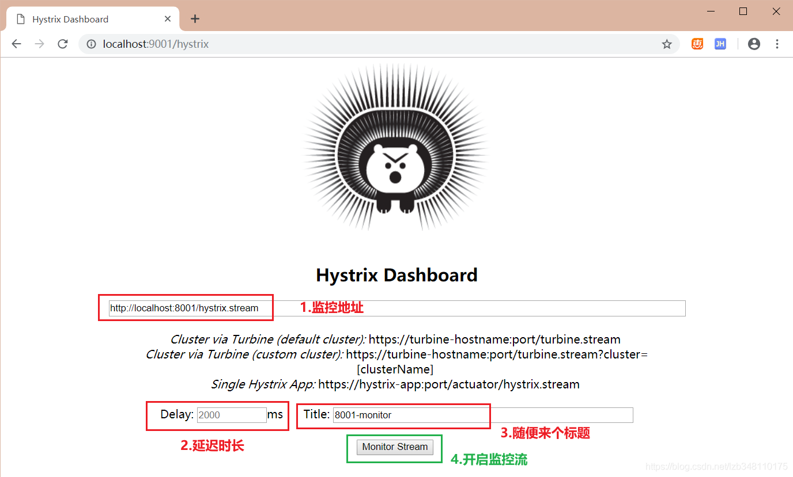
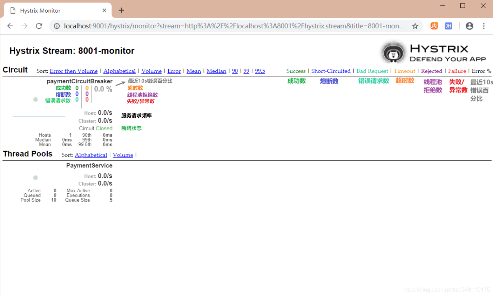
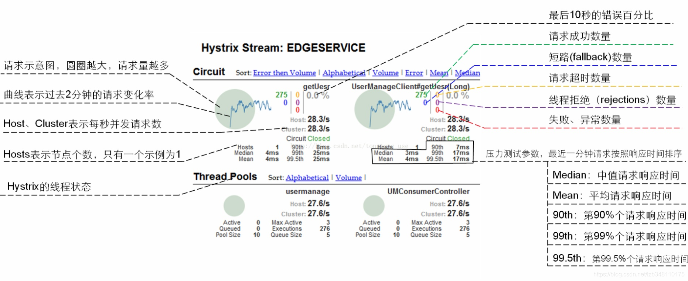

# Hystrix Dashboard

除了 服务降级、 服务熔断、 服务限流 等服务以外，Hystrix 还提供了 准实时的调用监控(Hystrix Dashboard)，Hystrix 会持续地记录所有通过 Hystrix 发起的请求的执行信息，并以统计报表和图形的形式展示给用户，包括每秒执行多少请求，多少成功，多少失败等。

  Netflix 通过 hystrix-metrics-event-stream 项目实现了对以上指标的监控。同时 Spring Cloud 也提供了对 Hystrix Dashboard 的整合，将监控的内容信息转化成可视化界面。

## 1.Hystrix Dashboard 的使用

### 1.1 操作Hystrix Dashboard模块

  在使用 Hystrix Dashboard 时，需要以单独工程的方式运行。以下就是 Hystrix Dashboard 的使用流程。

#### Ⅰ. 创建工程

  **a050-cloud-consumer-hystrix-dashboard-9001** ，用来完成 Hystrix Dashboard 的部署。

#### Ⅱ. pom.xml 依赖

#### Ⅲ. 修改application.yml 配置

#### Ⅳ. 在启动类上添加 @EnableHystrixDashboard 注解

#### Ⅴ. 被监听的服务提供者，都需要添加actuator依赖

该依赖一般情况是配合 **spring-boot-starter-web** 同时使用，该模块主要用来完成对 **服务的健康监控**。在生产环境中，需要实时或定期监控服务的可用性。Spring Boo t的 actuator（健康监控）功能提供了很多监控所需的接口，可以对应用系统进行配置查看、相关功能统计等。

```java
<dependency>
    <groupId>org.springframework.boot</groupId>
    <artifactId>spring-boot-starter-actuator</artifactId>
</dependency>
```

#### Ⅵ. 启动Hystrix Dashboard模块

### 1.2 操作`服务提供`模块

  以下内容，是需要在 **服务提供模块** 进行配置。

#### Ⅰ. 配置Hystrix 指定监控路径

  **注意：** 新版本 Hystrix **需要在主启动类中指定监控路径**，如果没有此项操作，在项目启动后，Hystrix Dashboard 会报: **Unable to connect to Command Metric Stream** 这样一个错误。配置内容如下：

```java
    //在主启动类中指定监控路径
    @Bean
    public ServletRegistrationBean getServlet(){
        HystrixMetricsStreamServlet streamServlet = new HystrixMetricsStreamServlet();
        ServletRegistrationBean registrationBean = new ServletRegistrationBean(streamServlet);
        registrationBean.setLoadOnStartup(1);
        registrationBean.addUrlMappings("/hystrix.stream");
        registrationBean.setName("HystrixMetricsStreamServlet");
        return registrationBean;
    }
```

#### Ⅱ. 开启监控

  将 **服务注册中心（7001端口）**、**服务提供方（8001端口）**、**Hystrix Dashboard（9001端口）** 模块进行启动。然后通过 Hystrix Dashboard 9001 来监控服务端 8001。需要在 Hystrix Dashboard 中填写 **监控地址**：ip:port/hystrix.stream，并完成图中四部曲：




## 2.Hystrix Dashboard 图解

  看着上图所有内容，有没有一脸懵逼。哈哈，接下来就对监控页面各个内容做一些简单的介绍。监控页面可以划分为：**7色**、**1圈**、**1线**。

