# Spring Cloud Gateway 微服务新一代网关

在微服务中，几乎所有的微服务架构都需要 **网关** 的加持，目的就是：**让网关统一的挡在 所有请求 之前，进行 日志管理、 限流、 权限、 安全加固 等一些操作。**

网关，就类似 **医院分诊台、挂号窗口** ,由它来负责各个科室、医生的分配情况。在微服务中，我们可以在 **Zuul**、**Zuul2**、**Gateway** 中进行服务网关选型，我们选择 **Gateway**。

## 1.为什么选择 Gateway

  以前，**Zuul** 作为默认服务网关被使用。Zuul Github 官网：https://github.com/Netflix/zuul/wiki。Zuul 是 Netflix 公司产品，Netflix 认为 **Zuul 版本过老需要更新换代，Zuul 停更了。Zuul2 版本开始开发，此时 Spring Cloud 也在等待 Zuul 新版本的开发。** 结果：Zuul 的核心开发人员跳槽了，他们对 Zuul 升级到 Zuul2 产生了分歧，导致 Zuul2 一次又一次的推迟，2年都没能开发完成。 Spring 不再继续等 Zuul2 ，Spring 社区便借鉴 Zuul 的思想，开发了自己的 **Spring Cloud Gateway**。

  Zuul2 开发完成，因为自己亲儿子 Gateway 的加持， Spring 也就没有开发 Spring Cloud 和 Zuul2 的整合包。用自己的 Gateway 显然更香，就没有再整合 Zuul2 的必要了。

   附官网链接：[Spring Cloud Gateway 官网](https://cloud.spring.io/spring-cloud-static/spring-cloud-gateway/2.2.1.RELEASE/reference/html/)。简单来说 Gateway 就是 Zuul 1.x 的替代品。Gateway 网关在微服务架构中的位置，如下图：

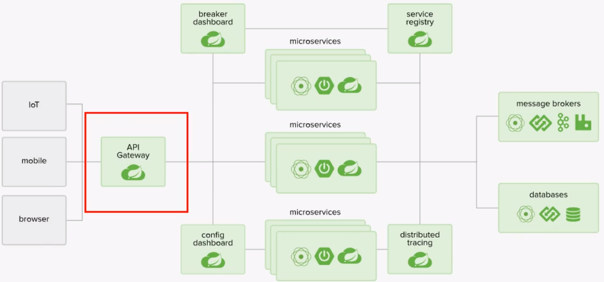

## 2.Gateway 是什么

  Spring Cloud Gateway 是在 Spring Cloud 的一个全新项目，基于 **Spring5**、**Spring Boot 2** 和 **Project Reactor** 等技术开发的网关，**它旨在为微服务提供一种简单有效的统一的 API 路由管理。**

  Spring Cloud Gateway 作为 Spring Cloud 生态系统中的网关，目标是替代 Zuul。在 Spring Cloud 2.0 以上版本中，没有对新版本的 Zuul 2.0 以上版本进行集成，使用的使用时 Zuul 1.x 非 Reactor 模式的老版本。

  为了提升网关的性能，Spring Cloud Gateway 基于 WebFlux 框架实现，WebFlux 框架底层使用的时高性能 Reactor 模式通信框架 Netty，对于高并发、非阻塞式通信有非常大的优势。（Netty 采用的是 **NIO模型**

   Spring Cloud Gateway 的目标是：提供统一的路由方式，基于 Filter 链的方式提供了网关的基本功能，例如：**安全**、**监控/指标**、**权限管理**、**限流** 等

  由于Webflux 和 Netty 都是非阻塞式响应编程的框架，所以在服务网关的选择上，我们也更应该学习 Gateway。

###  BIO/NIO/AIO/多路复用IO图解

​		①同步阻塞IO（Blocking IO）：即传统的IO模型。

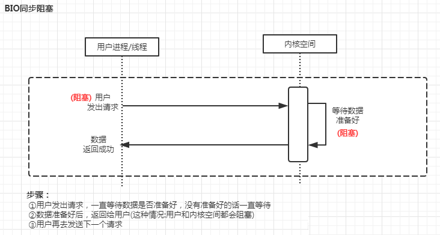

​       ②同步非阻塞IO（Non-blocking IO）：默认创建的socket都是阻塞的，非阻塞IO要求socket被设置为NONBLOCK。注意这里所说的NIO并非Java的NIO（New IO）库。

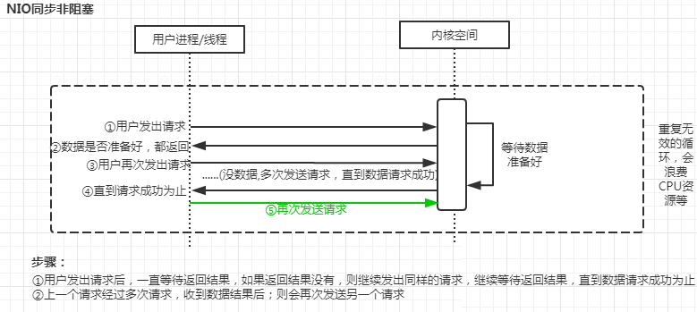

​       ③多路复用IO（IO Multiplexing）：即经典的Reactor设计模式，有时也称为**异步阻塞IO**，Java中的Selector和Linux中的epoll都是这种模型（Redis单线程为什么速度还那么快，就是因为用了多路复用IO和缓存操作的原因）

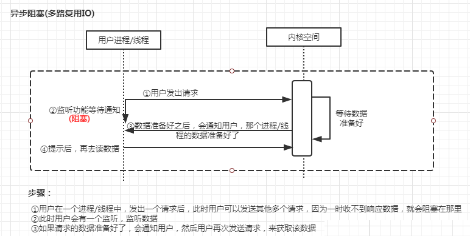

​       ④异步IO（Asynchronous IO）：即经典的Proactor设计模式，也称为**异步非阻塞IO**。

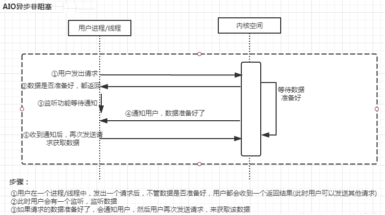

#### 2.1 GateWay 具有的特性

1. 基于 Spring Framework 5、Project Reactor 和 Spring Boot 2.0 进行构建；
2. 动态路由：能够匹配任何请求属性；
3. 可以对路由指定 **Predicate**(断言) 和 **Filter**(过滤器)，易于编写；
4. 集成 Hystrix 的断路器功能；
5. 集成 Spring Cloud 服务发现功能（Gateway一样可注册到 Eureka）；
6. 请求限流功能；
7. 支持路径重写；
8. Spring 自家产品，更稳定。

#### 2.2 Spring Cloud Gateway 和 Zuul 的区别

  在 Spring Cloud Finchley 正式版之前，Spring Cloud 推荐的网关是 Netflix 提供的 Zuul。**在这之后，还是更倾向于推荐使用：Spring Cloud Gateway。** 它两者区别如下：

1. Zuul 1.x 是一个基于 **阻塞 I/O** 的 API 网关
2. **Zuul 1.x 基于 Servlet 2.5 使用阻塞架构，它不支持任何长连接（如：websocket）**。Zuul的设计模式和 Nginx 类似，每次 I/O 操作都是从工作线程中选择一个执行，请求线程被阻塞到工作线程完成，但是差别是 Nginx 用 C++ 实现，Zuul 用 Java 实现，JVM 本身会有第一次加载较慢的情况，是的 Zuul 的性能相对较差；
3. Zuul 2.x 理念更先进，但是 Spring Cloud 目前还没有整合。Zuul 2.x 的性能较 Zuul 1.x 有较大提升。**在性能方面，根据官方提供的基准测试，Spring Cloud Gateway 的 RPS(每秒请求数)是 Zuul 的 1.6 倍；**
4. Spring Cloud Gateway 建立在 Spring Framework 5、Project Reactor 和 Spring Boot 2.0 之上，**使用非阻塞 API**；
5. Spring Cloud Gateway 还支持 WebSocket，并且与 Spring 集成会有更好的开发体验。

#### 2.3 Gateway 三大概念

  Route(路由)、Predicate(断言)、Filter（过滤），这三大概念构成了强大的 Gateway。**一个web 请求，通过一些匹配条件，最终定位到真正的服务节点。并在这个转发过程的前后，进行一些精细化控制**。Predicate 就是我们的匹配条件；而 Filter 就可以理解为一个无所不能的拦截器。有了这两个元素，再加上目标 URI，就可以实现一个具体的路由了

###### Ⅰ、Route(路由)

  **路由是构建网关的基本模块，它由ID，目标URI，一系列的断言和过滤器组成，如果断言为 true 则匹配该路由**

###### Ⅱ、Predicate(断言)

  参考的是 java8 的 java.util.function.Predicate，开发人员可以匹配HTTP请求中的所有内容（例如请求头或请求参数），**如果请求URL与断言相匹配（true）则进行路由**

###### Ⅲ、Filter(过滤)

  指的是Spring框架中GatewayFilter的实例，使用过滤器，可以在请求被路由前或者之后对请求进行修改。类似 **过滤器**、**拦截器** 的概念。

## 3.微服务架构网关所在位置

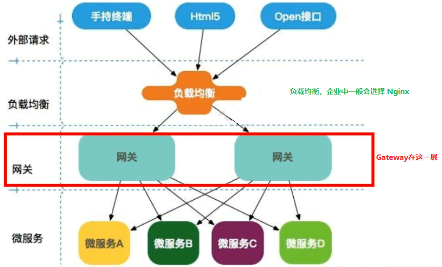

## 4.Gateway 工作流程

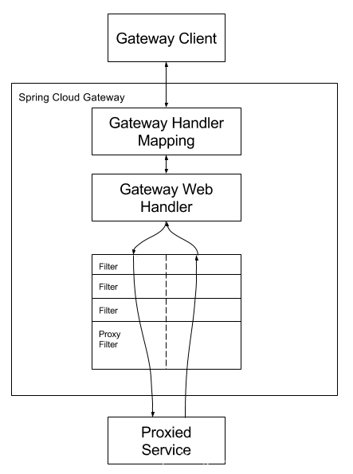

> **工作流程来自官网：** Clients make requests to Spring Cloud Gateway. If the Gateway Handler Mapping determines that a request matches a route, it is sent to the Gateway Web Handler. This handler runs the request through a filter chain that is specific to the request. The reason the filters are divided by the dotted line is that filters can run logic both before and after the proxy request is sent. All “pre” filter logic is executed. Then the proxy request is made. After the proxy request is made, the “post” filter logic is run.**中文翻译：客户端向 Spring Cloud Gateway 发出请求。然后在 Gateway Handlar Mapping 中找到与请求相匹配的路由，将其发送到 Gateway Web Handler。**
>
>   Handler 再通过指定的 **过滤器链** 将请求发送到我们实际的服务执行业务逻辑，然后返回。过滤器之间用虚线分开是因为过滤器可能会在发送代理请求之前(“pre”)或之后(“post”)执行业务逻辑。
>   Filter 在 “pre” 类型的过滤器可以做 **参数校验、权限校验、流量监控、日志输出、协议转换等**；在 “post” 类型的过滤器中可以做 **响应内容、响应头的修改、日志的输出、流量监控** 等有着非常重要 的作用。
>
> **Gateway核心逻辑一句话总结：路由转发 + 执行过滤器链**。

## 5.将 Gateway 引入微服务项目

#### 5.1 新建网关模块

  新建一个网关模块，名称为：**a060-cloud-gateway-9527**。

#### 5.2 引入 pom.xml 依赖

```xml
<!--引入 spring-cloud-gateway 依赖-->
<dependency>
    <groupId>org.springframework.cloud</groupId>
    <artifactId>spring-cloud-starter-gateway</artifactId>
</dependency>
```

  **注意：** 引入 spring-cloud-starter-gateway 依赖，需要移除 spring-boot-starter-web 和 spring-boot-starter-actuator 这两个依赖，否则会报错：**'org.springframework.http.codec.ServerCodecConfigurer' that could not be found.**

#### 5.3 配置文件 application.yml 修改

```yaml
见代码注释
```

#### 5.4 主启动类

 @EnableEurekaClient 用于将 Gateway 注册到 Eureka，其他注解没啥可加的。只是一个网关模块，也没有具体相关业务。

```java
@SpringBootApplication
@EnableEurekaClient
public class GatewayMain9527 {
    public static void main(String[] args) {
        SpringApplication.run( GatewayMain9527.class,args);
    }
}
```

#### 5.5 gateway 路由规则配置

  在 application.yml 中，需要进行详细的路由规则配置。当前场景，多个微服务对应端口分别为：

| 端口 | 功能                | 提供服务说明                                                 |
| ---- | ------------------- | ------------------------------------------------------------ |
| 7001 | 注册服务中心 Eureka | 8001、8002、9527 进行服务注册                                |
| 8001 | 服务提供方(服务端)  | 1.提供 **/payment/get/{id}** 服务接口(返回一个字符串) 2.提供 **/payment/lb** 服务接口(负载均衡，该接口返回集群中具体提供服务的端口号) |
| 8002 | 服务提供方(服务端)  | 同 8001 组成集群方式                                         |
| 9527 | 网关                |                                                              |

###### Ⅰ.单机版(仅使用 8001 单机提供服务)

  **网关也可以起到变相保护服务端口的作用：我们目前不想暴露8001端口，希望在8001外面套一层9527。**以下就是对8001端口服务 url 的网关配置信息：

```yaml
server:
  port: 9527
  
spring:
  application:
    name: cloud-gateway
  cloud:
  	# gateway 网关配置
    gateway:
      routes:
      - id: payment_routh #路由的ID，没有固定规则但要求唯一，建议配合服务名
        uri: http://localhost:8001   #匹配后提供服务的路由地址
        predicates:
        - Path=/payment/get/**   #断言,路径相匹配的进行路由

   	  - id: payment_routh2
        uri: http://localhost:8001
        predicates:
        - Path=/payment/lb/**   #断言,路径相匹配的进行路由
```

**服务调用测试结果：**
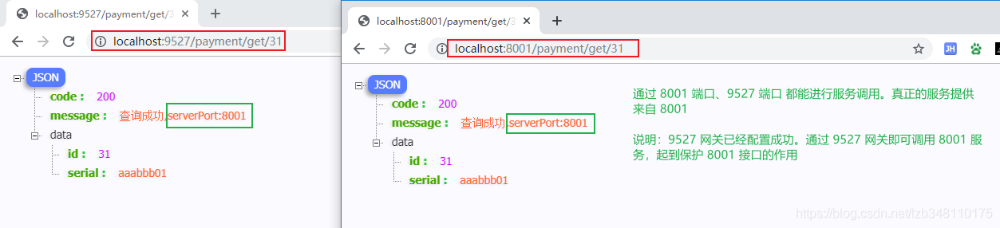

###### Ⅱ.集群版( 8001、8002 集群提供服务，通过微服务名实现动态路由)

  开启集群方式提供服务，网关配置部分， uri 就不能采用 **http://localhost:8081** 直接写死的方式，这样是无法达到负载均衡效果的。此处需要使用 **服务名** 的方式进行调用。

在配置上，需要两个地方修改：

1. **spring.cloud.gateway.discovery.locator.enabled = true** 开启从注册中心动态获取路由的功能，利用微服务名进行路由；
2. **uri** 配置，使用 **lb://服务名** 的方式 **（uri 以 lb:// 开头，lb 代表从注册中心获取服务）**

```yaml
server:
  port: 9527
  
spring:
  application:
    name: cloud-gateway
  cloud:
    gateway:
      discovery:
        locator:
          enabled: true  #开启从注册中心动态创建路由的功能，利用微服务名进行路由
      routes:
      - id: payment_routh #路由的ID，没有固定规则但要求唯一，建议配合服务名
#        uri: http://localhost:8001   #匹配后提供服务的路由地址
        uri: lb://cloud-payment-service #集群服务路由地址
        predicates:
        - Path=/payment/get/**   #断言,路径相匹配的进行路由
              
      - id: payment_routh2
#        uri: http://localhost:8001
        uri: lb://cloud-payment-service
        predicates:
        - Path=/payment/lb/**   #断言,路径相匹配的进行路由
```

**服务调用测试结果：** **【通过 9527，已经实现负载均衡(轮询)】**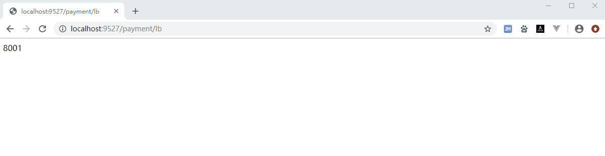

## 6.Gateway网关路由两种配置方式

1. application.yml 中配置 **（推荐）**
2. 代码方式配置 **(使用 @Bean 代码中注入 RouteLocator 的方式 )** **（不推荐）**

#### 6.1 代码方式配置

```java
@Configuration
public class GatewayConfig {

    @Bean
    public RouteLocator routes(RouteLocatorBuilder builder) {
        /**
         * 配置了一个 id 为 "toBaiduGuoNei" 的路由规则，当访问地址 http://localhost:9527/guonei 时会自动转发到地址：http://news.baidu.com/guonei   
         */
        return builder.routes()
                .route("toBaiduGuoNei",r -> r.path("/guonei").uri("https://news.baidu.com/guonei"))
                .build();
    }
}
```

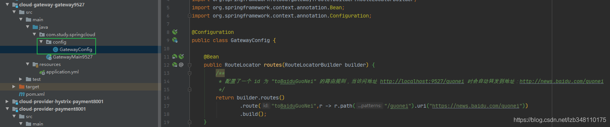

#### 6.2 代码方式配置 Predicate、Filter 等规则

  代码方式进行配置，详细内容此处不做说明。建议你来官网了解：[Spring Cloud Gateway 官网](https://cloud.spring.io/spring-cloud-static/spring-cloud-gateway/2.2.1.RELEASE/reference/html)（**官网：Ctrl + F 搜索 RouteLocator 即可**）

  **推荐 applicaiton.yml 文件的方式进行配置。**

## 7.Predicate 断言的使用

  Gateway 网关模块启动时，在 Console 工作台能够观察到 Gateway 去加载 Predicate。我们会看到 **Gateway 一共提供了 11 种 Predicate 机制(xxxFactory、xxxService 2个除外)**。加载日志如图所示：
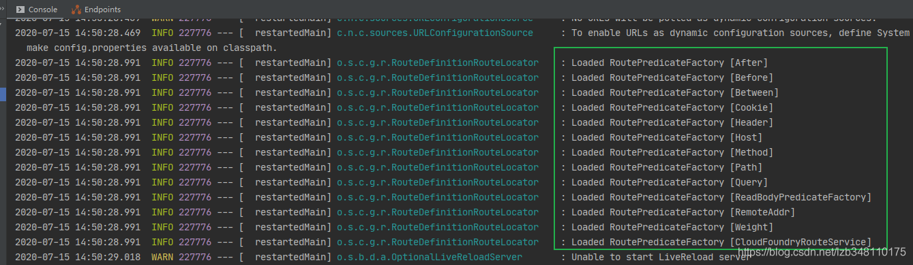

#### 7.1 After Route Predicate

**application.yml**

```yaml
spring:
  cloud:
    gateway:
      routes:
      - id: after_route
        uri: https://example.org
        predicates:
        - After=2017-01-20T17:42:47.789-07:00[America/Denver]
```

**说明：** **这个路由规则，在 2017年1月29号 17:42:47.789 后访问才会生效。** 此处日期可以使用 **ZonedDateTime zonedDateTime = ZonedDateTime.now();** 来生成

#### 7.2 Cookie Route Predicate

**application.yml**

```yaml
spring:
  cloud:
    gateway:
      routes:
      - id: cookie_route
        uri: https://example.org
        predicates:
        - Cookie=chocolate, ch.p
```

**说明：** **这个路由规则，需要两个参数，一个是 Cookie name，一个是正则表达式。如果能够匹配 Cookie name值 和正则表达式，就会执行路由，如果没有匹配上则不执行。**

**举例：**

```yaml
spring:
  cloud:
    gateway:
      routes:
		- id: payment_routh2
        uri: http://localhost:8001
        predicates:
        - Path=/payment/lb/**   #断言,路径相匹配的进行路由
        - Cookie=username, ch.p\d
```

  Predicate 规则为：**- Cookie=username, ch.p\d**。**ch.p\d** 为正则表达式，**\d** 代表数字。即只有cookie 为 **username=ch.p3** 能够匹配；**username=ch.a**、**username=ch.pabc** 能是不能够匹配的；

**测试结果：**
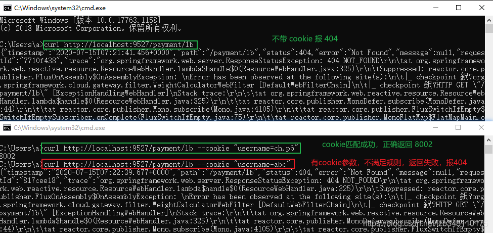

#### 7.3 Others Route Predicate

  Predicate 断言这块内容，在官网都有很详细的介绍。其他 9 个断言，此处不做过多说明

  官网 Predicate 地址：[Route Predicate Gactories](https://cloud.spring.io/spring-cloud-static/spring-cloud-gateway/2.2.1.RELEASE/reference/html/#gateway-request-predicates-factories)

## 8.Filter 过滤的使用

  **路由过滤器，可用于修改进入的 Http 请求和返回的 Http 响应**，路由过滤器只能 **指定路由** 进行使用。Spring Cloud Gateway 内置了多种路由过滤器，他们都有 GatewayFilter 的工厂类来产生。

  Filter 种类，分为两种：一种是 **GatewayFilter**；另一种是 **GlobalFilter**。GatewayFilter 共 31 个，官网地址：[GatewayFilter Factories](https://cloud.spring.io/spring-cloud-static/spring-cloud-gateway/2.2.1.RELEASE/reference/html/#gatewayfilter-factories)；GlobalFilter 共 10 个，官网地址：[GlobalFilter Factories](https://cloud.spring.io/spring-cloud-static/spring-cloud-gateway/2.2.1.RELEASE/reference/html/#global-filters)。

  常用的 GatewayFilter 有 **AddRequestParameter**。其他用的也不是很多。去官网了解一下即可。常用的还是 **自定义全局过滤器（这个用的多）**，这里来简单介绍一下如何开发自己的 **自定义全局过滤器**

#### 8.1 自定义全局过滤器

  自定义全局过滤器，可以帮助我们进行 **全局日志记录**、**统一网关鉴权** 等功能。我们需要定义一个类，并实现 **GlobalFilter** ，**Ordered** 两个接口，重写里面的 **filter、order** 方法即可。

  **主要是 filter 方法，编写详细的过滤器逻辑；order 方法是用来定义加载过滤器的优先级，返回一个 int 数值，值越小优先级越高。**

###### Ⅰ.自定义过滤器：

  以组件的方式，在 Spring Boot 启动时被加载。使用 **@Component** 进行注释。

```java
@Component
@Slf4j
public class MyLogGatewayFilter implements GlobalFilter,Ordered {
    @Override
    public Mono<Void> filter(ServerWebExchange exchange, GatewayFilterChain chain) {

        log.info("*********come in MyLogGateWayFilter: "+new Date());
        log.info("*********进入全局过滤器： "+new Date());
        String username = exchange.getRequest().getQueryParams().getFirst("username");
        if(StringUtils.isEmpty(username)){
            log.info("*****用户名为Null 非法用户,(┬＿┬)");
            exchange.getResponse().setStatusCode(HttpStatus.NOT_ACCEPTABLE);//给人家一个回应，设置http状态码
            return exchange.getResponse().setComplete();
        }
        return chain.filter(exchange);
    }

    @Override
    public int getOrder() { //加载过滤器优先级，越小优先级越高
        return 0;
    }
}
```

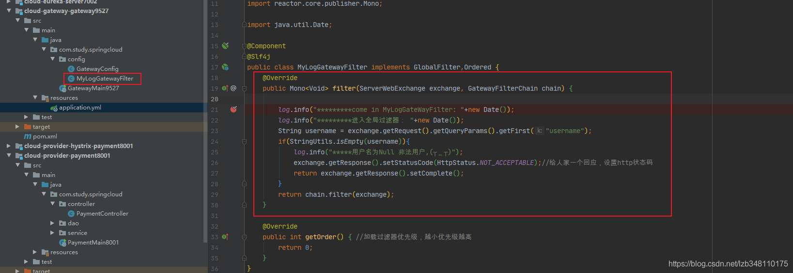

###### Ⅱ.测试自定义过滤器

  过滤器需要满足带参数：username。**链接不带 username 参数，会被过滤掉。**
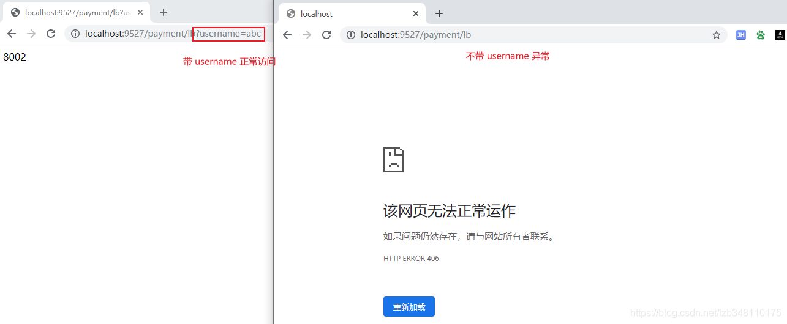
**日志返回：**
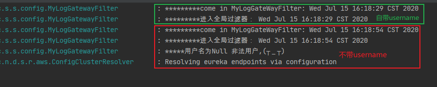