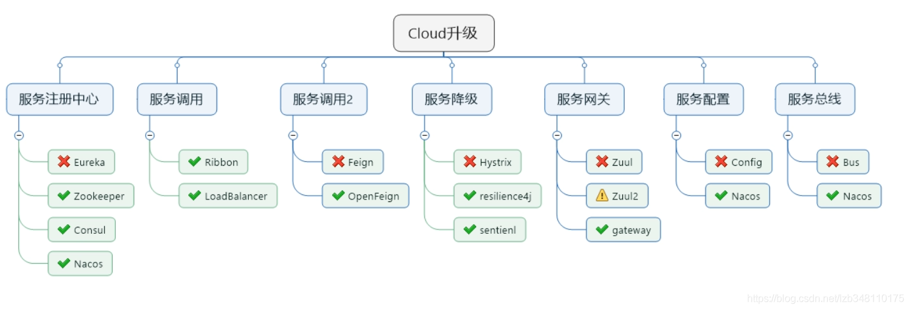
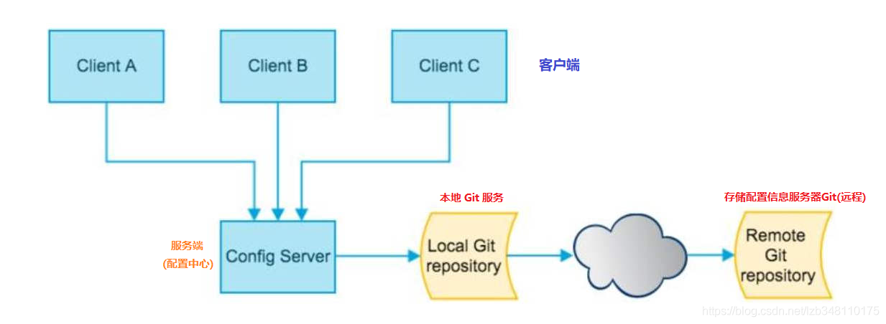
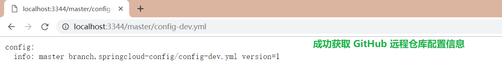
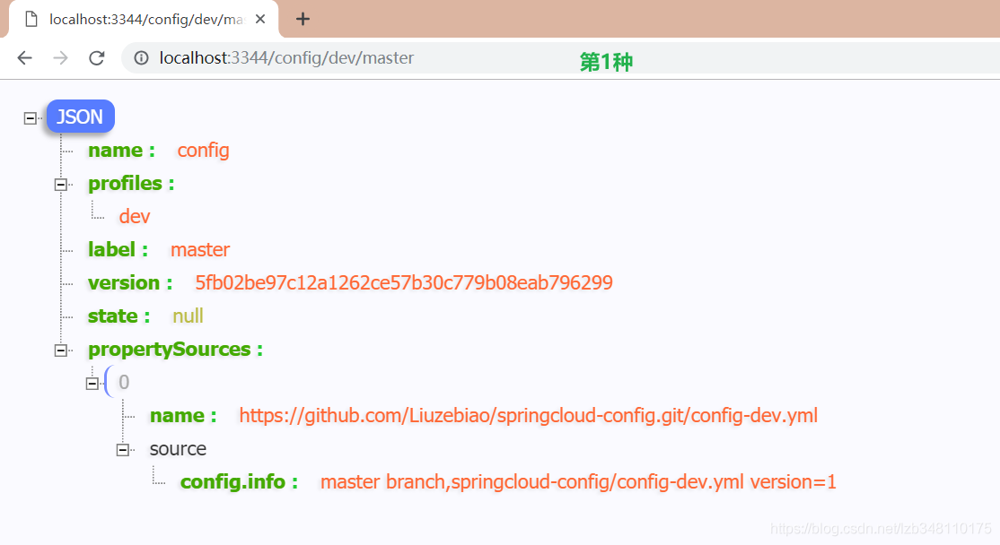
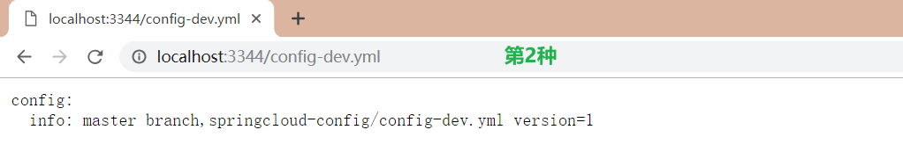
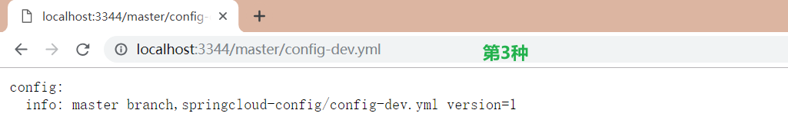
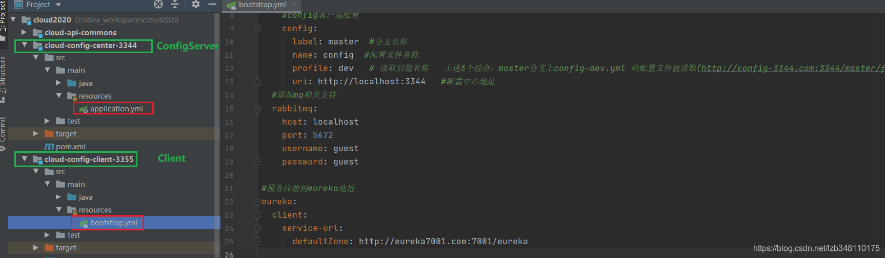
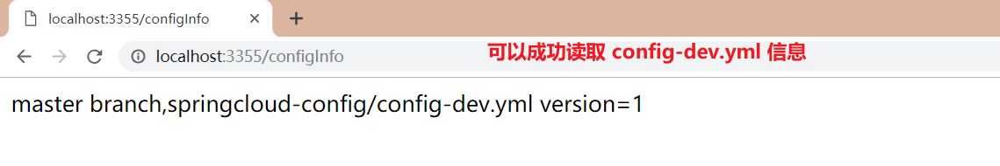
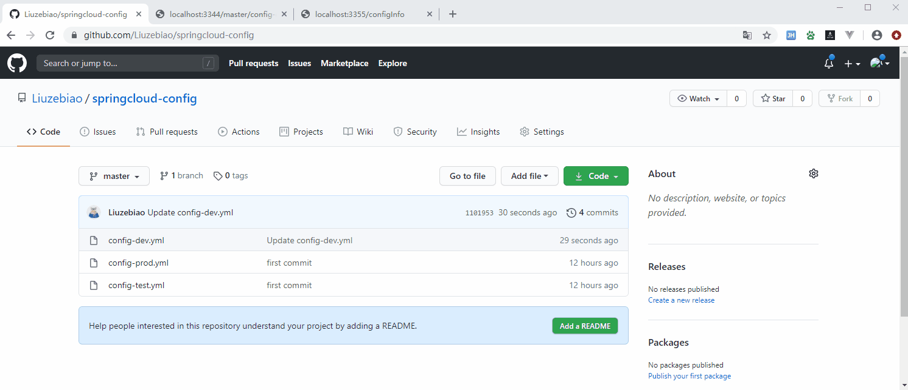

**Spring Cloud Config** 和 **Spring Cloud Bus** 这两哥们，倒是谈不上 **停更进维**，在开发中还在使用。但是在接下来将会慢慢的被 后起之秀 Alibaba Nacos 所替代。

微服务在 **服务配置 + 服务总线** 这块进行选型，共有三套方案：**1.Spring Cloud Config + Spring Cloud Bus**、**2.Spring Cloud Alibaba Nacos** ([Nacos 官网](https://nacos.io/zh-cn/))、**3.携程 Apollo**([Github 地址：Apollo](https://github.com/ctripcorp/apollo))



## 1.微服务面临的问题

  到目前为止，我们对 `Eureka`、`Robbin`、`Feign`、`Hystrix`、`Gateway` 等有了相应的了解，每个微服务都是单独一个模块，微服务彼此还支持集群环境。但是在微服务项目的开发中，还面临着一个严重的配置问题。每一个微服务都需要一个配置文件，如果有几个微服务需要连接数据库，name就需要进行 4 次数据库的配置。当数据库发生改变，那么就需要同时修改 4 个微服务的配置文件才可以。那么如果有40台呢？如果是集群模式呢？？

  如果能够做到：**一处修改、处处生效**，这样就可以减轻修改配置压力，从而增强配置管理方面的功能，此时就需要 **Spring Cloud Config 和 Spring Cloud Bus** 上场了。

  使用 Config + Bus，可以实现 **1.一处修改、处处生效**，同时也可以 **2.灵活的对版本(dev/test/prod)进行切换**，这样就足够方便了。先来介绍 **Spring Cloud Config**

## 2.了解 Spring Cloud Config

Spring Cloud Config 为[wèi]微服务架构中的微服务 **提供集中化的外部配置支持**，配置服务器为[wèi]各个不同微服务应用的所有环境 **提供了一个中心化的外部配置**。公共配置都去配置中心读取，私有配置，各个服务独自配置，简直不要太爽

  附：[Spring Cloud Config 官网](https://cloud.spring.io/spring-cloud-static/spring-cloud-config/2.2.1.RELEASE/reference/html/)

#### 2.1 Config 何方神圣 (Config 是什么)

Spring Cloud Config 分为 **服务端** 和 **客户端**。

- 服务端：也称为 **分布式配置中心，它是一个独立的微服务应用**，用来连接配置服务器并为客户端提供获取配置信息，加密/解密信息等访问接口。就是图中的 **Config Server**；
- 客户端：通过指定的 **配置中心(Config Server)** 来管理应用资源，以及与业务相关的配置内容，并在启动的时候从 **配置中心** 获取和加载配置信息。

  服务器默认采用 Git 来存储配置信息，这样就有助于对环境配置进行版本管理，并且可以通过 Git 客户端工具来方便的管理和访问配置内容。(**服务器也支持其他方式**：支持SVN 和 本地文件，最推荐 Git，而且使用的是 http/https 访问的形式)

#### 2.2 Config 结构图



#### 2.3 Config 能帮我们干吗 (Config 功能)


## 3. Git 远程服务器配置

#### Ⅰ.创建存储 Config 的新 Repository

  登陆 Github 账号，进行新 Repository 的创建。此处新创建的 Repository 名称为：**springcloud-config** 。

  Repository 创建成功，即可获取自己的仓库地址。

#### Ⅱ.将新建的GitHub远程仓库克隆到本地

  将项目克隆到本地，方便对数据的修改。GitHub 也支持直接修改，你也可以不克隆，此处克隆只是为了更方便处理数据。

  进入克隆目录，新建三个配置文件，分别是 **config-dev.yml**、**config-test.yml**、**config-prod.yml**。然后通过命令将其推送到远程GitHub仓库

> git add *.yml   (将提交的文件加入暂存区，为git commit做准备)
>
> git commit -m “first commit”    （完成对文件内容提交至Git版本库）
>
> git push -u origin master    （将本地仓库内容，推送至GitHub远程仓库）

**到此为止，远程GitHub仓库推送成功**

## 4.服务端配置测试 (Config 结构图中的 ConfigServer)

  服务端：也称为 **分布式配置中心，它是一个独立的微服务应用**。我们现在就来对服务端 ConfigServer 进行配置。

#### 4.1 创建ConfigServer模块

  它是一个独立的微服务应用，此处模块名称命名为：**a070-cloud-config-center-3344**。

#### 4.2 引入 pom.xml 依赖

```xml
<!--引入spring-cloud-config-server依赖-->
<dependency>
    <groupId>org.springframework.cloud</groupId>
    <artifactId>spring-cloud-config-server</artifactId>
</dependency>
```

#### 4.3 配置文件 application.yml 修改

```yaml
server:
  port: 3344   #端口号
  
spring:
  application:
    name: cloud-config-server
  cloud:
    config:
      server:
        git:
          uri: https://github.com/DongLiusuo/spring-cloud-202103.git  #配置文件所在仓库
          default-label: master #配置文件所在分支
          search-paths: a075-cloud-config-file # 配置文件所在目录
          username: NAN #登录账号
          password: NAN #登录密码


#服务注册到eureka
eureka:
  client:
    service-url:
      defaultZone:  http://localhost:7001/eureka
```

#### 4.4 主启动类 配置@EnableConfigServer注解

```java
@SpringBootApplication
@EnableConfigServer 
public class ConfigCenterMain3344 {
    public static void main(String[] args) {
        SpringApplication.run(ConfigCenterMain3344 .class,args);
	}
}
```

#### 4.5 启动服务端模块，测试

  Config 模块需要注册到 Eureka Server，先启动 Eureka 服务。

  启动 Config 模块后，测试通过 Config 微服务是否可以从 Github上获取配置内容。我们通过地址：**http://localhost:3344/master/config-dev.yml** 进行配置内容的访问。


> **→ 到此为止，成功实现了用 SpringCloud Config 通过 GitHub 获取配置信息**

## 5.GitHub配置文件读取规则

  远程 GitHub 仓库，配置文件的命名也是有具体规则的。Spring Cloud Config 官方共支持 5 种方式的配置。5种配置规则见：[Config 官网配置规则](https://cloud.spring.io/spring-cloud-static/spring-cloud-config/2.2.1.RELEASE/reference/html/#_quick_start)

```c
/{application}/{profile}/{label}
/{application}-{profile}.yml (这种不带label方式，默认使用 application.yml 配置)
/{label}/{application}-{profile}.yml (推荐使用第三种)
/{application}-{profile}.properties
/{label}/{application}-{profile}.properties
```

#### 5.1 规则说明：

1. `/{application}/{profile}/{label}` 这种方式，返回的是 Json 对象，需要自己解析所要的内容；



2. `/{application}-{profile}.yml` 这种不带 label 方式，因为 applicaiton.yml 文件已经有配置过 label，不带label 方式，默认走的就是 yml 配置的 label，返回的是配置内容；
   
3. `/{label}/{application}-{profile}.yml` **推荐使用第3种**，这种方式简明扼要，条理清晰，返回的是配置内容；
   
   \5. `{application}-{profile}.properties` 同第2种；
   \6. `{label}/{application}-{profile}.properties` 同第3种。

## 6.客户端配置测试 (Config 结构图中的 Client A、Client B、Client C)

  客服端：在启动的时候从 **配置中心(Config Server)** 获取和加载配置信息。

#### 6.1 客户端模块

  创建客户端模块，用来读取ConfigServer配置。此处模块名称为：**a072-cloud-config-client-3355**

#### 6.2 引入 pom.xml 依赖

```xml
<!--引入spring-cloud-starter-config依赖-->
<dependency>
    <groupId>org.springframework.cloud</groupId>
    <artifactId>spring-cloud-starter-config</artifactId>
</dependency>
```

#### 6.3 配置文件 bootstrap.yml 修改

**注意：**此处需要增加的是一个 **bootstap.yml** 文件。

###### Ⅰ.bootstrap.yml 是什么

  **application.yml** 是**(用户级)**的资源配置项。bootstrap.yml 是**(系统级)**的资源配置项，优先级更高。

  Spring Cloud 会创建一个 “Bootstrap Context”，作为 Spring 应用的 “Application Context” 的 **父上下文**。初始化的时候，“Bootstrap Context” 负责从 **外部源** 加载配置属性并解析配置。这两个上下文共享一个从外部获取的 “Environment”。

  **"Bootstrap" 属性有高优先级。默认情况下，它们不会被本地配置覆盖。** “Bootstrap Context” 和 “Application Context” 有这不同的约定，**所以新增了一个 "bootstrap.yml" 文件，保证"Bootstrap Context" 和 "Application Context" 配置的分离。**

  **所以，将客户端模块下的 application.yml 文件改为bootstrap.yml，这是很关键的。** 因为 bootstrap.yml 是比 application.yml 优先加载的。bootstrap.yml 优先级高于 applicaiton.yml。

###### Ⅱ.bootstrap.yml 配置内容

```yaml
server:
  port: 3355 #端口

spring:
  application: #名称
    name: config-client
  cloud:
    #config客户端配置
    config:
      label: master  #分支名称
      name: config  #配置文件名称
      profile: dev   # 读取后缀名称   上述3个综合：master分支上config-dev.yml 的配置文件被读取(http://config-3344.com:3344/master/fongig-dev.yml)
      uri: http://localhost:3344   #配置中心地址

#服务注册到eureka地址
eureka:
  client:
    service-url:
      defaultZone: http://eureka7001.com:7001/eureka
```

**配置图解：**


#### 6.4 主启动类 配置@EnableConfigServer注解

```java
import org.springframework.boot.SpringApplication;
import org.springframework.boot.autoconfigure.SpringBootApplication;
 
@EnableEurekaClient
@SpringBootApplication
public class ConfigClientMain3355 {
    public static void main(String[] args) {
            SpringApplication.run( ConfigClientMain3355.class,args);
        }
}
```

#### 6.5 controller业务类

```java
@RestController
public class ConfigClientController {

    @Value("${config.info}") //通过这种方式，可以直接读取ConfigServer中的配置信息
    private String configInfo;

    @GetMapping("/configInfo")
    public String getConfigInfo(){
        return configInfo;
    }
}
```

#### 6.6 启动客户端模块，测试

  Config 模块需要注册到 Eureka Server，先启动 Eureka 服务。然后启动 Config Server 3344 模块，最后启动 Client 3355 模块。我们通过地址：**http://localhost:3355/configInfo** 发现可以成功读取到 ConfigServer 中的 **config-dev.yml** 配置。

  需要获取 **test**、**prod** 等环境配置信息，只需要修改 **Ⅱ.bootstrap.yml 配置内容** 中的相关属性，即可获取响应环境的配置信息。



## 7.分布式配置的动态刷新问题

  当 GitHub 上的配置文件内容有调整，**Github中配置变更后，ConfigServer 配置中心会立刻响应，然鹅客户端却没有任何响应，除非客户端重启或者重新加载，才能够获取最新的配置。** 难道每次修改配置文件，客户端都需要重启吗？？

  那简直就是个噩梦，还是没有解决根本问题。为了避免每次修改 GitHub 配置文件后，客户端都需要重启的问题，此处就引出了客户端 **动态刷新** 的问题。

接下来对客户端进行 **动态刷新** 配置。

#### 7.1 pom.xml 引入actuator监控依赖

```xml
<!--引入actuator监控-->
<dependency>
    <groupId>org.springframework.boot</groupId>
    <artifactId>spring-boot-starter-actuator</artifactId>
</dependency>
```

#### 7.2 修改YML，新增暴露监控端口配置

```yaml
#暴露监控端点
management:
  endpoints:
    web:
      exposure:
        include: "*"  #此处有很多选项可以配置，为了省事 ,直接配置 *
```

#### 7.3 Controller层添加 @RefreshScope 注解

```java
@RefreshScope
@RestController
public class ConfigClientController {

    @Value("${config.info}")
    private String configInfo;

    @GetMapping("/configInfo")
    public String getConfigInfo(){
        return configInfo;
    }
}
```

#### 7.4 修改远程 GitHub 配置后，手动发送Post请求刷新客户端(3355端口)

  发送命令，刷新客户端。该请求必须是 **Post** 方式。经过上述一番配置，便可避免服务的重启，成功实现客户端刷新到最新配置内容。

**手动版动态刷新实现OK**

#### 7.5 手动版动态刷新，存在的问题

  实现了动态刷新，解决了 ConfigClient 重启才能获取最新配置信息问题。假如有 N 多个台，就需要 N 多次的 **curl -X POST "http://微服务地址:端口号/actuator/refresh"**。这仍然是一个噩梦，还是没有解决根本问题。

  大规模 **微服务/集群模式**，**我们可以采用广播的方式，一次通知，处处生效。**类似于 **消息队列的 Topic** ，**微信公众号** 的概念，一次订阅，所有订阅者都能接收到新消息。

  他来了，他来了，**Spring Cloud Bus 总线** 带着 **消息队列/广播 机制** 向我们走来了。Spring Cloud Bus 总线 可以帮我们实现以下功能：

1. **真正实现：一处通知、处处生效**；
2. **实现精确通知,只通知集群中的某些服务**(精确通知，比如有100台机器，只通知前98台)

> **Spring Cloud Config + Spring Cloud Bus** 两个组件配合使用，绝代双骄，这两个组件用就要一起用。