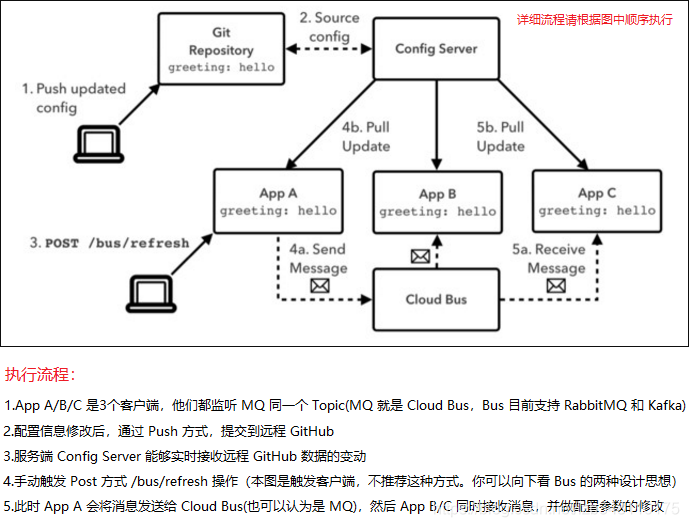
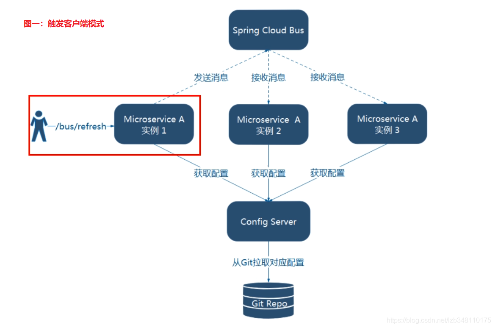
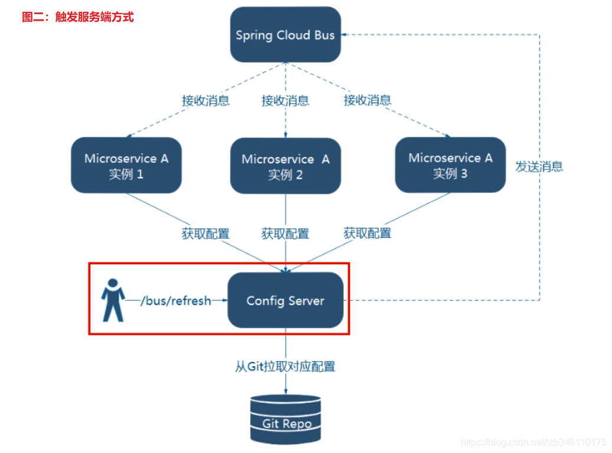
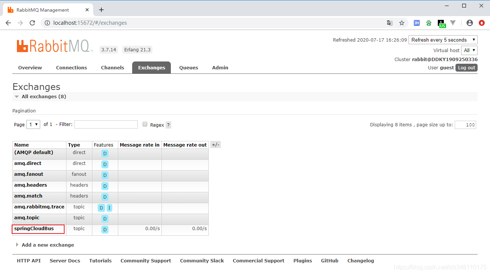
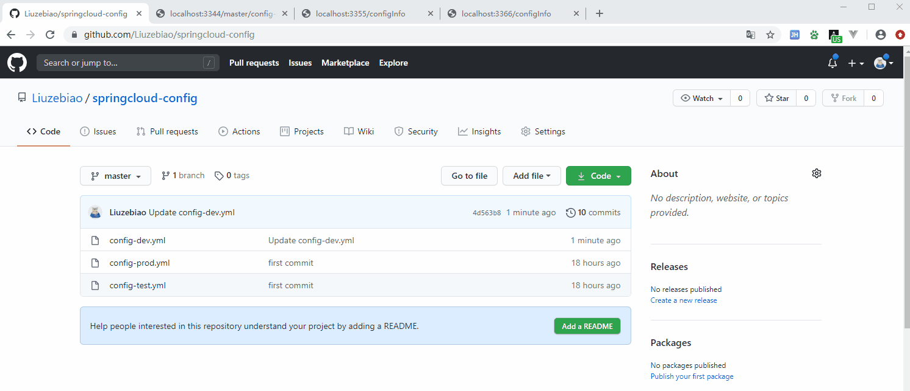

## 写在开头

针对 Spring Cloud Config 存在的问题：

1. **无法真正实现：一处通知、处处生效；**
2. **无法实现精确通知,只通知集群中的某些服务(精确通知，比如有100台机器，只通知前98台)**

带着上面这两个问题，我们来聊聊 Spring Cloud Bus 服务总线。

## 环境说明

1. `Config Server` 服务端配置中心，端口号：3344
2. 客户端，端口号：3355、3366，(采用集群模式，演示精确通知)

## 1.了解 Spring Cloud Bus

  附送直达飞机票：[Spring Cloud Bus 官网](https://cloud.spring.io/spring-cloud-static/spring-cloud-bus/2.2.1.RELEASE/reference/html/)

#### 2.1 Bus 何方神圣 (Bus 是什么)

  在微服务架构的系统中，通常会使用 **轻量级的消息代理 来构建一个共用的消息主题，并让系统中所有的微服务实例都连接上来。由于 该主题中产生的消息会被所有实例监听和消费**，所以称它为**消息总线**。在总线上的各个实例，都可以方便的广播一些需要让其他连接在该主题上的实例都知道的消息。

  Spring Cloud Bus 是用来将 `分布式系统的节点`与 `轻量级消息系统`连接起来的框架，它整合了 Java 的事件处理机制和消息中间件的功能。**Spring Cloud Bus 目前仅支持 RabbitMQ 和 Kafka。**

#### 2.2 Bus 原理

  Config 客户端实例，都去监听 MQ 中的同一个 topic（默认是 **springCloudBus**）。当一个服务刷新数据的时候，它会把这个消息放入到 Topic 中，这样其他监听同一 Topic 的服务就能够得到通知，然后去更新自身的配置。**就是通过 MQ 消息队列的 Topic 机制，达到广播的效果。**



## 2.Bus的两种设计思想

选用 Spring Cloud Bus 进行 Topic 消息的发送，在技术选型上共有两种设计思想：

#### 2.1 触发客户端

  利用消息总线，触发一个**客户端** 的 **/bus/refresh** 端点。通过客户端向 Bus 总线发送消息，实现刷新所有客户端的配置。


#### 2.2 触发服务端

  利用消息总线，触发一个**服务端** 的 **/bus/refresh** 端点。通过Config Server 服务端向 Bus 总线发送消息，实现刷新所有客户端的配置。


#### 2.3 如何选型

  根据架构图显然 **图二** 更加合适，所以推荐使用 **触发服务端 Config Server** 的方式。**图一触发客户端方式** 不适合的原因如下：

1. 利用消息总线触发客户端方式，`打破了微服务的职责单一性`，因为微服务本身是业务模块，它本不应该承担配置刷新的职责；
2. 触发客户端方式，`破坏了微服务各个节点之间的对等性`（比如说：3355/3366/3377 集群方式提供服务，此时 3355 还需要消息通知，影响节点的对等性）
3. `有一定的局限性。`当微服务迁移时，网络地址会经常发生变化，如果此时需要做到自动刷新，则会增加更多的修改。

## 3.环境搭建

  **Spring Cloud Bus 目前仅支持 RabbitMQ 和 Kafka。** 此处选型 RabbitMQ，Rabbit MQ 需要 Erlang 环境。

## 4.Bus 动态刷新全局广播配置

根据 **a072-cloud-config-center-3355** 来配置一个一模一样的客户端 **a073-cloud-config-center-3366**。与 3355 组成集群模式，方便接下来 Bus **定点通知** 效果的演示。

#### 4.1 集群版客户端组建

  **a073-cloud-config-center-3366** 。

#### 4.2 服务端配置中心/客户端 pom 引入Bus总线依赖

  在`服务端`配置中心 Config Server (3344)、客户端集群(3355/3366) 中引入 Bus 总线依赖

```xml
<!--添加消息总线支持-->
<dependency>
    <groupId>org.springframework.cloud</groupId>
    <artifactId>spring-cloud-starter-bus-amqp</artifactId>
</dependency>
```

#### 4.3 服务端配置中心 application.yml 修改 (添加 rabbitmq 相关配置)

```yaml
#添加rabbitmq相关支持（新加）
spring:
  rabbitmq:
    host: localhost
    port: 5672
    username: guest
    password: guest

#rabbitmq相关配置，暴露bus舒心配置的端点
management:
  endpoints:
    web:
      exposure:
        include: 'bus-refresh'  #为什么配置 bus-refresh，看传染病那张图
```

#### 4.4 客户端 application.yml 修改 (同样添加 rabbitmq 相关配置)

```yaml
#添加rabbitmq相关支持
spring:
  rabbitmq:
    host: localhost
    port: 5672
    username: guest
    password: guest

#暴露监控端点
management:
  endpoints:
    web:
      exposure:
        include: "*"  #此处有很多选项可以配置，为了省事 ,直接配置 *
```

#### 4.5 启动模块，开始测试

  启动：服务端配置中心 Config Server (3344)、客户端集群(3355/3366)、Eureka Server(7001)。修改 GitHub 参数配置，然后向 **服务端** 发送 Post 请求，命令：**curl -X POST "http://localhost:3344/actuator/bus-refresh"**，

  当向 Config Server 发送 Post 请求后，总线上的各个实例(客户端 3355/3366 )都能够及时 **监听和消费** 配置的变更。使用广播的方式，真正的实现 **一处通知，处处生效**。

使用 MQ 广播的方式，实现 **一处通知，处处生效** 的效果。此时我们登陆 Rabbit MQ 客户端，在 **Exchanges** 模块，就能够看到一个叫做 **springCloudBus** 的 Topic。

  与本文 **2.2 Bus 原理** 中介绍吻合：Config 客户端示例，都去监听 MQ 中的同一个 topic（默认是 `springCloudBus`）。当一个服务刷新数据的时候，它会把这个消息放入到 Topic 中，这样其他监听同一 Topic 的服务就能够得到通知，然后去更新自身的配置。


## 5. Bus 动态刷新定点通知配置

  如果需要 **差异化通知**，并不想进行全局广播，此时就用到了 Bus 的 **定点通知** 功能。

  此次我们通过客户端集群(3344/3355)演示。GitHub 远程配置修改后 ，进行差异化定点通知，只通知 3355，不通知 3366。此处命令和全局广播有点不同，命令为：**http://配置中心IP:配置中心的端口号/actuator/bus-refresh/{destination}**

  通过指定 **/bus/refresh请求** 不再发送到具体的服务实例上，而是发给 Config Server 并通过 **{destination} 参数** 来指定需要更新配置的服务或实例。

  **{destination} 参数** = **微服务名 ：端口号**。3355 微服务名为：**config-client**。此处最终发送的 Post 请求命令为：**curl -X POST http://localhost:3344/actuator/bus-refresh/config-client:3355**，真正的实现 **精确通知** 功能。测试如图所示：
