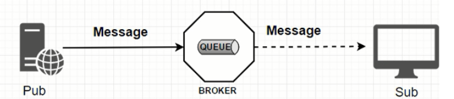
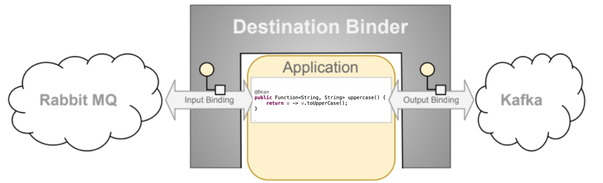
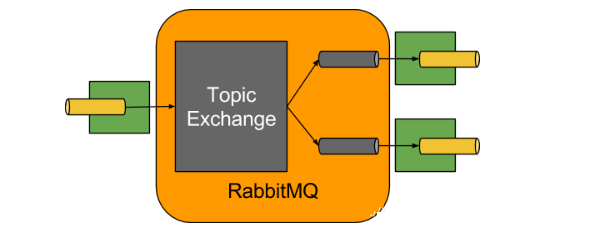
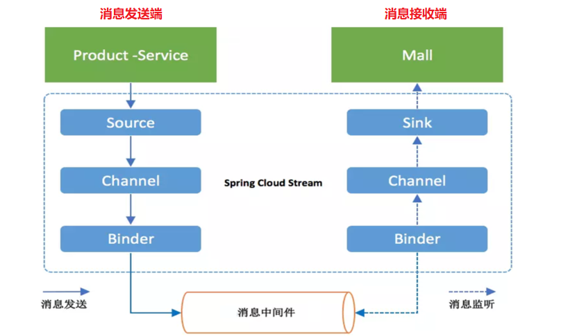
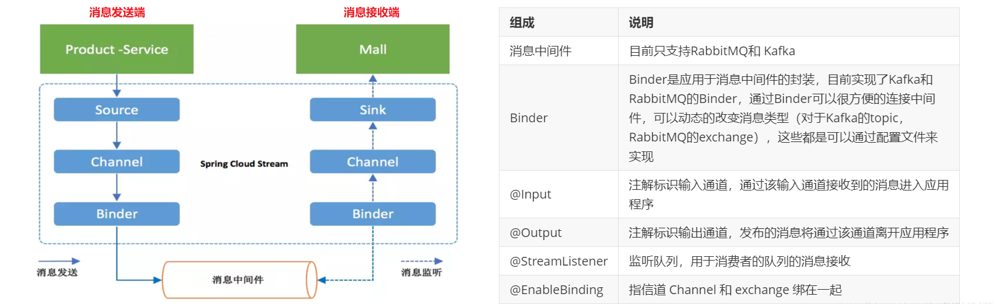
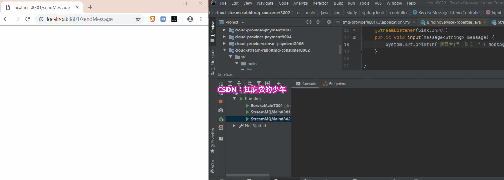
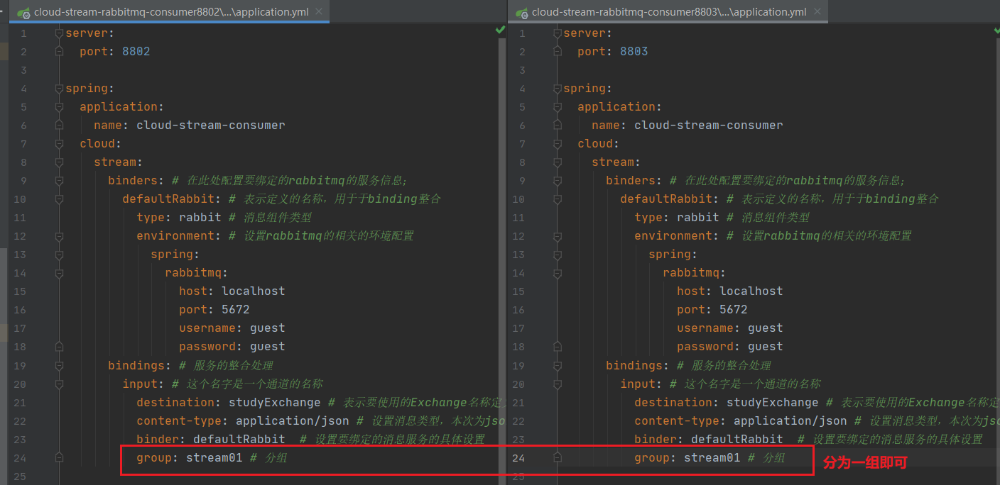
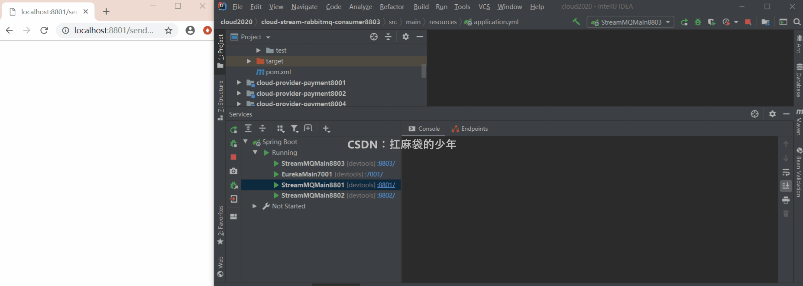
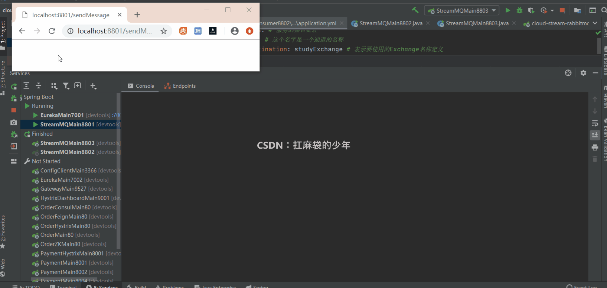

## 写在开头

   **Spring Cloud Config + Spring Cloud Bus 实现统一服务配置、一处通知处处生效、精确通知功能**。本文我们来学习一个全新的组件：**Spring Cloud Stream 消息驱动**。

## 1.微服务面临的问题

  在项目开发中，常用的四种消息中间件：`ActiveMQ`、`RabbitMQ`、`RocketMQ`、`Kafka`。由于每个项目需求的不同，在消息中间件的选型上也就会不同。

**在项目开发中，你会遇到以下一些问题：**

1. **自己学的是 RabbitMQ，公司用的却是 Kafka 。再学 Kafka？学习成本太高，负担太重；**
2. **多部门配合，MQ差异化带来的联调问题。A部门使用 RabbitMQ 进行消息发送，大数据部门却用 Kafka， MQ 选型的不同，MQ 切换、维护、开发等困难随之而来。**

  有没有一种技术，可以让我们不再关注 MQ 的细节，只需要用一种适配绑定的方式，就可以帮助我们自动的在各种 MQ 之间切换呢？**Spring Cloud Stream 消息驱动，它来了。**

  Spring Cloud Stream 消息驱动，它可以屏蔽底层 MQ 之间的细节差异。我们只需要操作Spring Cloud Stream 就可以操作底层多种多样的MQ。从而解决我们在 MQ **切换**、**维护**、**开发** 方面的难度问题。

## 1. 什么是 Spring Cloud Stream

  **飞机票直达：**[Spring Cloud Steam官网](https://spring.io/projects/spring-cloud-stream#overview)

  Spring Cloud Stream 是一个 **构建消息驱动微服务的框架**。应用程序通过 `inputs` 或者 `outputs` 来与 Spring Cloud Stream 中的 `binder` 对象交互。通过我们的配置来进行 binding(绑定)， 然后 Spring Cloud Stream 通过 **binder 对象与消息中间件交互。**所以，我们只需要搞清楚如何与 Spring Cloud Stream 交互，就可以方便使用消息驱动的方式。

  Spring Cloud Stream 通过使用 Spring Integration 来连接消息代理中间件，以实现消息时间驱动。Spring Cloud Stream 为一些供应商的消息中间件产品提供了个性化的自动配置发现，引用了 **发布-订阅**、**消费组**、**分区** 三个核心概念。**目前仅支持 RabbitMQ、Kafka。**

  **一句话总结：** Spring Cloud Stream 屏蔽了底层消息中间件的差异，降低 MQ 切换成本，统一消息的编程模型。开发中使用的就是各种 **xxxBinder**。

## 2. 标准MQ 和 Spring Cloud Stream 对比

#### 2.1 标准 MQ 结构图

  **生产者/消费者** 之间通过 **消息媒介** 传递消息内容


#### 2.2 Spring Cloud Stream 结构图

  比如说我们用到了 RabbitMQ 和 Kafka，由于这两个消息中间件的架构上的不同。像 RabbitMQ 有 `exchange`，Kafka 有 `Topic` 和 `Partions` 分区的概念。

  这些中间件的差异性，给我们实际项目的开发造成了一定的困扰。我们如果用了两个消息队列中的其中一个，后面的业务需求如果向往另外一种消息队列进行迁移，这需求简直是灾难性的。因为它们之间的耦合性过高，导致一大堆东西都要重新推到来做，这时候 Spring Cloud Stream 无疑是一个好的选择，它为我们提供了一种解耦合的方式。


## 3. Spring Cloud Stream如何统一底层差异

  在没有绑定器这个概念的情况下，我们的 Spring Boot 应用直接与消息中间件进行信息交互时，由于个消息中间件构建的初衷不同，它们的实现细节上会有较大的差异性。

  **通过定义绑定器(Binder)作为中间层，就可以完美的实现应用程序与消息中间件细节的隔离。** 通过向应用程序暴露统一的 Channel 通道，使得应用程序不需要在考虑各种不同的消息中间件的实现。


  默认情况下，RabbitMQ Binder 实现 **将每个目标映射到TopicExchange**。 对于每个使用者组，队列都绑定到该 TopicExchange。 每个使用者实例在其组的队列中都有一个对应的 RabbitMQ使用者实例。 对于分区的生产者和使用者，队列以分区索引为后缀，并使用分区索引作为路由键。 对于匿名使用者（没有组属性的使用者），将使用自动删除队列（具有随机的唯一名称）。

## 4. Spring Cloud Stream 执行流程


**说明：**

1. `Source/Sink`：Source 输入消息，Sink 输出消息
2. `Channel`：通道，是队列 Queue 的一种抽象，在消息通讯系统中就是实现存储和转发的媒介，通过Channel 对队列进行配置；
3. `Binder`：很方便的 **连接中间件**，屏蔽 MQ 之间的差异

## 5. 编码API和常用注解



## 6. 详细配置代码直接上

  **本示例选用 RabbitMQ，在不需要任何 RabbitMQ 包依赖的基础上，使用 Spring Cloud Stream 消息驱动来实现消息的发送&接收。** 

#### 6.1 生产者配置

消息生产者模块，命名为：`a080-cloud-stream-rabbitmq-provider8801`

###### Ⅰ.引入 pom 依赖

```xml
<!--引入stream-rabbit依赖-->
<dependency>
    <groupId>org.springframework.cloud</groupId>
    <artifactId>spring-cloud-starter-stream-rabbit</artifactId>
</dependency>

  
```

###### Ⅱ.修改applicaiton.yml 配置

```yaml
server:
  port: 8801
spring:
  application:
    name: cloud-stream-provider
  cloud:
    stream:
      binders: # 在此处配置要绑定的rabbitmq的服务信息；
        defaultRabbit: # 表示定义的名称，用于binding整合(可以自定义名称)
          type: rabbit # 消息组件类型
          environment: # 设置rabbitmq的相关的环境配置
            spring:
              rabbitmq:
                host: localhost
                port: 5672
                username: guest
                password: guest
      bindings: # 服务的整合处理
        output: # 这个名字是一个通道的名称
          destination: studyExchange # 表示要使用的Exchange名称定义
          content-type: application/json # 设置消息类型，本次为json，文本则设置“text/plain”
          default-binder: defaultRabbit
          binder: defaultRabbit  # 设置要绑定的消息服务的具体设置(需与自定义名称一致)(飘红：Settings->Editor->Inspections->Spring->Spring Boot->Spring Boot application.yml 对勾去掉)
eureka:
  client: # 客户端进行Eureka注册的配置
    service-url:
      defaultZone: http://localhost:7001/eureka
  instance:
    lease-renewal-interval-in-seconds: 2 # 设置心跳的时间间隔（默认是30秒）
    lease-expiration-duration-in-seconds: 5 # 如果现在超过了5秒的间隔（默认是90秒）
    instance-id: send-8801.com  # 在信息列表时显示主机名称
    prefer-ip-address: true     # 访问的路径变为IP地址

  
```

###### Ⅲ. 业务类编写

**1.controller**

```java
@RestController
public class SendMessageController {
    @Resource
    private IMessageProvider messageProvider;
    @GetMapping(value = "/sendMessage")
    public String sendMessage() {
        return messageProvider.send();
    }
}

  
```

**2.interface 接口**

```java
public interface IMessageProvider {
    public String send();
}

  
```

**3.service**

```java
import com.study.springcloud.service.IMessageProvider;
import org.springframework.cloud.stream.annotation.EnableBinding;
import org.springframework.cloud.stream.messaging.Source;
import org.springframework.messaging.MessageChannel;
import org.springframework.messaging.support.MessageBuilder;
import javax.annotation.Resource;
import java.util.UUID;
//@EnableBinding 指信道channel和exchange绑定在一起
//@EnableBinding(Source.class) 就是将 Source(源) 放到 Channel 的意思
@EnableBinding(Source.class)  //定义消息的推送管道
public class MessageProviderImpl implements IMessageProvider {
    @Resource
    private MessageChannel output; // 消息发送管道
    @Override
    public String send() {
        String serial = UUID.randomUUID().toString();
        output.send(MessageBuilder.withPayload(serial).build());
        System.out.println("发送消息: "+serial);
        return null;
    }
}

  
```

###### Ⅳ. 客户端测试

  启动RabbitMQ、微服务相关模块，通过接口调用 `http://localhost:8801/sendMessage` 进行消息发送，可以看到后台有显示发送消息，进入 RabbitMQ 可视化界面，可以看到有发送消息波峰出现。


#### 6.2 消费者配置

消息消费者模块，命名为：`a085-cloud-stream-rabbitmq-provider8802`

###### Ⅰ.引入 pom 依赖

```xml
<!--引入stream-rabbit依赖-->
<dependency>
    <groupId>org.springframework.cloud</groupId>
    <artifactId>spring-cloud-starter-stream-rabbit</artifactId>
</dependency>

  
```

###### Ⅱ.修改applicaiton.yml 配置

```yaml
server:
  port: 8802
spring:
  application:
    name: cloud-stream-consumer
  cloud:
    stream:
      binders: # 在此处配置要绑定的rabbitmq的服务信息；
        defaultRabbit: # 表示定义的名称，用于于binding整合(可以自定义名称)
          type: rabbit # 消息组件类型
          environment: # 设置rabbitmq的相关的环境配置
            spring:
              rabbitmq:
                host: localhost
                port: 5672
                username: guest
                password: guest
      bindings: # 服务的整合处理
        input: # 这个名字是一个通道的名称
          destination: studyExchange # 表示要使用的Exchange名称定义
          content-type: application/json # 设置消息类型，本次为json，文本则设置“text/plain”
          binder: defaultRabbit  # 设置要绑定的消息服务的具体设置(需与自定义名称一致)(飘红：Settings->Editor->Inspections->Spring->Spring Boot->Spring Boot application.yml 对勾去掉)
eureka:
  client: # 客户端进行Eureka注册的配置
    service-url:
      defaultZone: http://localhost:7001/eureka
  instance:
    lease-renewal-interval-in-seconds: 2 # 设置心跳的时间间隔（默认是30秒）
    lease-expiration-duration-in-seconds: 5 # 如果现在超过了5秒的间隔（默认是90秒）
    instance-id: receive-8802.com  # 在信息列表时显示主机名称
    prefer-ip-address: true     # 访问的路径变为IP地址

  
```

###### Ⅲ. 业务类编写

```java
import org.springframework.cloud.stream.annotation.StreamListener;
import org.springframework.messaging.Message;
import org.springframework.beans.factory.annotation.Value;
import org.springframework.cloud.stream.annotation.EnableBinding;
import org.springframework.cloud.stream.messaging.Sink;
import org.springframework.stereotype.Component;
@Component
@EnableBinding(Sink.class)
public class ReceiveMessageListenerController {
    @Value("${server.port}")
    private String serverPort;
    @StreamListener(Sink.INPUT)
    public void input(Message<String> message) {
        System.out.println("1号消费者，接收："+message.getPayload()+"\t port:"+serverPort);
    }
}

  
```

###### Ⅳ. 消费端测试

  启动 RabbitMQ、微服务消息生产模块、消费模块，通过接口调用 `http://localhost:880/sendMessage` 进行消息发送，可以看到消费者后台在实时接收消息。

  这样，我们并没有引入任何相关 RabbitMQ 包，也并不了解 Rabbit MQ。便能够使用 Rabbit MQ 进行 **消息发送 & 接收**。这就是Spring Cloud Stream 消息驱动的优越之处。


## 7. Stream 重复消费/持久化问题

  上述情况，只有一个生产者、一个消费者，并不会发现有问题存在。此时如果来两个消费者(8802、8803集群方式存在)。此处 8803 消费者就不再创建了，同 8802 一模一样配置，你可以自行测试。

#### 7.1 重复消费问题

  当集群方式进行消息消费时，就会存在 **消息的重复消费问题**。**比如订单库存相关消息，购物完成库存 -1，消息重复消费就会导致库存不准确问题出现**，这显然是不能接受的。

  **这是因为没有进行分组的原因，不同组就会出现重复消费；同一组内会发生竞争关系，只有一个可以消费。** 如果我们不指定(8802、8803)集群分组信息，它会默认将其当做两个分组来对待。这个时候，如果发送一条消息到 MQ，不同的组就都会收到消息，就会造成消息的重复消费。

**解决方式：**

  **解决方式很简单，只需要用到 Stream 当中 group 属性对消息进行分组即可。将8802、8803分到一个组即可。**

**分组后测试结果：**

  只要是一个组的消费者，就处于竞争关系，一次只能有一个去消费，这就可以解决重复消费的问题了。**（项目中，是否分组就视业务情况而定吧）**


#### 7.2 持久化问题

  此时去掉 8802 分组属性，8803 分组仍然为 `stream01`。此时他们是 2 个分组状态。关闭8802 服务，开启 8803 服务。此时生产者8801 开始发送 4 条消息，我们可以发现 8803 能够正常消费到 4条消息，**此时开启 8802 服务，发现 8802 一条消息都没有收到，这就是消息持久化的问题。** 测试结果如下图所示：

**解决方式：**

  还是很简单，还是加一个 group 分组属性就行了。**所以说 group 分组属性在消息重复消费和消息持久化消费(避免消息丢失)是一个非常重要的属性，推荐你在使用时加上。**

**测试结果：**

  将 8802 的 group 属性删除，8803属性保留，此时让两个客户端都停服务。**在停止服务期间，生产者发送了 4 条消息。当 8802 启动时，由于没有 group 属性，并不会消费之前产生的消息；8803 则会消费之前产生的信息。** 测试结果如下图所示：