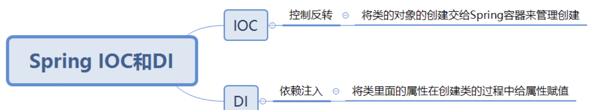

## Spring IoC和DI
在Spring容器的底层，最重要的功能就是IOC和DI，也就是控制反转和依赖注入。

DI和IOC它俩之间的关系是DI不能单独存在，DI需要在IOC的基础上来完成。

在Spring内部，所有的组件都会放到IOC容器中，组件之间的关系通过IOC容器来自动装配，也就是我们所说的依赖注入。

## Spring常用注解

* @Configuration 用于标注配置类
* @Bean 结合@Configuration（full mode）使用或结合@Component（light mode）使用。可以导入第三方组件,如果方法有参数默认从IOC容器中获取，可以指定initMethod和destroyMethod 指定初始化和销毁方法,多实例对象不会调用销毁方法.
* @Scope:设置组件作用域 1.prototype:多例的2.singleton:单例的（默认值）
* @Lazy 懒加载
* @Conditional({Condition}):按照一定的条件进行判断,满足条件给容器中注册Bean,传入Condition数组,，使用时需自己创建类继承Condition然后重写match方法。
* @Import\[快速给容器中导入一个组件\]
  1. Import(类名),容器中就会自动注册这个组件，id默认是组件的全名
  2. ImportSelector：返回需要导入的组件的全类名的数组
  3. ImportBeanDefinitionRegistrar：手动注册bean
* FactoryBean:工厂Bean,交给spring用来生产Bean到spring容器中.可以通过前缀&来获取工厂Bean本身.
* @Value:给属性赋值,也可以使用SpEL和外部文件的值
* @PropertySource:读取外部配置文件中的k/v保存到运行环境中,结合@value使用,或使用ConfigurableEnvironment获取
* @Profile:结合@Bean使用,默认为default环境,可以通过命令行参数来切换环境
* 自定义组件使用Spring容器底层的组件:需要让自定义组件实现xxxAware，(例如:ApplicationContextAware),spring在创建对象的时候,会帮我们自动注入。spring通过BeanPostProcessor机制来实现XXXXAware的自动注入。
