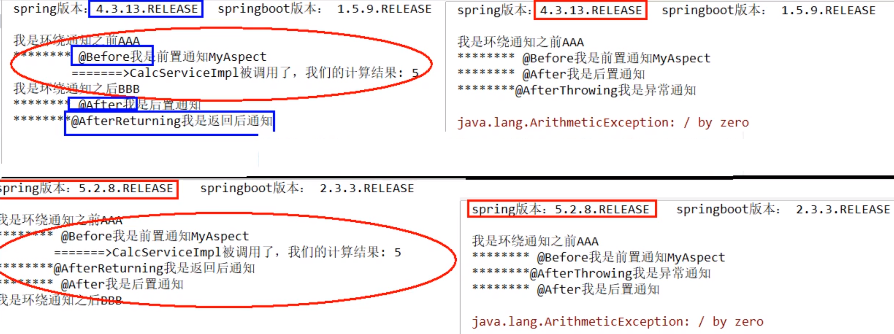

# 1 AOP概述

### 1.1.1 AOP概念

AOP：全称是Aspect Oriented Programming即：面向切面编程。

简单的说它就是把我们程序重复的代码抽取出来，在需要执行的时候，使用动态代理的技术，在不修改源码的基础上，对我们的已有方法进行增强。

### 1.1.2 AOP的作用及优势

* 作用：
  * 在程序运行期间，不修改源码对已有方法进行增强。
* 优势
  * 减少重复代码
  * 提高开发效率
  * 维护方便

### 1.1.3 AOP的实现方式

使用动态代理方式

# 2 动态代理

### 2.1 动态代理的特点

字节码随用随创建，随用随加载。

 它与静态代理的区别也在于此。因为静态代理是字节码一上来就创建好，并完成加载。 

装饰者模式就是静态代理的一种体现。

### 2.2 动态代理的实现方式

#### 2.2.1 基于接口的动态代理

提供者：JDK官方的Proxy类

要求：被代理的类最少实现一个接口

#### 2.2.2 基于子类的动态代理

提供者：CGLib，如果报asmxxxx异常，需要导入asm.jar。

要求：被代理的类不能用final修饰（最终类）

# Spring AOP

### 相关术语

* **Joinpoint（连接点）**：所谓连接点就是指那些被拦截到的点。在Spring中，这些点指的是方法，因为Spring只支持方法类型的连接点。

* **Pointcut（切入点）**：所谓切入点是指我们要对哪些Joinpoint进行拦截的定义。

* **Advice（通知/增强）**：所谓通知是指拦截到Joinpoint之后所要做的事情就是通知。 

  ​									通知的类型：前置通知,后置通知,异常通知,最终通知,环绕通知。

  

* **Introduction(引介)**：引介是一种特殊的通知在不修改类代码的前提下, Introduction可以在运行期为类动态地添加一些方法或Field。

* **Target(目标对象):**代理的目标对象。

* **Weaving(织入):**是指把增强应用到目标对象来创建新的代理对象的过程。spring采用动态代理织入，而AspectJ采用编译期织入和类装载期织入。

* **Proxy（代理）:**一个类被AOP织入增强后，就产生一个结果代理类。

* **Aspect(切面):**是切入点和通知（引介）的结合。

### 关于代理的选择

在spring中，框架会根据目标类是否实现了接口来决定采用哪种动态代理的方式。

### AOP常用注解

**@Before**：前置通知：切入点方法之前执行

**@AfterReturning**：后置返回通知：切入点方法正常执行之后。它和异常通知只能有一个执行

**@AfterThrowing**：异常通知：切入点方法执行产生异常后执行。它和后置通知只能执行一个

**@After**：最终通知（对于Spring4来说是后置通知）：切入点方法执行之后执行（始终执行）

**@Around**：环绕通知：环绕目标方法执行

### Spring AOP执行顺序

对于Spring4和Spring5，aop的执行顺序是不同的。

### 面试题

##### 你肯定知道Spring，那说说aop的全部通知顺序，SpringBoot1和SpringBoot2对aop的执行顺序有影响吗？

```java
@Around("execution(* org.example.service.impl.*.*(..))")
public Object transactionAround(ProceedingJoinPoint pjp) {
    // 返回值
    Object rtValue = null;
    try{
        Object[] args = pjp.getArgs();
        // @Before
        pjp.proceed(args); // 切入点方法
        // @AfterReturning
    }catch(Exception e){
        // @AfterThrowing
    }finally{
        // @After
    }
}
```

Spring4正常执行：@Before(前置通知)=>切入点方法=>@After(后置通知)=>@AfterReturning(后置返回通知)

Spring4异常执行：@Before(前置通知)=>切入点方法=>@After(后置通知)=>@AfterThrowing(后置异常通知)

Spring5正常执行：@Before(前置通知)=>切入点方法=>@AfterReturning(后置返回通知)=>@After(后置通知)

Spring5异常执行：@Before(前置通知)=>切入点方法=>@AfterThrowing(后置异常通知)=>@After(后置通知)




