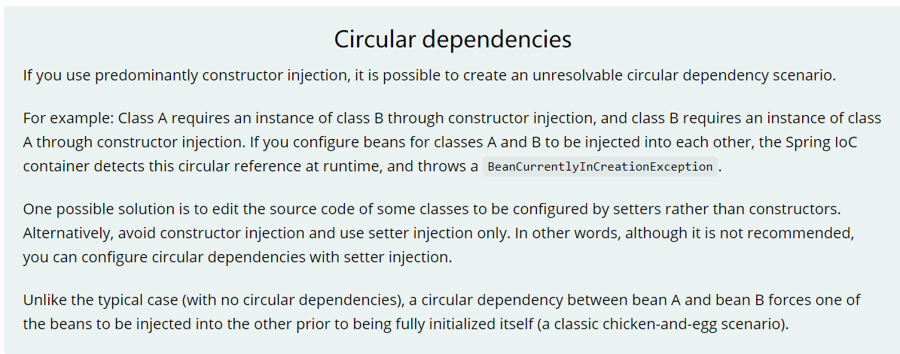

# 循环依赖是什么？

多个bean之间相互依赖，形成了一个闭环。比如A依赖于B、B依赖于C、C依赖于A

通常来说，如果问Spring容器内部如何解决循环依赖，一定是指默认的单例bean，属性相互引用的场景




**结论：我们AB循环依赖问题只要A的注入方式是setter且singleton, 就不会有循环依赖问题。**

**结论：Spring内部通过三级缓存来解决循环依赖。**DefaultSingletonBeanRegistry 

> 只有单例的bean会通过三级缓存提前暴露来解决循环依赖的问题，而非单例的bean，每次从容器中获取都是一个新的对象，都会重新创建，所以非单例的bean是没有缓存的，不会将其放到三级缓存中。

```java
public class DefaultSingletonBeanRegistry extends SimpleAliasRegistry implements SingletonBeanRegistry {

	/** Maximum number of suppressed exceptions to preserve. */
	private static final int SUPPRESSED_EXCEPTIONS_LIMIT = 100;


    // 一级缓存,也叫单例池singletonObjects:存放已经经历了完整生命周期的Bean对象
	/** Cache of singleton objects: bean name to bean instance. */
	private final Map<String, Object> singletonObjects = new ConcurrentHashMap<>(256);

    // 三级缓存，存放可以生成bean的工厂
	/** Cache of singleton factories: bean name to ObjectFactory. */
	private final Map<String, ObjectFactory<?>> singletonFactories = new HashMap<>(16);

    // 二级缓存,earlySingletonObjects,存放早期暴露出来的Bean对象，bean生命周期未结束（属性还未填充完整）
	/** Cache of early singleton objects: bean name to bean instance. */
	private final Map<String, Object> earlySingletonObjects = new ConcurrentHashMap<>(16);

	/** Set of registered singletons, containing the bean names in registration order. */
	private final Set<String> registeredSingletons = new LinkedHashSet<>(256);

}

```


